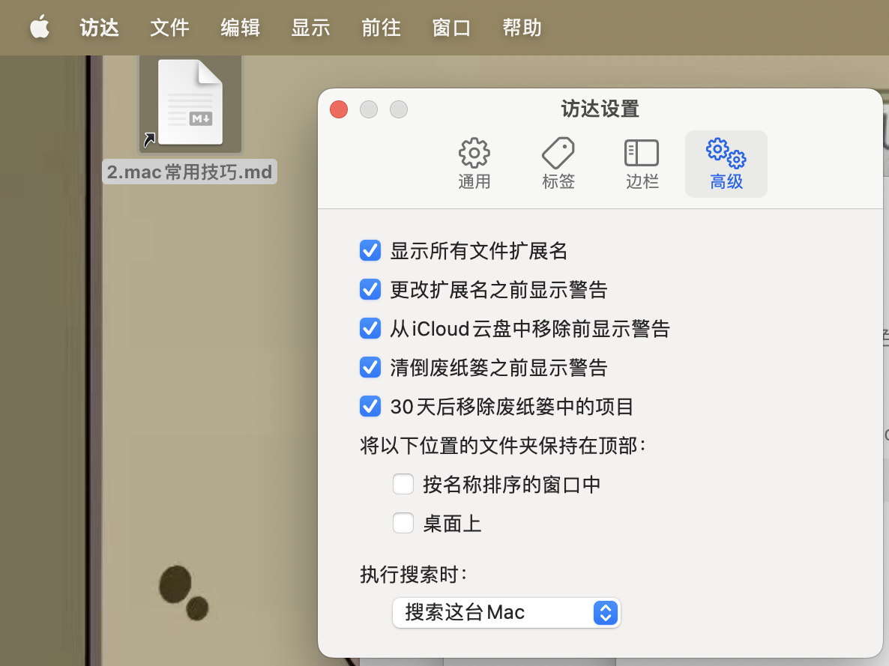

# 4.mac常见问题

## Start

+ 总结一下我使用mac的常见问题。

[toc]

## 1. 设置文件名后缀

打开文件的时候，有的默认不会有文件后缀名，我们可以在

`打开访达=>访达设置=》显示所有文件扩展名`

## 2. 截图

`command shift 3` 截全屏
`command shift 4` 选择区域截图
`command shift 5` 完整的截图功能 （包含录屏）

## 3. 各种软件
可淘宝自行购买。例如 adobe全家桶，office, `typora`

## 4.压缩软件

bindazip

> https://xclient.info/下载破解版本

## 5.屏幕取色器
系统自带 数码测色计

## 6.录屏
`command shift 5` 完整的截图功能 （包含录屏）

## 7.右键扩展
超级右键
> 快速打开终端，打开vscode，非常好用