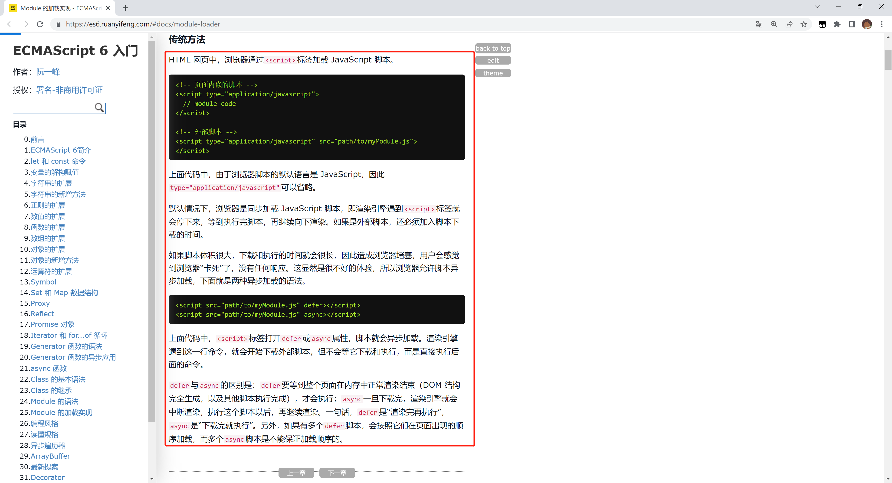

# script 标签中 defer 和 async 的区别

## 解释：

| script 标签      | JS 执行顺序      | 是否阻塞解析 HTML                                                      |
| ---------------- | ---------------- | ---------------------------------------------------------------------- |
| `<script>`       | 在 HTML 中的顺序 | 阻塞                                                                   |
| `<script async>` | 网络请求返回顺序 | 可能阻塞，也可能不阻塞（JS 加载完毕就会解析 JS，可能会阻塞 HTML 加载） |
| `<script defer>` | 在 HTML 中的顺序 | 不阻塞                                                                 |

## 相关知识

阮一峰-Es6 基础入门-`<\/script>` 标签：[点击这里](https://es6.ruanyifeng.com/#docs/module-loader)

## 自我总结

1. 普通的`script`标签，先加载，然后执行；
2. defer，异步加载，等页面加载完毕后再按照顺序执行；
3. async，异步加载，JS 加载完毕后，就执行，（如果页面正在加载就会阻塞页面加载）

