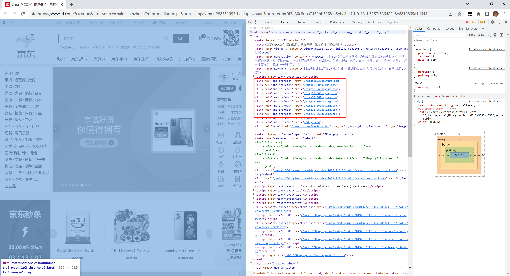

# 从浏览器地址栏输入 url 到请求返回发生了什么

## start

- 可以说这个问题被问烂了，要是看了这么多，都不会那就有些说不过去了。
- 写一个博客专门解释一下其中的过程。

## 基础步骤

1. 输入 URL 后解析出协议、主机、端口、路径等信息，并构造一个 HTTP 请求。

2. DNS 域名解析

   

   

3. TCP 连接

4. http 请求

5. 服务器处理请求并返回 HTTP 报文

6. 浏览器渲染页面

7. 断开 TCP 连接

## 相关博客

- [从输入 URL 开始建立前端知识体系](https://juejin.cn/post/6935232082482298911)

- [从 URL 输入到页面展现到底发生什么？](https://juejin.cn/post/6844903784229896199)
