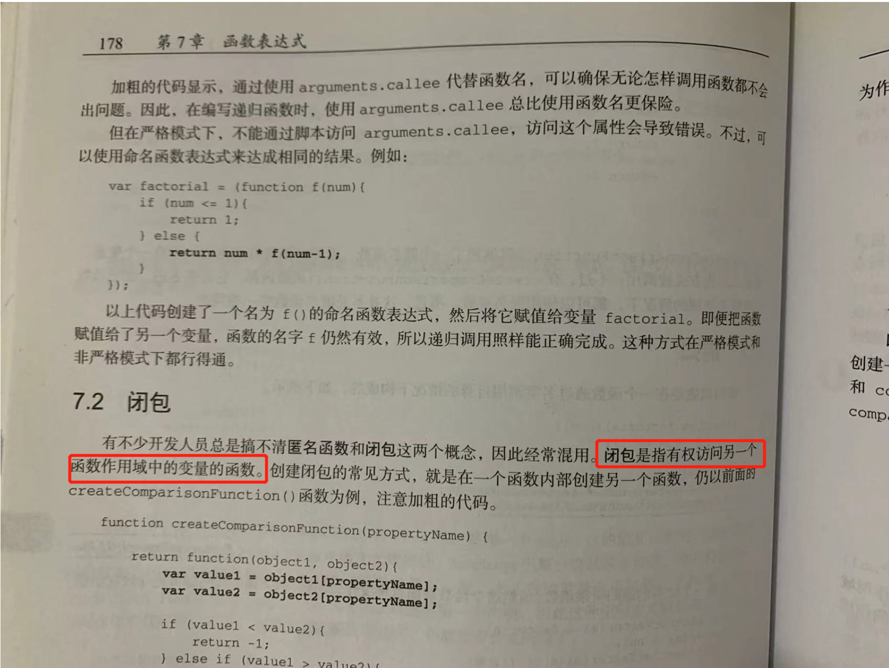

# 什么是闭包

## 1. 概念

闭包（closure）指有权访问另一个函数作用域中变量的`函数`。---《JavaScript高级程设计》

> 简单理解就是一个函数。





## 2. 如何产生闭包？

当一个嵌套的内部函数引用了嵌套的外部函数的变量（函数）时，就产生了闭包.


## 3. 闭包到底是什么？

### 3.1 代码：

```js
function fn1 () {
    debugger
    var a = 123
    var b = 123

    function fn2 () {
        console.log(a)
    }

    fn2()
}

fn1()
```

`浏览器 debugger 中的截图：`

/image-20221127203742785.png)

### 3.2 思考：

+ 可以在浏览器的debugger查看， `Closure`

  + 理解一：闭包是嵌套的内部函数

  + 理解二：包含被引用变量（函数）的对象

    > 注意：闭包存在于嵌套的内部函数中

> 看到浏览器的调试工具：在外层函数的作用域中，存储着内部函数，内部函数身上有一个内部属性 `[[Scopes]]` 里面存储着 `Closure`。


### 3.3 产生闭包的条件？

1. 函数嵌套

2. 内部函数引用了外部函数的数据（变量/函数）

3. 调用了外部函数。


## 4. 闭包的思考

### 4.1 闭包的作用

+ 使函数内部的变量在函数执行完后，仍然存活在内存中（延长了局部变量的生命周期）

+ 让函数外部可以操作（读写）到函数内部的数据（变量/函数）

### 4.2 闭包的应用

1. 将函数作为另一个函数的返回值
2. 将函数作为实参传递给另一个函数调用  


#### 模块化中的使用

```js
;(function (window) {
  let str = 'tomato777'
  function foo() {
    console.log(`foo() ${str}`)
  }

  function bar() {
    console.log(`bar() ${str}`)
    otherFun()
  }

  function otherFun() {
    console.log('otherFun()')
  }
  window.myModule = { foo, bar }
})(window)

console.log('myModule', myModule)
// {foo: ƒ, bar: ƒ}

console.log('myModule.str', myModule.str)
// undefined
```

> 可以保证变量私有，但是又可以通过我们自己暴露的方法去修改这个变量。


for循环中使用的场景：

```js
var arr = []
for (var i = 0; i < 5; i++) {
  arr[i] = function fn() {
    console.log(i)
  }
}

arr.forEach((item) => {
  item()
})
/* 
5
5
5
5
5

因为 arr 中存储的函数中的i都是使用的for循环中的`var i`


解决方案1： var改为let

解决方案2： 利用闭包，在赋值的代码外层包裹一层函数，形成闭包。代码如下
var arr = []
for (var i = 0; i < 5; i++) {
  ;((i) => {
    arr[i] = function fn() {
      console.log(i)
    }
  })(i)
}

arr.forEach((item) => {
  item()
})


*/

```


### 4.3 闭包的生命周期

1. 产生：嵌套内部函数定义执行完毕之后就产生了（不是在调用）
2. 死亡：在嵌套的内部函数成为垃圾对象时

### 4.4 闭包优缺点

1. 缺点
   + 函数执行完后，函数内的局部变量没有释放，占用内存时间会变长
   + 容易造成内存泄露
2. 解决
   + 能不用就不用
   + 及时释放


## End

**说说番茄我自己的想法，参考即可。**

闭包可以说，是从我开始学习 JavaScript 的那天开始，就频繁遇到的名词。

***1. 有权访问另一个函数作用域中变量的`函数`***

 ***2. 闭包是一种引用关系，该引用存在于内部函数中，引用的是外部函数中的局部变量。***


> + 用我自己的理解来说，闭包就是一个对象，存储在内部函数中，记录了内部函数对外部函数的局部变量的引用。实现了，当外部函数执行完毕以后，在内部函数中，依旧可以访问到外部函数中的局部变量。
> + 当然，理解成函数，理解成对象，本质上无差别。