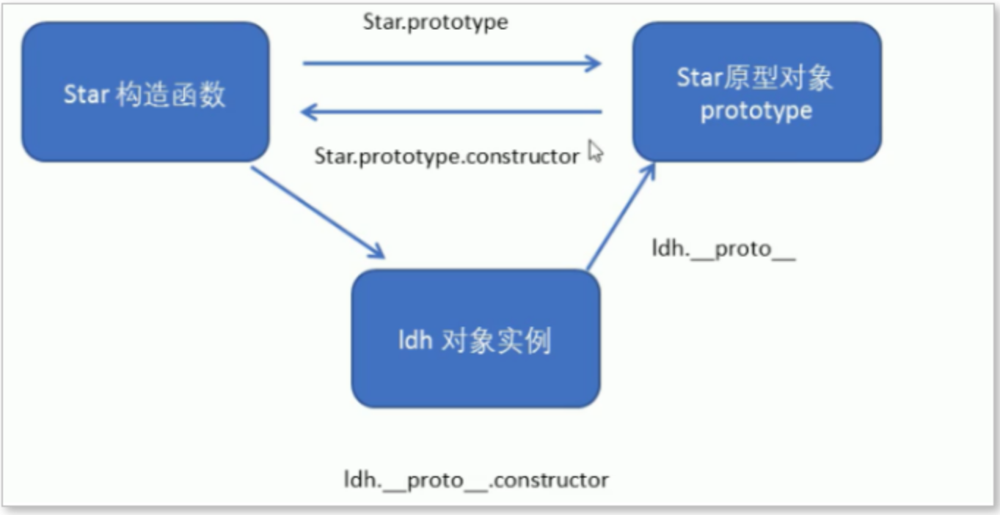

# 构造函数、原型对象、实例对象三者关系

- 构造函数，为了创建对象
- 构造函数的原型对象，为了存储构造函数共有的方法和属性
- 构造函数的实例对象，是通过构造函数创建的一个一个实例
- 每一个构造函数都有一个 prototype 属性，指向的是该构造函数的原型对象。
- 每一个实例对象都有一个 `__proto__` 属性，指向的是构造函数的原型对象。
- 实例对象原型 `__proto__` 和构造函数原型 prototype 里面都有一个属性 constructor 属性 ，都指向了构造函数。

