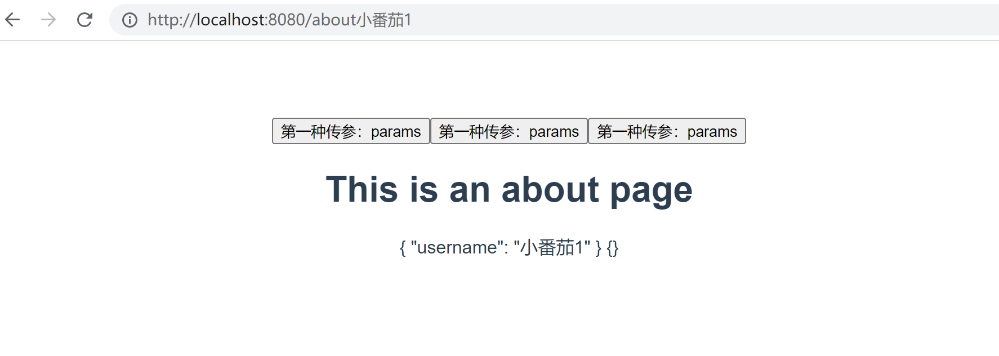

# vue 中路由传参

## 1. 使用 params

`1.1 路由配置：`

```js
;[
  {
    path: '/',
    name: 'Home',
    component: Home,
  },
  {
    path: '/about',
    name: 'about',
    component: () => import('../views/About.vue'),
  },
]
```

`1.2 路由跳转：`

```js
this.$router.push({
  name: 'about',
  params: { username: '小番茄1' },
})

// 或

// <router-link :to="{ name: 'about', params: { username: '小番茄1' } }">
//   About
// </router-link>
```

`1.3 接收传参：`

```js
this.$route.params
```

### 注意事项：

1.  注意使用 params 时一定不能使用 path；
2.  name 对应路由中定义的 name；
3.  刷新页面，参数会丢失

## 2. 使用 query

`2.1 路由配置：`

```js
;[
  {
    path: '/',
    name: 'Home',
    component: Home,
  },
  {
    path: '/about',
    name: 'about',
    component: () => import('../views/About.vue'),
  },
]
```

`2.2 路由跳转：`

```js
this.$router.push({
  name: 'about',
  query: { username: '小番茄2' },
})

// 或

// <router-link :to="{ name: 'about', query: { username: '小番茄2' } }">
//   About
// </router-link>
```

`2.3 接收传参：`

```js
this.$route.query
```

### 注意事项：

1.  使用的参数是 path；
2.  类似 get 请求，参数会展示在 Url 上。

## 3. 动态路由

`3.1 路由配置：`

```js
;[
  {
    path: '/',
    name: 'Home',
    component: Home,
  },
  {
    path: '/about:username',
    name: 'about',
    component: () => import('../views/About.vue'),
  },
]
```

`3.2 路由跳转：`

```js
this.$router.push({
  name: 'about',
  params: { username: '小番茄1' },
})

// 或

// <router-link :to="{ name: 'about', params: { username: '小番茄1' } }">
//   About
// </router-link>
```

`3.3 接收传参：`

```js
this.$route.params
```

### 注意事项：

1. 刷新的时候，参数依旧存在。

2. 效果截图：

   
