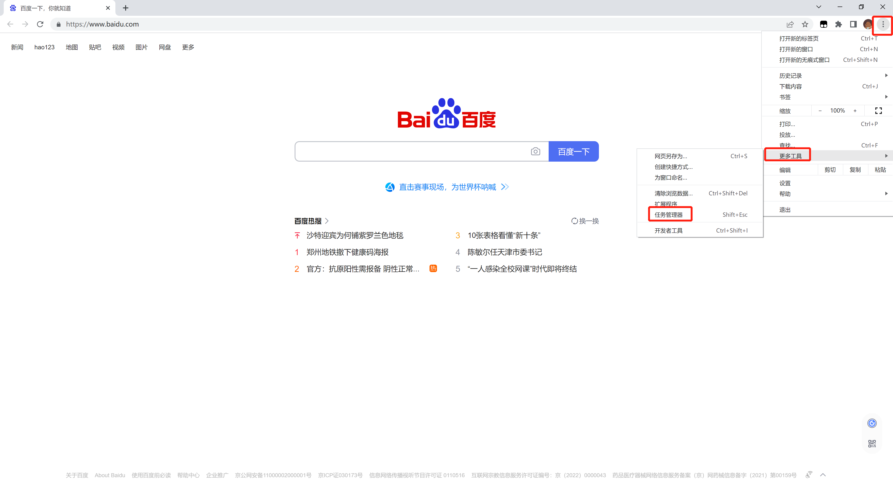
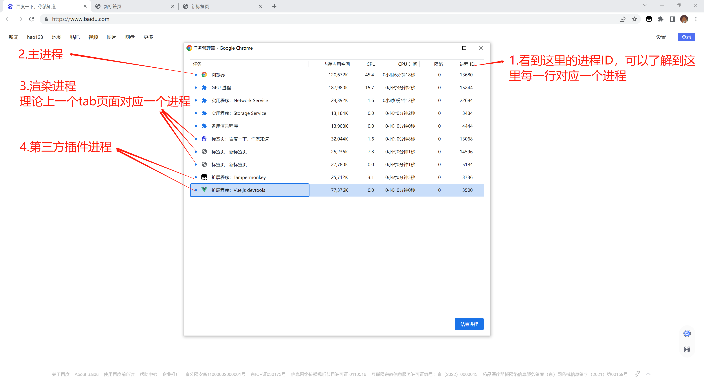

# 浏览器中的进程

## start

- 上一篇文章，学习到了如何区分进程和线程。
- 在这里再复习一下，**进程**类似于**一个工厂**，**线程**类似于工厂的工人，一个工厂可以有一个或多个工人。

## 1. 浏览器的进程

一个浏览器中有很多的进程，我以谷歌浏览器为例，做一下说明：

### 1.1 Blink内核包含的主要进程

+ 谷歌浏览器使用的是Blink内核。

+ Blink内核包含的主要进程如下：

     1. Browser进程：主进程，只有一个。

        > 它的作用有
        >
        > + 负责浏览器界面显示，与用户交互。如前进，后退等
        > + 负责各个页面的管理，创建和销毁其他进程
        > +  将Renderer进程得到的内存中的Bitmap，绘制到用户界面上
        > +  网络资源的管理，下载等

     2. Renderer进程：默认每个页面一个，互不影响。主要作用为解析HTML，CSS，构建DOM树和RenderObject树，布局和绘制等。

     3. 第三方插件进程：每种类型的插件对应一个进程，仅当使用该插件时才创建

     4. GPU进程：最多一个，用于3D绘制等

### 1.2 查看浏览器的任务管理器

上面说了一堆进程，有点晕，我们查看一下浏览器的任务管理器，用可视化的方式来看看进程。

> 例如：谷歌浏览器右上角竖着三个点的菜单-->更多工具-->任务管理器

看到上图的任务管理器，可以验证我们所说的进程分类。

### 1.3 浏览器多进程的好处？

- 避免单个page crash影响整个浏览器

  > page crash 页面崩溃

- 避免第三方插件crash影响整个浏览器

- 多进程充分利用多核优势

- 方便使用沙盒模型隔离插件等进程，提高浏览器稳定性

### 1.4 小结

简单来说，记住一点，浏览器是由多个进程组成的。

## 2.渲染进程

浏览器有这么多进程，我们更应该关注哪一个进程呢？

答：**渲染进程**

> 页面的渲染，JS的执行，事件的循环，都在这个进程内进行。

### 2.1 渲染进程包含那些线程？

1. GUI渲染线程
   - 负责渲染浏览器界面，解析HTML，CSS，构建DOM树和RenderObject树，布局和绘制等。
   - 当界面需要重绘（Repaint）或由于某种操作引发回流(reflow)时，该线程就会执行
   - 注意，**GUI渲染线程与JS引擎线程是互斥的**，当JS引擎执行时GUI线程会被挂起（相当于被冻结了），GUI更新会被保存在一个队列中**等到JS引擎空闲时**立即被执行。
2. JS引擎线程
   - 也称为JS内核，负责处理Javascript脚本程序。（例如V8引擎）
   - JS引擎线程负责解析Javascript脚本，运行代码。
   - JS引擎一直等待着任务队列中任务的到来，然后加以处理，一个Tab页（renderer进程）中无论什么时候都只有一个JS线程在运行JS程序
   - 同样注意，**GUI渲染线程与JS引擎线程是互斥的**，所以如果JS执行的时间过长，这样就会造成页面的渲染不连贯，导致页面渲染加载阻塞。
3. 事件触发线程
   - 归属于浏览器而不是JS引擎，用来控制事件循环（可以理解，JS引擎自己都忙不过来，需要浏览器另开线程协助）
   - 当JS引擎执行代码块如setTimeOut时（也可来自浏览器内核的其他线程,如鼠标点击、AJAX异步请求等），会将对应任务添加到事件线程中
   - 当对应的事件符合触发条件被触发时，该线程会把事件添加到待处理队列的队尾，等待JS引擎的处理
   - 注意，由于JS的单线程关系，所以这些待处理队列中的事件都得排队等待JS引擎处理（当JS引擎空闲时才会去执行）
4. 定时触发器线程
   - 传说中的`setInterval`与`setTimeout`所在线程
   - 浏览器定时计数器并不是由JavaScript引擎计数的,（因为JavaScript引擎是单线程的, 如果处于阻塞线程状态就会影响记计时的准确）
   - 因此通过单独线程来计时并触发定时（计时完毕后，添加到事件队列中，等待JS引擎空闲后执行）
   - 注意，W3C在HTML标准中规定，规定要求setTimeout中低于4ms的时间间隔算为4ms。
5. 异步http请求线程
   - 在XMLHttpRequest在连接后是通过浏览器新开一个线程请求
   - 将检测到状态变更时，如果设置有回调函数，异步线程就**产生状态变更事件**，将这个回调再放入事件队列中。再由JavaScript引擎执行。

### 2.2 小结

看完上述的信息之后，有什么用？

我总结一下我自己的收获

1. 一个进程中可以有一个或多个线程。

2. 执行JS的代码的，其实只是渲染进程中的一个线程而已。

3. 所以再看到`JS是单线程的`这句话就很好理解了。

4. 但是单线程就意味着，所有任务需要排队，前一个任务结束，才会执行后一个任务。如果前一个任务耗时很长，后一个任务就不得不一直等着。

   > + JS执行会阻断页面的渲染（GUI渲染线程与JS引擎线程是互斥的）
   > + JavaScript的单线程，与它的用途有关。作为浏览器脚本语言，JavaScript的主要用途是与用户互动，以及操作DOM。这决定了它只能是单线程，否则会带来很复杂的同步问题。比如，假定JavaScript同时有两个线程，一个线程在某个DOM节点上添加内容，另一个线程删除了这个节点，这时浏览器应该以哪个线程为准？
   > + 为了利用多核CPU的计算能力，HTML5提出Web Worker标准，允许JavaScript脚本创建多个线程，但是子线程完全受主线程控制，且不得操作DOM。所以，这个新标准并没有改变JavaScript单线程的本质。（**这个多线程由浏览器提供，切不可操作DOM**）

### end

+ 本文学习了浏览器多个进程，
+ 了解到其实执行JS的，是渲染进程中众多线程的其中一个。
+ 由于JS单线程的本质，针对耗时长，阻塞页面渲染的逻辑，就需要引入额外的处理方式。就是我们下一篇文章会说到的 事件循环`event loop`。
