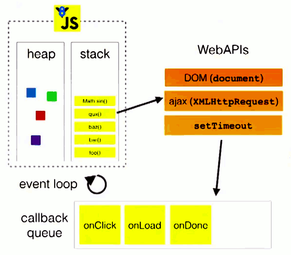

# event loop 事件循环

## start

- 最近这段时间一直在研究 javascript 中的事件循环，看了不少相关视频和文章。
- 学习完知识后，虽然对 javascript 的代码执行顺序，能够正确判断。但是当我想将理论知识用自己口头语言表达出来的时候，发现有点困难。
- 随即想写个文章梳理梳理。

## 1. javascript 是单线程的

首先我们知道 **javascript 是单线程的**。

单线程就意味着，所有任务需要排队，前一个任务结束，才会执行后一个任务。如果前一个任务耗时很长，后一个任务就不得不一直等着。

如果排队是因为计算量大，CPU 忙不过来，倒也算了，但是很多时候 CPU 是闲着的，因为 IO 设备（输入输出设备）很慢（比如 Ajax 操作从网络读取数据），不得不等着结果出来，再往下执行。

## 2.同步，异步任务

由于上面讲述到的问题，随即有同步和异步这两个概念来解决上述的问题。

- 同步任务指的是，在主线程上排队执行的任务，只有前一个任务执行完毕，才能执行后一个任务；
- 异步任务指的是，不进入主线程、而进入"任务队列"（task queue）的任务，只有"任务队列"通知主线程，某个异步任务可以执行了，该任务才会进入主线程执行

## 3.执行逻辑

（1）所有同步任务都在主线程上执行，形成一个执行栈（execution context stack）。

（2）主线程之外，还存在一个"任务队列"（task queue）。只要异步任务有了运行结果，就在"任务队列"之中放置一个事件。

（3）一旦"执行栈"中的所有同步任务执行完毕，系统就会读取"任务队列"，看看里面有哪些事件。那些对应的异步任务，于是结束等待状态，进入执行栈，开始执行。

（4）主线程不断重复上面的第三步。

## 4.event loop

主线程从"任务队列"中读取事件，这个过程是循环不断的，所以整个的这种运行机制又称为 Event Loop（事件循环）。

> 简单来书：JS 只有一个主线程，主线程执行完执行栈的任务后去检查异步的任务队列，如果异步事件触发，则将其加到主线程的执行栈。

## 5.加深理解事件循环

对照上述的截图，我来说说我的理解。

>个人理解，若表达有误，欢迎指出。

1. 上图的左上角，有一个包含V8图标的区域，简称区域A。这个区域可以理解为，**执行 JS 代码的线程**所在区域。JS是单线程的，这个单线程指的就是这个线程。

2. 在执行代码的过程中，遇到同步的任务，会按照代码执行顺序，将任务在区域A中的 `stack` 压入压出。

   > stack可以理解为是一个数组，可以用于存储，遵循**后进先出**的规则。

3. 在执行代码的过程中，遇到异步任务，会调用对应的WebApi。例如上图中的 `1.元素上的事件`；`2.XMLHttpRequest`;`3.setTimeout`。

   > WebApi由浏览器提供，当然运行这些API的是浏览器中的其他线程。

4. 当异步任务执行完毕后，会将它们的回调函数存放在 `callback queue` （回调队列/任务队列）中。

   > 这个队列，简单理解，就是一个存储数据的地方，它和stack不一样的是，它遵循**先进先出**的规则。

5. 当**执行 JS 代码的线程**的任务执行完毕，也就是`stack`中的任务执行完毕，就会从`callback queue` 中读取事件（回调函数）。

   > + 每次读取一个；
   > + 多个回调函数，则会循环读取；（也就是所说到的事件循环）
   > + **执行 JS 代码的线程**从"任务队列"中读取事件，这个过程是循环不断的，所以整个的这种运行机制又称为 Event Loop（事件循环）。

6. **执行 JS 代码的线程**读取了事件，会存放到 `stack` ，然后按顺序执行，当 `stack` 中的任务执行完毕，会继续读取 `callback queue`中的事件。如此循环下去

## 6.对自己的提问

### 6.1 什么叫做事件循环？

执行JS的主线程任务执行完毕，会循环读取事件队列中的事件，叫做事件循环。

### 6.2 为什么JS单线程，却能通过异步同时执行多个任务？

执行JS的是单线程不假，但是异步操作，可借用宿主环境（浏览器）提供的WebApi，启动对应的线程进行工作，例如网络请求，文件读取。

我理解异步本质上，其实是借用了宿主环境的线程，达到同时执行多个任务。

> 看过一个讲解事件循环的演讲，让我印象很深刻，他说他查看了浏览器的V8引擎源代码，发现在引擎源码中并没有定时器的相关代码。定时器，其是宿主环境提供的API。
>
> 
>
> 按照这个说法，我理解到，怪不得 `axios` 中封装网络请求，浏览器中使用`XMLHttpRequest`，NodeJs环境中使用`http`模块。
>
> 因为网络请求和定时器类似，本身就是宿主环境提供的支持。所以分别进行单独处理。

## 7.其他

番茄在写这篇文章的时候，看到了另一篇文章，该文章记录了和 `ChatGPT` (最近比较火智能 AI)的聊天记录。

文章中问 AI 这么一个问题，让我印象深刻。我这里记录一下。

**问：Javascript 执行机制？**

A: JavaScript 执行机制是基于事件循环的单线程模型，它会按照代码的顺序执行，遇到异步操作时会将其放入任务队列中，等待主线程空闲时再执行。

##  end

+ 对于事件循环，就整理到这里。
+ 下文说说，宏任务和微任务。

