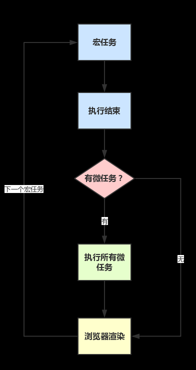

# 宏任务和微任务

## start

- 如果彻底理解了事件循环，其实大多数 JS 执行的逻辑都能理解了
- 但是在 ES6 中引入了 `Promise`, 就引出了两个新概念，宏任务和微任务。

## 1.宏任务和微任务

### 1.1 名词

- 宏任务：`macrotask`
- 微任务：`microtask`

  > 在 ECMAScript 中，`microtask` 称为 jobs，`macrotask` 可称为 task

  

### 1.2 概念

+ `macrotask`（又称之为宏任务），可以理解是每次执行栈执行的代码就是一个宏任务

+ `microtask`（又称为微任务），可以理解是在当前 task 执行结束后立即执行的任务


### 1.3 区分

#### 1.3.1 宏任务

+ 每一个 task 会从头到尾将这个任务执行完毕，不会执行其它

+ 浏览器为了能够使得 JS 内部 task 与 DOM 任务能够有序的执行，会在一个 task 执行结束后，在下一个 task 执行开始前，对页面进行重新渲染

+ 每次从事件队列中获取一个事件回调并放到执行栈中执行（**这个事件回调也会当做宏任务**）

  


#### 1.3.2 微任务

+ 在当前 task 任务后，下一个 task 之前，在渲染之前
+ 所以它的响应速度相比` setTimeout`（`setTimeout` 是 task）会更快，因为无需等渲染
+ 也就是说，在某一个 macrotask 执行完后，就会将在它执行期间产生的所有 `microtask` 都执行完毕（在渲染前）


#### 1.3.3 和DOM渲染的顺序

```
（`task->渲染->task->...`）
```


### 1.4 应用场景

- `macrotask`：主代码块，`script标签`，`setTimeout`，`setInterval`等（可以看到，事件队列中的每一个事件都是一个`macrotask`）
- `microtask`：`Promise`，`process.nextTick`等

> 在node环境下，process.nextTick的优先级高于Promise

### 1.5 执行顺序图解




## 2.小试牛刀

### 2.1 普通事件循环

`题目:`

```js
console.log(1)

setTimeout(() => {
  console.log(2)
}, 1000)

console.log(3)
```

`答案：`

```js
1
3
2
```


### 2.2 事件循环+promsie

`题目:`

```js
console.log(1)

setTimeout(() => {
  console.log(2)
}, 1000)

Promise.resolve().then(() => {
  console.log(3)
})

console.log(4)

```

`答案：`

```js
1
4
3
2
```


### 2.3 多重组合

`题目:`

```js
console.log(1)

setTimeout(() => {
  console.log(2)
}, 0)

setTimeout(() => {
  console.log(3)
}, 0)

Promise.resolve()
  .then(() => {
    console.log(4)
  })
  .then(() => {
    console.log(5)
  })
  .catch(() => {
    console.log(6)
  })

console.log(7)

```

`答案：`

```js
1
7
4
5
2
3
```


### 2.4 检测

`题目:`

```js
console.log('1');

setTimeout(function() {
    console.log('2');
    process.nextTick(function() {
        console.log('3');
    })
    new Promise(function(resolve) {
        console.log('4');
        resolve();
    }).then(function() {
        console.log('5')
    })
})
process.nextTick(function() {
    console.log('6');
})
new Promise(function(resolve) {
    console.log('7');
    resolve();
}).then(function() {
    console.log('8')
})

setTimeout(function() {
    console.log('9');
    process.nextTick(function() {
        console.log('10');
    })
    new Promise(function(resolve) {
        console.log('11');
        resolve();
    }).then(function() {
        console.log('12')
    })
})

```

`答案：`

```js
1
7
6
8
2
4
3
5
9
11
10
12
```


## end

+ 需要注意，由于浏览器差异，部分api存在兼容问题，需要多加考虑。


