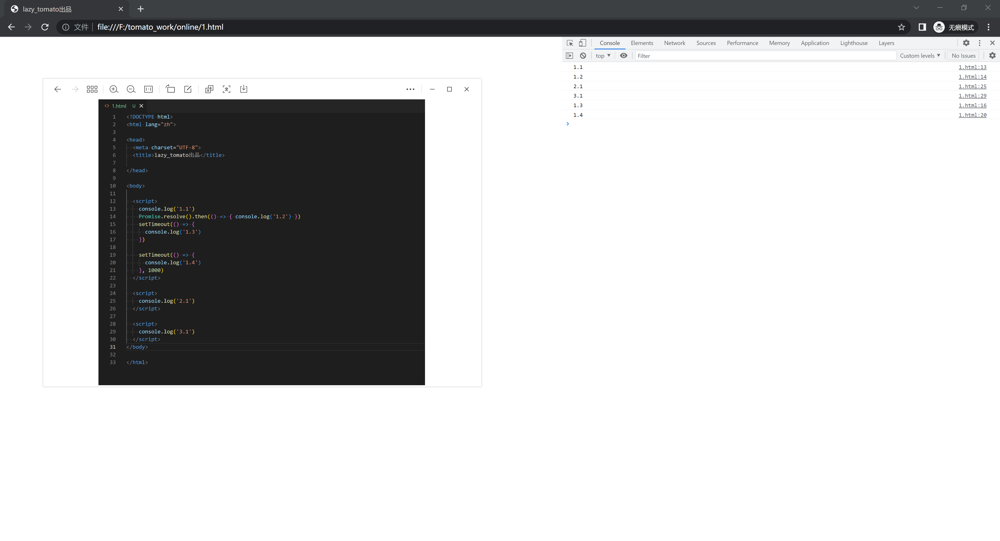
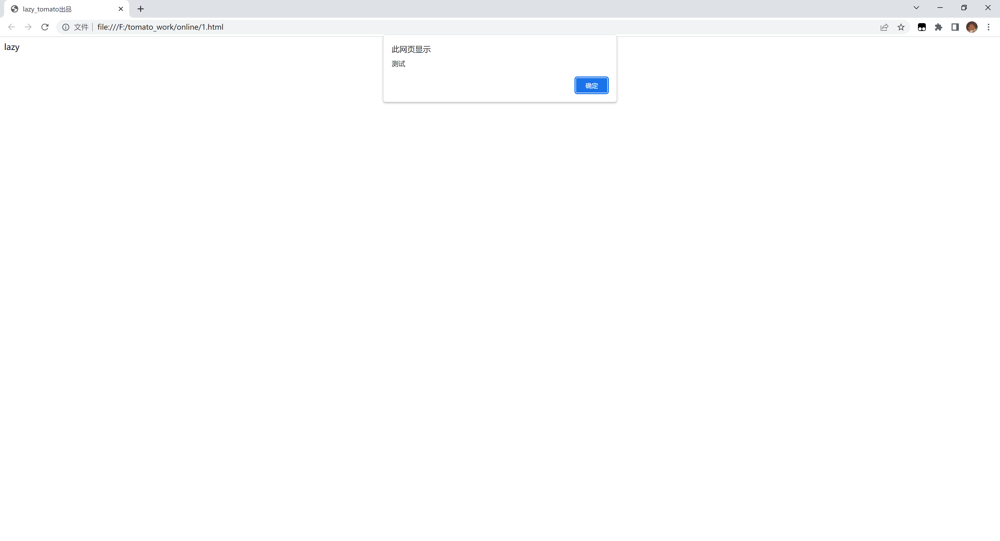
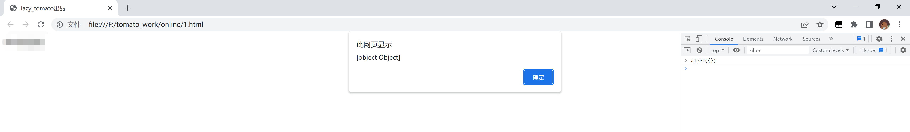
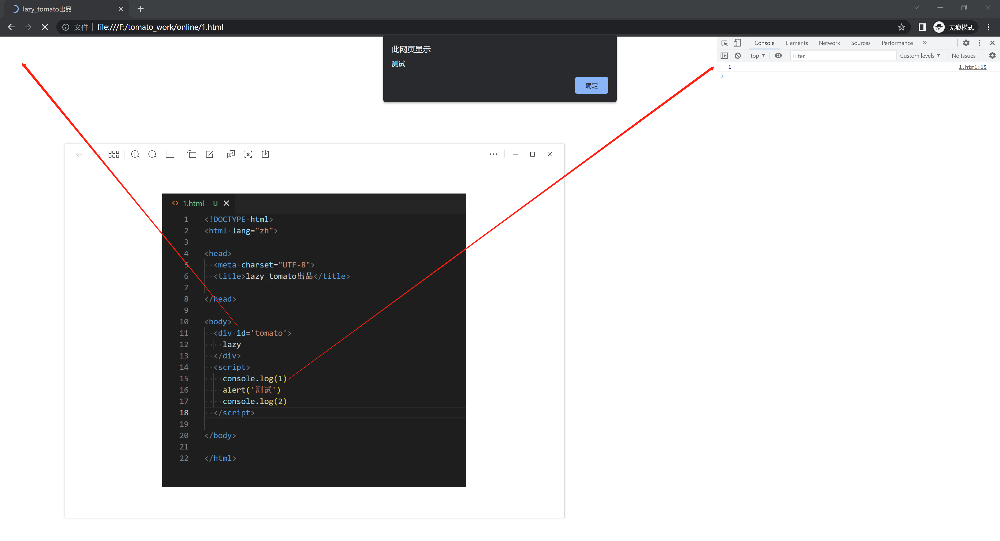
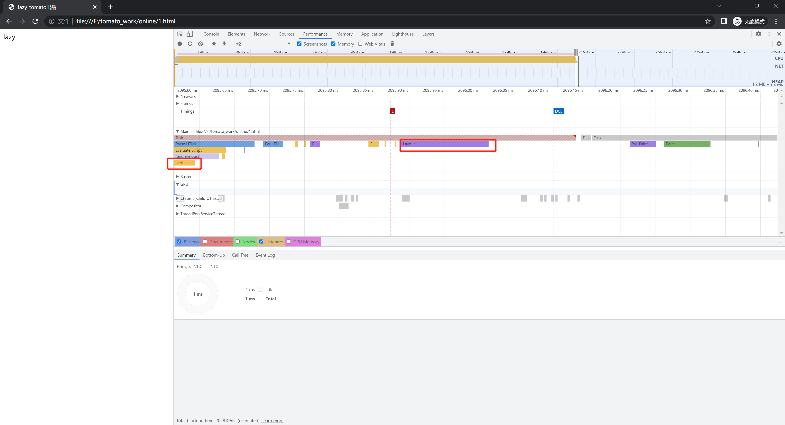

# JS 执行和 DOM 渲染的顺序

## start

- 前面学习了事件循环，学习了宏任务微任务，了解了它们之间的执行顺序。
- 但是还有些问题困扰着我。
- 那么今天这篇文章，就编写一些案例，验证一下困扰我的问题。

## 前置逻辑

- 首先，由前几篇文章可以了解到：JS 执行顺序：**`当前宏任务>当前的所有微任务>下一个宏任务>下一个的所有微任务`**。

- 本文所有示例，运行环境为：`谷歌浏览器`, `win10`, `107.0.5304.88`。

## 1. 多个`script`标签执行顺序

### 1.1 代码

```html
<!DOCTYPE html>
<html lang="zh">
  <head>
    <meta charset="UTF-8" />
    <title>lazy_tomato出品</title>
  </head>

  <body>
    <script>
      console.log('1.1')
      Promise.resolve().then(() => {
        console.log('1.2')
      })
      setTimeout(() => {
        console.log('1.3')
      })

      setTimeout(() => {
        console.log('1.4')
      }, 1000)
    </script>

    <script>
      console.log('2.1')
    </script>

    <script>
      console.log('3.1')
    </script>
  </body>
</html>
```

### 1.2 运行截图



### 1.3 思考

结合上述截图的输出，可以把**每个 `script` 标签，都看做一个宏任务**；它们会按照定义的顺序，依次执行。

`其他`

> - 我在多个浏览器中打开了演示的`html`，查看了 `script` 标签和定时器的执行顺序，结果都是：定时器晚于 `script` 标签执行
>
>   我猜测可能是因为：W3C 在 HTML 标准中规定，规定要求 setTimeout 中低于 4ms 的时间间隔算为 4ms；（所以相对于声明的标签，会略晚运行）
>
> - 每个 `script` 标签相互独立，如果某个 `script` 标签报错，不影响其他 `script` 标签的代码执行，但是共享全局变量(window)。
>
> - `script` 标签，有两个特殊的属性：
>
>   1. `async`：异步加载，JS 加载完毕后，就执行，（如果页面正在加载就会阻塞页面加载）
>   2. `defer`：异步加载，等页面加载完毕后再按照顺序执行

## 2. alert 会阻止页面加载

### 2.1 说明

后续的演示代码，会用到 `alert` ，所以这里简单介绍一下 `alert`。

### 2.2 alert 可以弹出弹框，输出内容。



### 2.3 alert 输出的内容会隐式转换为字符串

```js
alert({})
```



### 2.4 alert 会阻塞 JS 执行

```html
<!DOCTYPE html>
<html lang="zh">
  <head>
    <meta charset="UTF-8" />
    <title>lazy_tomato出品</title>
  </head>

  <body>
    <div id="tomato">lazy</div>
    <script>
      console.log(1)
      alert('测试')
      console.log(2)
    </script>
  </body>
</html>
```



`思考`

问题：在弹出 alert 的时候，页面的 lazy 没有被渲染出来？

**我猜测的原因**：首先`script` 标签本身也是`html`标签，所以首次绘制也会加载对应的`script` 标签；然后渲染树已经加载完毕了，在真正渲染到页面之前，会执行`script` 标签中的代码，执行完毕后再渲染页面。



## 3. DOM 渲染的顺序

### 3.1 代码

```html
<!DOCTYPE html>
<html lang="zh">
  <head>
    <meta charset="UTF-8" />
    <title>lazy_tomato出品</title>
  </head>

  <body>
    <div id="tomato"></div>
    <script>
      var tomato = document.getElementById('tomato')

      for (let index = 0; index < 5; index++) {
        // 定义多个宏任务
        setTimeout(() => {
          // 修改DOM
          tomato.innerHTML = index

          // 同步任务
          console.log('宏任务执行了', index, tomato.innerHTML)

          // 微任务
          Promise.resolve().then(() => {
            console.log('微任务执行了', index)

            // 阻断
            alert(
              '当前的tomato中的内容已经被修改了，修改的值为' + tomato.innerHTML
            )
          })
        }, 1000)
      }
    </script>
  </body>
</html>
```

### 3.2 运行截图


### 3.3 思考

1. 上述的实例可以很好的证明：

   **页面执行顺序为： 当然的宏任务 > 当前的微任务 > DOM 渲染 > 下一个宏任务 > 下一个微任务 > 下一次 DOM 渲染。**

## end

- JS 博大精深，想写的很深入，奈何了解的知识有限，后面要是有新的感悟，再做补充
- 加油！！！
