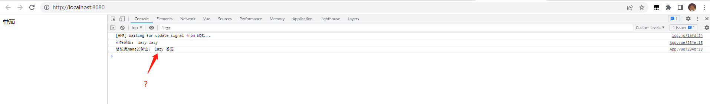
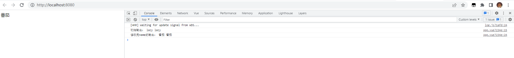
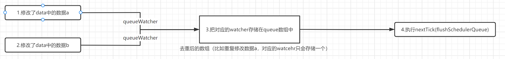
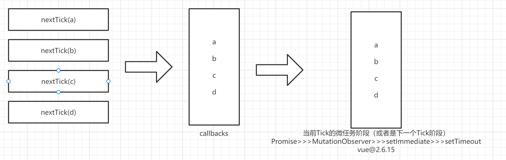
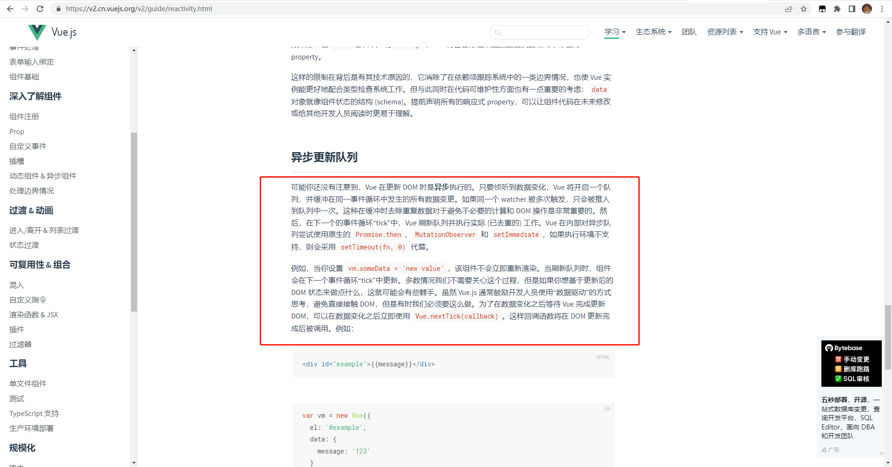
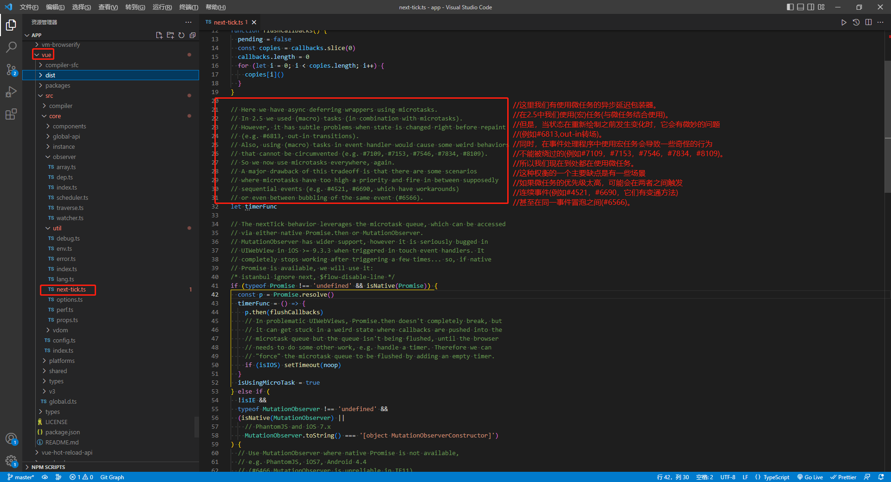

# Vue 中的 nextTick\_\_番茄出品

## start

- 本篇文章，由浅入深的学习 Vue 中的 **`nextTick`** 。

  > 本文主要以 vue@2.6.11 为主

- 作者：`lazy_tomato`

## 1. 一个简单的任务场景

一切的起源，要从一个简单的问题开始，我很久以前编写了如下代码：

```html
<template>
  <div id="app">
    <div id="tomato">{{ name }}</div>
  </div>
</template>

<script>
  export default {
    data() {
      return {
        name: 'lazy',
      }
    },
    mounted() {
      console.log(
        '初始输出：',
        document.getElementById('tomato').innerText,
        this.name
      )

      this.name = '番茄'

      console.log(
        '修改完name的输出：',
        document.getElementById('tomato').innerText,
        this.name
      )

      // 初始输出： lazy lazy
      // 修改完name的输出： lazy 番茄
    },
  }
</script>
```

简单说明一下上述代码逻辑，当页面加载完毕后，我修改了 `data` 中的数据。然后立即获取对应 DOM 中的内容，DOM中的内容并不是最新的。



_为什么修改了数据，立即获取 DOM 中的内容，并不是最新的？_


## 2. 猜测问题原因

虽然打印的数据是**旧的数据**，但是可以看到上方的截图（图 1），页面显示的是番茄（**新的数据**）。

**我猜测问题的原因：可能是因为修改数据到更新 dom，这一步需要一定的时间。**

好的，我加一个定时器，直接等待 5s，再去获取DOM的内容，验证我自己的猜想。

```html
<template>
  <div id="app">
    <div id="tomato">{{ name }}</div>
  </div>
</template>

<script>
  export default {
    data() {
      return {
        name: 'lazy',
      }
    },
    mounted() {
      console.log(
        '初始输出：',
        document.getElementById('tomato').innerText,
        this.name
      )

      this.name = '番茄'

      setTimeout(() => {
        console.log(
          '修改完name的输出：',
          document.getElementById('tomato').innerText,
          this.name
        )
      }, 5000)

      // 初始输出： lazy lazy
      // 修改完name的输出： 番茄 番茄
    },
  }
</script>
```



可以看到上述的截图，输出的内容是正确的。

**当我把定时器等待的时间，不断减少，直到为 `0`的时候，我发现获取的数据也是最新的**，why？

```js
setTimeout(() => {
    console.log(
    '修改完name的输出：',
    document.getElementById('tomato').innerText,
    this.name
    )
}, 0)
```


## 3. 找寻问题的根源

上述的试验，并没有找到问题的根本原因。

为了彻底解决这个问题，我们阅读一下 Vue 的源码，一探究竟。

> **我当前案例运行的 Vue 版本为 `vue@2.6.11`，我就以此版本做详细说明。**

有些前置逻辑，这里简单提一下，Vue2 响应式原理是借助 `Object.defineProperty()` 来实现的，当对象值被修改的时候，会依次触发以下函数：

```js
// notify => update => queueWatcher

// 这里需要对响应式原理有一些掌握
```

对应案例中的代码。当我修改了`data` 中  `name` 的值，就会触发 `queueWatcher` 函数。

## 4. queueWatcher

### 4.1 所在目录

`queueWatcher` 文件所在目录：`vue\src\core\observer\scheduler.ts`

### 4.2 英文说明

 - `scheduler`：调度程序
- `queue`：队列
 - `Watcher`：观察者

### 4.3 Vue 源码中的 queueWatcher

```js
/**
 * Push a watcher into the watcher queue.
 * Jobs with duplicate IDs will be skipped unless it's
 * pushed when the queue is being flushed.
 */
export function queueWatcher(watcher: Watcher) {
  const id = watcher.id
  if (has[id] != null) {
    return
  }

  if (watcher === Dep.target && watcher.noRecurse) {
    return
  }

  has[id] = true
  if (!flushing) {
    queue.push(watcher)
  } else {
    // if already flushing, splice the watcher based on its id
    // if already past its id, it will be run next immediately.
    let i = queue.length - 1
    while (i > index && queue[i].id > watcher.id) {
      i--
    }
    queue.splice(i + 1, 0, watcher)
  }
  // queue the flush
  if (!waiting) {
    waiting = true

    if (__DEV__ && !config.async) {
      flushSchedulerQueue()
      return
    }
    nextTick(flushSchedulerQueue)
  }
}
```

### 4.4 简化后的 queueWatcher

```js
const queue = []
let has = {}
let waiting = false
let flushing = false

export function queueWatcher(watcher) {
  const id = watcher.id
  has[id] = true
  if (!flushing) {
    queue.push(watcher)
  }
  if (!waiting) {
    waiting = true
    nextTick(flushSchedulerQueue)
  }
}

// 上述代码就是简化后的代码
// 简单来说，用一个数组存储存储了去重后的watcher。  (watcher可理解为是一个对象)
// 然后执行 `nextTick(flushSchedulerQueue)`
```

### 4.5 queueWatcher

`queueWatcher` 主要作用就是，存储了**去重**后的 `watcher`。也就是说，数据改变了并**不会马上去渲染页面**，而是先用一个数组缓存起来。然后执行了`nextTick(flushSchedulerQueue)`




## 5. flushSchedulerQueue

### 5.1 所在目录

`flushSchedulerQueue` 文件所在目录：`vue\src\core\observer\scheduler.ts`

### 5.2 英文说明


 - `flush`：刷新，冲刷
 - `scheduler`：调度程序
 - `queue`：队列

### 5.3 Vue 源码中的 flushSchedulerQueue

```js
/**
 * Flush both queues and run the watchers.
 */
function flushSchedulerQueue() {
  currentFlushTimestamp = getNow()
  flushing = true
  let watcher, id

  // Sort queue before flush.
  // This ensures that:
  // 1. Components are updated from parent to child. (because parent is always
  //    created before the child)
  // 2. A component's user watchers are run before its render watcher (because
  //    user watchers are created before the render watcher)
  // 3. If a component is destroyed during a parent component's watcher run,
  //    its watchers can be skipped.
  queue.sort(sortCompareFn)

  // do not cache length because more watchers might be pushed
  // as we run existing watchers
  for (index = 0; index < queue.length; index++) {
    watcher = queue[index]
    if (watcher.before) {
      watcher.before()
    }
    id = watcher.id
    has[id] = null
    watcher.run()
    // in dev build, check and stop circular updates.
    if (__DEV__ && has[id] != null) {
      circular[id] = (circular[id] || 0) + 1
      if (circular[id] > MAX_UPDATE_COUNT) {
        warn(
          'You may have an infinite update loop ' +
            (watcher.user
              ? `in watcher with expression "${watcher.expression}"`
              : `in a component render function.`),
          watcher.vm
        )
        break
      }
    }
  }

  // keep copies of post queues before resetting state
  const activatedQueue = activatedChildren.slice()
  const updatedQueue = queue.slice()

  resetSchedulerState()

  // call component updated and activated hooks
  callActivatedHooks(activatedQueue)
  callUpdatedHooks(updatedQueue)
  cleanupDeps()

  // devtool hook
  /* istanbul ignore if */
  if (devtools && config.devtools) {
    devtools.emit('flush')
  }
}
```

### 5.4 简化后的 flushSchedulerQueue

```js
function flushSchedulerQueue() {
  flushing = true
  let watcher, id

  queue.sort(sortCompareFn)

  for (index = 0; index < queue.length; index++) {
    watcher = queue[index]
    id = watcher.id
    has[id] = null
    watcher.run()
  }

  resetSchedulerState() // 重置一些变量
}
```

### 5.5 说明

`flushSchedulerQueue` 英译过来可以理解为，**刷新调度队列**。

首先给 `queue` 排序，然后通过 for 循环，按顺序执行所有 **watcher 的 run 方法**。

注意这里的代码为： `nextTick(flushSchedulerQueue)`，`flushSchedulerQueue` 并没有立刻执行，是把 `flushSchedulerQueue` 这个函数以参数的形式传入 `nextTick`.

> + `watcher.run()` 可以理解为就是重新渲染页面的方法，这个时候会去更新页面。
>
> + `resetSchedulerState` 重置部分变量的逻辑。

## 6. nextTick

### 6.1 所在目录

`nextTick` 文件所在目录：`vue\src\core\util\next-tick.ts`

### 6.2 英文说明

- `next`：下一个
- `tick`：钩子

### 6.3 Vue 源码中的 nextTick

```js
/* globals MutationObserver */

import { noop } from 'shared/util'
import { handleError } from './error'
import { isIE, isIOS, isNative } from './env'

export let isUsingMicroTask = false

const callbacks: Array<Function> = []
let pending = false

function flushCallbacks() {
  pending = false
  const copies = callbacks.slice(0)
  callbacks.length = 0
  for (let i = 0; i < copies.length; i++) {
    copies[i]()
  }
}

// Here we have async deferring wrappers using microtasks.
// In 2.5 we used (macro) tasks (in combination with microtasks).
// However, it has subtle problems when state is changed right before repaint
// (e.g. #6813, out-in transitions).
// Also, using (macro) tasks in event handler would cause some weird behaviors
// that cannot be circumvented (e.g. #7109, #7153, #7546, #7834, #8109).
// So we now use microtasks everywhere, again.
// A major drawback of this tradeoff is that there are some scenarios
// where microtasks have too high a priority and fire in between supposedly
// sequential events (e.g. #4521, #6690, which have workarounds)
// or even between bubbling of the same event (#6566).
let timerFunc

// The nextTick behavior leverages the microtask queue, which can be accessed
// via either native Promise.then or MutationObserver.
// MutationObserver has wider support, however it is seriously bugged in
// UIWebView in iOS >= 9.3.3 when triggered in touch event handlers. It
// completely stops working after triggering a few times... so, if native
// Promise is available, we will use it:
/* istanbul ignore next, $flow-disable-line */
if (typeof Promise !== 'undefined' && isNative(Promise)) {
  const p = Promise.resolve()
  timerFunc = () => {
    p.then(flushCallbacks)
    // In problematic UIWebViews, Promise.then doesn't completely break, but
    // it can get stuck in a weird state where callbacks are pushed into the
    // microtask queue but the queue isn't being flushed, until the browser
    // needs to do some other work, e.g. handle a timer. Therefore we can
    // "force" the microtask queue to be flushed by adding an empty timer.
    if (isIOS) setTimeout(noop)
  }
  isUsingMicroTask = true
} else if (
  !isIE &&
  typeof MutationObserver !== 'undefined' &&
  (isNative(MutationObserver) ||
    // PhantomJS and iOS 7.x
    MutationObserver.toString() === '[object MutationObserverConstructor]')
) {
  // Use MutationObserver where native Promise is not available,
  // e.g. PhantomJS, iOS7, Android 4.4
  // (#6466 MutationObserver is unreliable in IE11)
  let counter = 1
  const observer = new MutationObserver(flushCallbacks)
  const textNode = document.createTextNode(String(counter))
  observer.observe(textNode, {
    characterData: true
  })
  timerFunc = () => {
    counter = (counter + 1) % 2
    textNode.data = String(counter)
  }
  isUsingMicroTask = true
} else if (typeof setImmediate !== 'undefined' && isNative(setImmediate)) {
  // Fallback to setImmediate.
  // Technically it leverages the (macro) task queue,
  // but it is still a better choice than setTimeout.
  timerFunc = () => {
    setImmediate(flushCallbacks)
  }
} else {
  // Fallback to setTimeout.
  timerFunc = () => {
    setTimeout(flushCallbacks, 0)
  }
}

export function nextTick(): Promise<void>
export function nextTick<T>(this: T, cb: (this: T, ...args: any[]) => any): void
export function nextTick<T>(cb: (this: T, ...args: any[]) => any, ctx: T): void
/**
 * @internal
 */
export function nextTick(cb?: (...args: any[]) => any, ctx?: object) {
  let _resolve
  callbacks.push(() => {
    if (cb) {
      try {
        cb.call(ctx)
      } catch (e: any) {
        handleError(e, ctx, 'nextTick')
      }
    } else if (_resolve) {
      _resolve(ctx)
    }
  })
  if (!pending) {
    pending = true
    timerFunc()
  }
  // $flow-disable-line
  if (!cb && typeof Promise !== 'undefined') {
    return new Promise(resolve => {
      _resolve = resolve
    })
  }
}

```

### 6.4 简化后的 nextTick

```js
const callbacks= []
let pending = false


export function nextTick(cb, ctx) {
  let _resolve

  // 存储一个箭头函数到 callbacks，箭头函数中会执行cb
  callbacks.push(() => {
    if (cb) {
      try {
        cb.call(ctx)
      } catch (e: any) {
        handleError(e, ctx, 'nextTick')
      }
    } else if (_resolve) {
      _resolve(ctx)
    }
  })

  if (!pending) {
    pending = true
    timerFunc()
  }

  // 没有传入回调函数，且存在 Promise。返回一个 Promise 对象
  if (!cb && typeof Promise !== 'undefined') {
    return new Promise(resolve => {
      _resolve = resolve
    })
  }
}
```

每执行一次 `nextTick` ，就会将 `nextTick` 的第一个参数  `cb`，也就是回调函数，存储到一个数组中。

当 `pending` 为 `false` 的时候，执行 `timerFunc`;


### 6.5 简化后的 timerFunc

```js
const callbacks: Array<Function> = []
let pending = false

// 简单来说，就是执行 callbacks 中所有的函数
function flushCallbacks() {
  pending = false
  const copies = callbacks.slice(0)
  callbacks.length = 0
  for (let i = 0; i < copies.length; i++) {
    copies[i]()
  }
}

let timerFunc

// Promise MutationObserver setImmediate setTimeout
if (typeof Promise !== 'undefined' && isNative(Promise)) {
  const p = Promise.resolve()
  timerFunc = () => {
    p.then(flushCallbacks)
    if (isIOS) setTimeout(noop)
  }
  isUsingMicroTask = true
} else if (
  !isIE &&
  typeof MutationObserver !== 'undefined' &&
  (isNative(MutationObserver) ||
    MutationObserver.toString() === '[object MutationObserverConstructor]')
) {
  let counter = 1
  const observer = new MutationObserver(flushCallbacks)
  const textNode = document.createTextNode(String(counter))
  observer.observe(textNode, {
    characterData: true,
  })
  timerFunc = () => {
    counter = (counter + 1) % 2
    textNode.data = String(counter)
  }
  isUsingMicroTask = true
} else if (typeof setImmediate !== 'undefined' && isNative(setImmediate)) {
  timerFunc = () => {
    setImmediate(flushCallbacks)
  }
} else {
  timerFunc = () => {
    setTimeout(flushCallbacks, 0)
  }
}
```

`timerFunc` 看着虽然代码很多，但是本质其实就是函数。执行该函数会启动一个异步任务，这个异步任务会执行数组  `callbacks` 中的所有回调函数。


异步任务的实现方式，依据兼容性判断，分四种情况。

实现顺序为：

```
1. Promise

2. MutationObserver

3. setImmediate

4. setTimeout

# vue@2.6.11
```

### 6.6 说明

 `nextTick` 这个函数，主要作用，就是把接收到的第一个参数（也就是回调函数），以数组存储起来，模拟成一个队列。然后在当前 Tick 的微任务阶段（或者是下一个 Tick 阶段），去执行这些回调函数。



## 7. 总结 Vue 中 DOM 更新的时机

整体看一下 Vue 中 DOM 更新的逻辑。

1. 我对 `data` 中的数据一顿修改。

2. 修改了数据，就会触发对应 `watcher` 上的 `queueWatcher`。

   > 修改了多个数据，则会触发多次 `queueWatcher`。

3. `queueWatcher` 会向数组 `queue` 中添加对应 `watcher` 。

4. 封装一个方法 `flushSchedulerQueue`，通过循环依次触发 `queue` 中的 `watcher.run `。

5. 调用 `nextTick(flushSchedulerQueue)`

6. 当前 Tick 的微任务阶段（或者是下一个 Tick 阶段），执行所有通过 `nextTick` 传入的回调函数。

   > 也就是 `flushSchedulerQueue` 会在此阶段执行，也就会更新页面。

### 7.1 官方文档对异步更新队列的介绍：

可能你还没有注意到，Vue 在更新 DOM 时是**异步**执行的。只要侦听到数据变化，Vue 将开启一个队列，并缓冲在同一事件循环中发生的所有数据变更。如果同一个 watcher 被多次触发，只会被推入到队列中一次。这种在缓冲时去除重复数据对于避免不必要的计算和 DOM 操作是非常重要的。然后，在下一个的事件循环“tick”中，Vue 刷新队列并执行实际 (已去重的) 工作。Vue 在内部对异步队列尝试使用原生的 `Promise.then`、`MutationObserver` 和 `setImmediate`，如果执行环境不支持，则会采用 `setTimeout(fn, 0)` 代替。





`个人总结：`

Vue 更新 DOM 的策略为：异步更新。当数据发生改变，不会立即更新DOM，而是用数组模拟一个队列，缓冲在同一事件循环中发生的所有数据变更。待到当前 Tick 的微任务阶段（或者是下一个 Tick 阶段）的时候，再统一执行更新操作。

> 这么做有什么好处？
>
> - 减少性能损耗，例如，我修改了一个数据 1000 次，DOM 更新 1000 次。（很明显，经过优化，能够极大的节约性能）


## 8. 问题的解决办法

阅读了源码，查看了官方文档，我了解了 Vue 更新DOM的方式。

回到最初遇到的问题，如果我希望修改了数据，立刻获取DOM的值就是最新的，该如何处理？


### 8.1 定时器解决

Vue 更新 DOM 的时机是当前 Tick 的微任务阶段（或者是下一个 Tick 阶段），想要获取最新 DOM 的内容，我们可以这样：

```js
setTimeout(function () {
  console.log('依照事件循环的执行顺序，可以直接通过定时器，再定义一个异步任务。等待时间略大于 0 即可')
}, 200)
```

> **不建议使用定时器的方式，不友好**


### 8.2 官方提供的解决方式

`Vue.nextTick( [callback, context] )` 或 `vm.$nextTick( [callback] )`

官方文档，[点击这里](https://v2.cn.vuejs.org/v2/api/#vm-nextTick)


Vue 源码，将 `nextTick` 这个函数，挂载到了`Vue.nextTick` 上，也挂载到了 `Vue.prototype.$nextTick`。（所以这两个方法，本质还是源码中的 `nextTick` ）

> 不过 `vm.$nextTick`  的 `this` 执行默认为 `vm`

```js
Vue.nextTick = nextTick;
// vue\src\core\global-api\index.ts  45行

Vue.prototype.$nextTick = function (fn) {
  return nextTick(fn, this);
};
// vue\src\core\instance\render.ts 99行
```


#### 8.2.1 使用示例

```js
mounted() {
    console.log(
      '初始输出：',
      document.getElementById('tomato').innerText,
      this.name
    )

    this.name = '番茄'

    this.$nextTick(() => {
      console.log(
        '修改完name的输出：',
        document.getElementById('tomato').innerText,
        this.name
      )
    })

    // 初始输出： lazy lazy
    // 修改完name的输出： 番茄 番茄
},
```


#### 8.2.2 运行逻辑梳理

当数据发生改变，就会向 Vue 模拟的队列中插入一个函数 `flushSchedulerQueue`（这个函数可以更新DOM）。

后续用户定义的一个或多个`$nextTick`，也会插入到 Vue 模拟的队列，但是是在 `flushSchedulerQueue` 这个方法后面的位置。

由于这个队列是先进先出的，所以当执行到用户定义的函数时， `flushSchedulerQueue` 已经执行完毕了，DOM已经更新，此时获取的DOM内容就是最新的了。


## 9. 我的思考

### 9.1 不同 vue 版本，异步任务实现的差异



#### 9.1.1 vue@2.5.22

```
默认微任务，
1. Promise

promise不支持或者强制宏任务
1. setImmediate
2. MessageChannel
3. setTimeout

# vue@2.6.11
```

#### 9.1.2  vue@2.6.11

```
1. Promise
2. MutationObserver
3. setImmediate
4. setTimeout

# vue@2.6.11
```


#### 9.1.3 vue@3.2.45

```js
function nextTick(fn?: () => void): Promise<void> {
  return fn ? p.then(fn) : p
}

// 直接一个 Promise
```


### 9.2 源码中这几个变量有什么作用？`pending`，`waiting`，`flushing`


#### 9.2.1 `pending`

`pending` 主要作用在函数 `nextTick` 中， 第一次调用 `nextTick` ，`pending` 为 `false`，就会注册一个异步任务。

注册异步任务的时候，会设置 `pending` 为 `true`。

当这个异步任务执行完毕后，会设置 `pending` 为 `false`。

> 我理解这个 `pending` 主要作用，就是保证一次事件循环，只触发一次异步任务。


#### 9.2.2 `waiting`


 `waiting` 主要作用在函数 `queueWatcher` 中， 第一次调用 `queueWatcher` ，`waiting` 为 `false`，就会触发一次 `nextTick`。

触发 `nextTick` 的时候，会设置 `waiting` 为 `true`。

当 `nextTick` 中的回调 `flushSchedulerQueue` 执行完毕后，会设置 `waiting` 为 `false`。

> + 我理解这个 `waiting` 主要作用，就是保证一次事件循环，只向 `nextTick` 添加一次 `flushSchedulerQueue`。
>
> + 函数 `queueWatcher` 多次调用，存储`watcher`的数组会更新，但是 `flushSchedulerQueue` 只添加一次。


#### 9.2.3 `flushing`

`flushing` 主要作用在函数 `queueWatcher` 中， 第一次调用 `queueWatcher` ，`flushing` 为 `false`，`queue` 就直接存储对应的`watcher`。

执行 `flushSchedulerQueue` 的时候，也就是正在更新DOM的时候，会设置 `flushing` 为 `true`。

`flushSchedulerQueue` 执行完毕后，会设置 `flushing` 为 `false`。

执行 `flushSchedulerQueue` 的时候，触发 `queueWatcher` 就不是单纯的直接向`queue`  尾部添加 `watcher` 了，而是如下逻辑：

```js
export function queueWatcher(watcher: Watcher) {
  if (!flushing) {
    queue.push(watcher)
  } else {
    let i = queue.length - 1
    // 从数组最后一项开始遍历，从后往前找，找到第一个待插入 `watcher` 的 id 比当前队列中 `watcher` 的 id 大的位置。把 `watcher` 按照 `id`的插入到队列中，因此 `queue` 的长度发生了变化。
    while (i > index && queue[i].id > watcher.id) {
      i--
    }
    queue.splice(i + 1, 0, watcher)
  }
}

function flushSchedulerQueue(){
  // 按照 watcher.id 的大小顺序进行排列。
  queue.sort(sortCompareFn)
    
  // 循环执行   watcher.run()
  for (index = 0; index < queue.length; index++) {
    watcher = queue[index]
    watcher.run()
  }
}

const sortCompareFn = (a: Watcher, b: Watcher): number => {
  return a.id - b.id
}
```

因为在 `flushSchedulerQueue` 的时候，很可能用户会再次添加新的 `watcher`，这样会再次执行到 `queueWatcher`。

此时会遍历 `queue`，从后往前找，找到第一个待插入 `watcher` 的 id 比当前队列中 `watcher` 的 id 大的位置。把 `watcher` 按照 `id` 大小的插入到`queue`中。


`为什么需要排序？`

```
1.组件的更新由父到子；因为父组件的创建过程是先于子的，所以 watcher 的创建也是先父后子，执行顺序也应该保持先父后子。

2.用户的自定义 watcher 要优先于渲染 watcher 执行；因为用户自定义 watcher 是在渲染 watcher 之前创建的。

3.如果一个组件在父组件的 watcher 执行期间被销毁，那么它对应的 watcher 执行都可以被跳过，所以父组件的 watcher 应该先执行。
```


> + 我理解这个 `flushing` 主要作用，就是保证在执行 `flushSchedulerQueue` 的时候。如果触发了`queueWatcher`， 那么插入的 `watcher`，按照`id` 的大小插入。


### 9.3 更新DOM和渲染UI分不清楚

熟悉事件循环的朋友，可以知道，事件循环执行的顺序为：

**页面执行顺序为： 当前的宏任务 > 当前的微任务 > DOM 渲染 > 下一个宏任务 > 下一个微任务 > 下一次 DOM 渲染。**


而 Vue 中却是

**当前的宏任务 > flushSchedulerQueue > 用户自定义的nextTick中传入的函数 > DOM 渲染 > 下一个宏任务 >**

一开始我对这里是存在疑惑的，为什么 **DOM更新** 在 **用户自定义的nextTick中传入的函数** 前面。为什么和事件循环说的不一样？


这个问题我是这样理解的：

+ `flushSchedulerQueue` 是去更新DOM的，它会操作DOM，例如更新案例中DOM的文本。操作完毕后，我们用 JS 再去获取的DOM内容就是最新的。

+ 而事件循环的`DOM 渲染` 是指将最新DOM树绘制到浏览器上，可以理解为渲染界面。


### 9.4 性能优化的思路？

短时间，多次修改某一"数据"。如果只关注"数据"最后的结果，而且对时效性要求不高。**可以考虑在当前 Tick中的微任务队列中统一进行处理**。

> + 说到这里，让我想到页面的`重排重绘` ，浏览器会自带优化：***通过队列化修改和批量运行的方法，减少重排/重绘版次***。
> + 两者思路有些类似。


## end

**总结自己的收获：**

1. 了解到 Vue 在更新 DOM 时是**异步**执行的。
2. 学习了  Vue 是如何实现一个异步队列的思路。
3. 了解了 Vue 在实现异步任务的兼容性处理。
4. 对事件循环又有了一个更好的认知。

