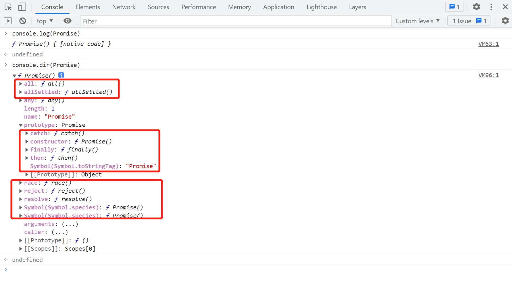
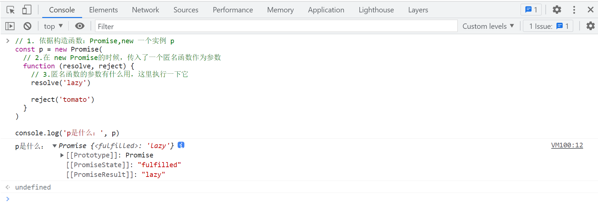

# 01.Promise 基础知识

## start

- `Promise` 中文释义： _承诺_。
- `Promise` 使用的非常广泛，不仅要掌握，而且还要非常熟练。

## 1.Promise 是什么？

### 1.1 概念

`Promise` 是**异步编程**的一种解决方案，比传统的解决方案：_"回调函数和事件"_ 更合理和更强大。所谓 `Promise`，简单说就是一个容器，里面保存着某个未来才会结束的事件（通常是一个异步操作）的结果。

### 1.2 粗略的理解一下 Promise

`抽象理解`

- `Promise` 是一门新的技术(ES6 规范)

- `Promise` 是 JS 中进行异步编程的新解决方案

  > 备注：旧方案是单纯使用回调函数

`具体表达`

- 从语法上来说: `Promise` 是一个构造函数
- 从功能上来说: `Promise` 对象用来封装一个异步操作并可以获取其成功/ 失败的结果值

## 2.为什么要是用 Promise?

### 2.1 异步编程的常见场景

1. 定时器
2. `ajax`请求
3. `nodejs`的文件操作模块(fs 模块) ==>读取文件时是异步的。

#### 2.1.1 定时器

```js
// 浏览器环境
setTimeout(function () {
  console.log('1.定时器')
}, 2000)
```

#### 2.1.2 ajax 请求

```js
// 浏览器环境
const xhr = new XMLHttpRequest()

xhr.open('get', 'http://www.baidu.com')

xhr.send()

xhr.onreadystatechange = function () {
  if (xhr.readyState === 4) {
    if (xhr.status >= 200 && xhr.status < 300) {
      console.log('2.ajax请求', xhr.status)
    } else {
      console.log('请求失败: status: ' + xhr.status)
    }
  }
}
```

#### 2.1.3 NodeJs 中读取文件

```js
// nodejs环境
const fs = require('fs')

fs.readFile('1.promise.md', (err, data) => {
  // 如果出错 则抛出错误
  if (err) throw err
  //输出文件内容
  console.log('3.nodejs中读取文件', data.toString())
})
```

### 2.2 旧的处理方案（单纯使用回调函数）

**1》**就以读取文件为例，读取文件，然后注册一个回调函数，用以处理读取完文件后的操作。

```js
const fs = require('fs')

fs.readFile('1.promise.md', (err, data) => {
  // 如果出错 则抛出错误
  if (err) throw err
  //输出文件内容
  console.log(data.toString())
})
```

**2》**如果希望，在读取完第一个文件之后，再读取第二个文件，依次类推，读取多个文件。

```js
const fs = require('fs')

// 1.读取第一个文件
fs.readFile('1.promise1.md', (err, data) => {
  if (err) throw err
  console.log(data.toString())

  // 2.读取第二个文件
  fs.readFile('1.promise2.md', (err, data) => {
    if (err) throw err
    console.log(data.toString())

    // 3.读取第三个文件
    fs.readFile('1.promise3.md', (err, data) => {
      if (err) throw err
      console.log(data.toString())
    })
  })
})
```

由于需求规定，必须等前一个文件读取完，再读取后一个文件。

所以目前只能把读取后面文件的代码，写在前一个读取文件的回调函数中。

**4》**写到这里，有这么几个问题：

1. 演示的代码读取的是三个文件，如果需要读取的文件数量很多怎么办？

   > - 如果文件数量很多，回调函数中嵌套的大括号，层级会非常多。
   >
   > - 代码的结构就类似 `>` 这种结构，这就叫做回调地狱。

2. 如果读取过程中某一个地方出错了，如何快速处理异常？

3. 回调函数必须提前写好，不是很方便。

### 2.3 为什么使用 Promise？

**1-**指定回调函数的方式更加灵活

- 旧的: 必须在启动异步任务前指定。
- `Promie` : 启动异步任务 => 返回 `Promie` 对象 => 给 `Promie` 对象绑定回调函数(甚至可以在异步任务结束后指定/多个)。

**2-**支持链式调用, 可以解决回调地狱问题

- 旧的：回调地狱，不便于阅读，不便于异常处理。
- `Promie` 链式调用，来解决回调地狱问题。

**3-**`async awiat`

- Promise 只是简单的改变格式，并没有彻底解决上面的问题真正要解决上述问题，`promise + async/await`实现异步传同步。
  > _`async/await` 在以后的 `await`和`async`的博客再细说。_

## 3. Promise 怎么用?

### 3.1 打印一下！

```js
// 打印出来 Promise 它是一个方法，我们换个方式继续打印
console.log(Promise)

// `console.dir` 可以打印一个对象所有的属性和方法。  （ps:由上面的console.log，我们知道它是一个函数。函数本身也是一个特殊的对象，我们打印一下看看它有哪些属性和方法）
console.dir(Promise)
```



①：可以得知 `Promise` 本身是一个函数；
②：这个函数对象本身有一些自己的方法，例如：（`all`,`race`,`resolve`,`reject`）
③：它的 `portotype` (显式原型)上除了默认的 `constructor`，还有一些独有的方法，例如：(`then`，`catch`，`finally`)

### 3.2 MDN 官网

[MDN 官网-Promise](https://developer.mozilla.org/zh-CN/docs/Web/JavaScript/Reference/Global_Objects/Promise)

### 3.3 其他教程

[阮一峰的 ES6_Promise 教程](https://es6.ruanyifeng.com/#docs/promise)

### 3.4 开始使用

查看了资料，了解了 `Promise` 的基本用法，现在来动手尝试一下。

```js
const p = new Promise(function(resolve, reject) {
  // ... some code

  if (/* 异步操作成功 */){
    resolve(value);
  } else {
    reject(error);
  }
});

console.log(p)
```

`解读一下上面的代码`

1. `Promise` 是一个函数，通过 `new` 关键词实例化使用。
2. `Promise` 实例化时，传入一个**匿名函数**.

```js
const p = new Promise(
  // 1. new Promise的时候，传入一个匿名函数
  function (resolve, reject) {
    // 2.这里面可以做一些逻辑处理 同步异步皆可
    // ... some code
    // if (/* 异步操作成功 */) {
    //     resolve(value);
    // } else {
    //     reject(error);
    // }
  }
)

console.log(p)
```

3. 传入的匿名函数，有两个形参，一个 `resolve` ，一个 `reject`。

   > - 代码中是如何使用这两个形参的？
   > - 直接在这两个形参后面加了一对括号，加了括号代表执行，也就是说这两个形参是函数。
   > - 这两个函数还可以接受，传入了实参 `value`、`error`

4. 那我们把代码改成这样的，去运行一下尝试一下。

```js
// 1. 依据构造函数：Promise,new 一个实例 p
const p = new Promise(
  // 2.在 new Promise的时候，传入了一个匿名函数作为参数
  function (resolve, reject) {
    // 3.匿名函数的参数有什么用，这里执行一下它
    resolve('lazy')

    reject('tomato')
  }
)

console.log('p是什么：', p)
```

5. 运行截图



5. 截图中的这个`[[PromiseState]]`是什么？

- 双方括号括起来的属性，表示 JS 中的一个内部属性，不能在代码中直接访问。

- `[[PromiseState]]` 存储的是这个 `Promise` 实例的状态。

### 3.5 p(Promise 实例)的状态

**`[[PromiseState]]` 存储的是这个 `Promise` 实例的状态。**

1. 实例对象 p 中的一个属性 `[[PromiseState]]`，它的值有三种情况：

   1. `pending` 未决定的；

   2. `resolved` / `fullfilled` 成功；

   3. `rejected` 失败；

   > ` State => 状态`，`PromiseState=> Promise的状态`

2. 实例对象 p(`Promise` 实例)的状态改变有哪几种情况?

   1. 由默认的 `pending` 变为 `resolved`
   2. 由默认的 `pending` 变为 `rejected`
      > - 注意 `Promise`实例的状态，只有这两种情况 。
      >
      > - 而且 一个 `Promise` 对象状态只能改变一次，无论变为成功还是失败, 都会有一个结果数据。
      >
      > - 成功的结果数据一般称为 value, 失败的结果数据一般称为 reason。

3. 如何改变实例对象 p(`Promise` 实例) 的状态
   在`new Promise()`传入的匿名函数中，以下情况，会改变实例对象的状态。

   - 调用`resolve(value)`: 如果当前状态是 `pending` 就会变为 `resolved`；

   - 调用`reject(reason)`: 如果当前状态是 `pending` 就会变为 `rejected；`

   - 抛出异常: 如果当前状态是 `pending` 就会变为 `rejected`；

### 3.6 实例的 `.then()` 方法

实例的`then`方法可以接受两个回调函数作为参数。第一个回调函数是 `Promise` 对象的状态变为 `resolved` 时调用，第二个回调函数是 `Promise` 对象的状态变为 `rejected` 时调用。

### 3.7 开始使用 Promise

> 说了那么多，写一个基本的用法

```js
// 说下执行顺序

const p = new Promise(function (resolve, reject) {
  // 1
  // 2
  resolve('lazy') // 4
  console.log(1) // 3
  reject('tomato') // 实例的状态已经改变了，这里不会再改变状态了
})

p.then(
  (res) => {
    console.log(res) // 5
  },
  (err) => {
    console.log(err)
  }
)

// 1
// lazy
```

### 3.8 异步下的 Promise

```js
const p = new Promise(function (resolve, reject) {
  // 1
  console.log('hello') // 2
  // 3 (执行setTimeout)
  setTimeout(function () {
    reject('tomato') // 5
  }, 2000)
})

// 4
p.then(
  (res) => {
    console.log(res)
  },
  (err) => {
    console.log('1', err) // 6
  }
)

// hello
// '1'  tomato
```

## 4.promise 实例上的方法

### 4.1 then

`代码示例`

```js
const p = new Promise(function (resolve, reject) {
  setTimeout(function () {
    resolve('tomato')
  }, 2000)
})

p.then(
  (res) => {
    console.log('1', res)
  },
  (err) => {
    console.log('2', err)
  }
)

// 1 tomato
```

`注意事项`

> 1. `then`方法可以接受两个回调函数作为参数。
>    - 第一个回调函数是 Promise 对象的状态变为`resolved`时调用；
>    - 第二个回调函数是 Promise 对象的状态变为`rejected`时调用。
> 2. 两个函数都是可选的，不一定要提供。
> 3. `then`方法返回的是一个**新的 Promise 实例**。
> 4. 绝大多数实际使用的时候，主要处理成功的回调，错误的回调统一由后续的 `catch` 处理。

### 4.2 catch

`代码示例`

```js
const p = new Promise(function (resolve, reject) {
  setTimeout(function () {
    reject('tomato')
  }, 2000)
})

p.catch((err) => {
  console.log(err)
})

// tomato
```

`注意事项`

> 1. `catch`方法可以接受一个回调函数作为参数。
> 2. 回调函数触发的方式有：
>
> - `Promise` 对象的状态变为 `rejected` 时调用。
>
> - `then()` 方法指定的回调函数，如果运行中抛出错误，也会被 `catch()` 方法捕获。
> - new 实例中的匿名函数运行报错，也会进 `catch`。
>
> 3. `catch` 方法返回的也是一个**新的 `Promise` 实例**

### 4.3 finally

`代码`

```js
// 1.finally()方法用于指定不管 Promise 对象最后状态如何，都会执行的操作。该方法是 ES2018 引入标准的。
promise
.then(result => {···})
.catch(error => {···})
.finally(() => {···});


// finally本质上是then方法的特例。
promise
.finally(() => {
  // 语句
});

// 等同于
promise
.then(
  result => {
    // 语句
    return result;
  },
  error => {
    // 语句
    throw error;
  }
);
```

## 5.Promise 构造函数上的方法

### 1. Promise.all()

Promise.all()方法用于将多个 Promise 实例，包装成一个新的 Promise 实例。

```js
Promise.all([Promise.resolve('2'), Promise.resolve('3'), Promise.resolve('4')])
```

上面代码中，Promise.all()方法接受一个数组作为参数，p1、p2、p3 都是 Promise 实例，如果不是，就会先调用下面讲到的 Promise.resolve 方法，将参数转为 Promise 实例，再进一步处理。另外，Promise.all()方法的参数可以不是数组，但必须具有 Iterator 接口，且返回的每个成员都是 Promise 实例。

p 的状态由 p1、p2、p3 决定，分成两种情况。

（1）只有 p1、p2、p3 的状态都变成 fulfilled，p 的状态才会变成 fulfilled，此时 p1、p2、p3 的返回值组成一个数组，传递给 p 的回调函数。

（2）只要 p1、p2、p3 之中有一个被 rejected，p 的状态就变成 rejected，此时第一个被 reject 的实例的返回值，会传递给 p 的回调函数。

> **简单总结:**
>
> 1. 接收有 Iterator 接口的数据作为参数，例如数组。
> 2. 参数中的每一项，都是一个 `Promise` 实例。（不是 `Promise` 实例的，会被转换为`Promise` 实例）
> 3. 当所有的项都成功的时候，Promise.all() 才返回包含成功数据的一个数组。
> 4. 只要有一项失败，Promise.all() 返回失败。

### 2. Promise.race()

Promise.race()方法同样是将多个 Promise 实例，包装成一个新的 Promise 实例。

```js
const p = Promise.race([p1, p2, p3])

const p = Promise.race([
  2,
  new Promise(function (resolve, reject) {
    setTimeout(() => reject(new Error('request timeout')), 5000)
  }),
])

console.log(p)
```

Promise.race()方法的参数与 Promise.all()方法一样，如果不是 Promise 实例，就会先调用下面讲到的 Promise.resolve()方法，将参数转为 Promise 实例，再进一步处理。
只要 p1、p2、p3 之中有一个实例率先改变状态，p 的状态就跟着改变。那个率先改变的 Promise 实例的返回值，就传递给 p 的回调函数。

> **简单总结:**
>
> 1. 接收有 Iterator 接口的数据作为参数，例如数组。
> 2. 参数中的每一项，都是一个 `Promise` 实例。（不是 `Promise` 实例的，会被转换为`Promise` 实例）
> 3. 只要有一项状态改变，Promise.race() 返回对应状态。
> 4. `race` 有竞速的意思，也就是多个异步事件，取返回最快的事件。

### 3. Promise.allSettled()

Promise.all()方法只适合所有异步操作都成功的情况，如果有一个操作失败，就无法满足要求。

为了解决这个问题，ES2020 引入了 Promise.allSettled()方法，用来确定一组异步操作是否都结束了（不管成功或失败）。所以，它的名字叫做”Settled“，包含了”fulfilled“和”rejected“两种情况。

返回值的状态只可能为成功;

返回值的结果呢是根据传递来的数据依次排序的，其次成功则 status=fulfilled，失败则 status=rejected

```js
async function tomato() {
  let p = await Promise.allSettled([
    '2',
    new Promise(function (resolve, reject) {
      reject('error')
      setTimeout(() => reject('error'), 5000)
    }),
  ])
  console.log(p)
  /* 
            PromiseState:'fulfilled'
            PromiseResult:[
                {
                    "status": "fulfilled",
                    "value": "2"
                },
                {
                    "status": "rejected",
                    "reason": "error"
                }
            ]
            */
}

tomato()
```

> **简单总结:**
>
> 1. 接收有 Iterator 接口的数据作为参数，例如数组。
> 2. 参数中的每一项，都是一个 `Promise` 实例。（不是 `Promise` 实例的，会被转换为`Promise` 实例）
> 3. 当一组 `Promise` 都执行完毕了，才会返回一个成功的 `Pormise`，对应值，是包含返回结果的数组，数组有成功也有失败。

### 4. Promise.any()

ES2021 引入了 Promise.any()方法。该方法接受一组 Promise 实例作为参数，包装成一个新的 Promise 实例返回。

只要参数实例有一个变成 fulfilled 状态，包装实例就会变成 fulfilled 状态；如果所有参数实例都变成 rejected 状态，包装实例就会变成 rejected 状态。

Promise.any()跟 Promise.race()方法很像，只有一点不同，就是 Promise.any()不会因为某个 Promise 变成 rejected 状态而结束，必须等到所有参数 Promise 变成 rejected 状态才会结束。

> 取第一个成功的 `Promise`

### 5. Promise.resolve()

作用:

将现有对象转为 Promise 对象

Promise.resolve()方法的参数分成四种情况。

（1）参数是一个 Promise 实例

如果参数是 Promise 实例，那么 Promise.resolve 将不做任何修改、原封不动地返回这个实例。

（2）参数是一个 thenable 对象

thenable 对象指的是具有 then 方法的对象，比如下面这个对象。

```js
let thenable = {
  then: function (resolve, reject) {
    resolve(42)
  },
}
```

Promise.resolve()方法会将这个对象转为 Promise 对象，然后就立即执行 thenable 对象的 then()方法。

（3）参数不是具有 then()方法的对象，或根本就不是对象

如果参数是一个原始值，或者是一个不具有 then()方法的对象，则 Promise.resolve()方法返回一个新的 Promise 对象，状态为 resolved。

```js
const p = Promise.resolve('Hello')

p.then(function (s) {
  console.log(s)
})
// Hello
```

（4）不带有任何参数
Promise.resolve()方法允许调用时不带参数，直接返回一个 resolved 状态的 Promise 对象。
所以，如果希望得到一个 Promise 对象，比较方便的方法就是直接调用 Promise.resolve()方法。

### 6. Promise.reject()

Promise.reject(reason)方法也会返回一个新的 Promise 实例，该实例的状态为 rejected。
Promise.reject()方法的参数，**会原封不动地作为 reject 的理由，变成后续方法的参数。**

## end

- 加油
