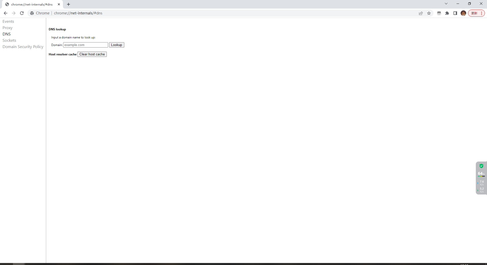
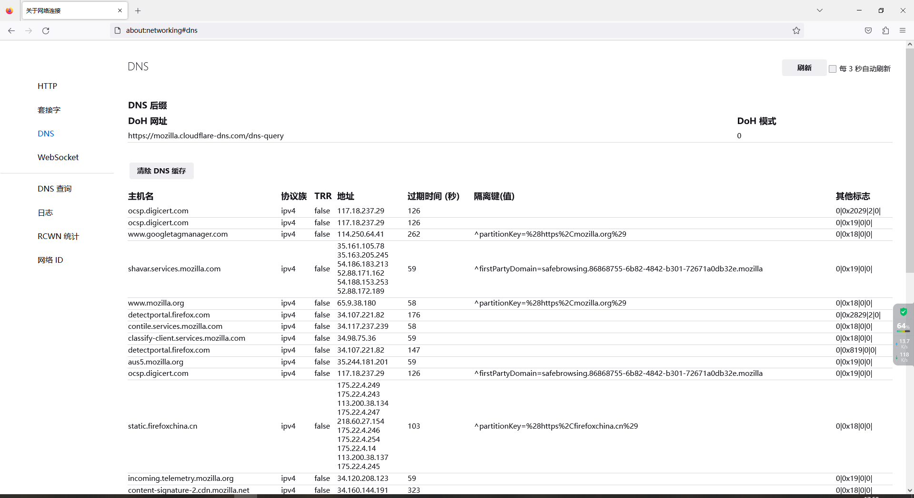
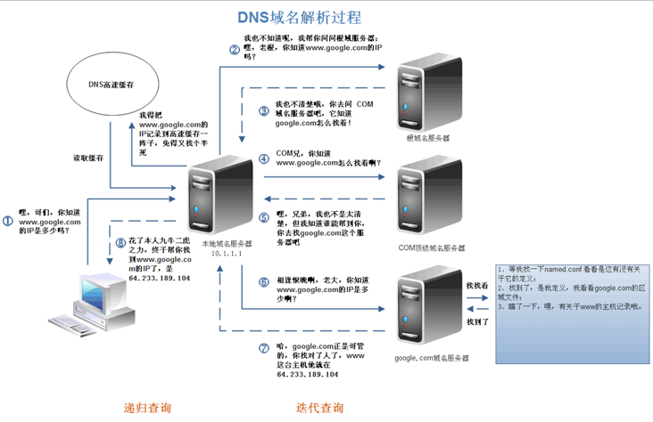
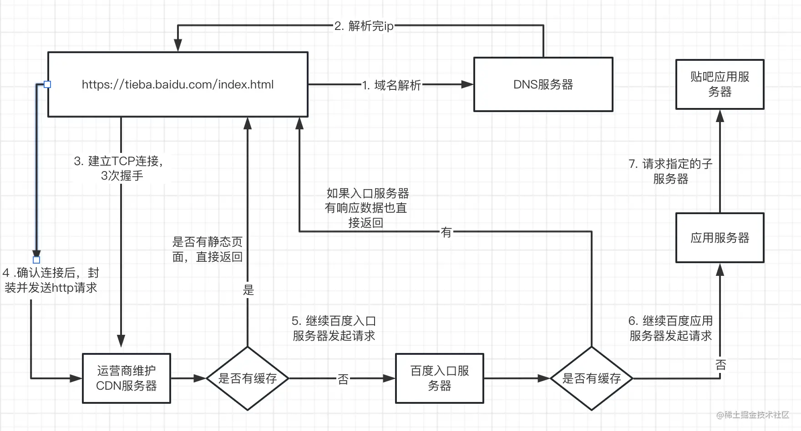

# 5.地址栏输入URL到页面展现都经历了哪些过程


## start

> 概要：

1. 浏览器解析 url
2. DNS解析
3. 建立TCP连接（3次握手）
4. 发送HTTP请求（请求行/头/体）
5. 服务器处理收到的请求，将数据返回浏览器
6. 浏览器收到HTTP响应
7. 读取内容，解析html，浏览器渲染
8.  生成dom树、解析css样式、js交互；


## 个人理解


### 1.浏览器解析 url

+ 看看输入的是不是一个合法的 `URL` 链接；

+ 若是则判断输入的 URL 是否完整。不完整的话，浏览器可能会对域猜测，也就是说尝试通过在输入的内容中添加前缀、后缀或两者来 “补全” `URL`。比如输入 `zhihu.com` 则可能会在前面添加 `www`；

+ 否，那就将输入的内容作为搜索的条件，使用用户设置的默认搜索引擎来进行搜索；


### 2. DNS 解析

#### 2.1 DNS 是什么？

DNS全称 `Domain Name System`，也就是域名系统（域名解析系统）。


#### 2.2 DNS 有什么用？

域名系统是因特网的一项内核服务，它作为可以将域名和IP地址相互映射的一个分布式数据库，能够使人更方便的访问互联网，而不用去记住能够被机器直接读取的IP数串。

```
服务器的地址是一串ip，例如：192.16.0.1
我们访问网站的地址可以为 `www.baidu.com` 或者 ip(192.16.0.1)

这么一长串 ip地址我们记不住怎么办？记域名即可，所以域名和ip相互映射。
但是机器不知道他们的映射关系，这就需要 DNS 去解析对应的域名，拿到对应的ip。
```


#### 2.3 DNS解析的顺序：是怎样的？

```
浏览器缓存->本地hosts文件->路由器缓存->本地DNS服务器->根DNS服务器->顶级域名服务器->主域名服务器
```


##### 2.3.1 查看浏览器的缓存

> + 谷歌浏览器 `chrome://net-internals/#dns`
>
>   
>
> + 火狐浏览器 `about:networking#dns`
>
>   
>
> 


##### 2.3.2 本地hosts文件

> + Unix、类Unix系统（例如 Linux、MacOs 等） ：`/etc/hosts`
> + windows系统：`C:\Windows\System32\drivers\etc\hosts`


##### 2.3.3  hosts文件使用方式

> ```bash
> # 注释
> 147.104.30.125 www.baidu.com
> 
> 147.104.30.125 www.taobao.com
> 
> # windows系统中可以使用 记事本打开 （修改需要管理员权限）
> ```


##### 2.3.4  DNS 域名解析过程




> ```bash
> 根DNS服务器->   查询 com 对应那个域名服务器
> 顶级域名服务器->  查询 baidu.com 对应那个域名服务器
> 主域名服务器->   查询 www.baidu.com 对应的ip
> ```


### 3. 建立tcp连接 (三次握手)

### 4. 发送请求

### 5. 服务器处理收到的请求，将数据返回浏览器

### 6. 浏览器收到HTTP响应

### 7. 读取内容，解析html，浏览器渲染

### 8. 生成dom树、解析css样式、js交互；


## 流程总结




## 相关优质博客

+ [[初识网络原理: 从浏览器地址栏输入 URL 到页面渲染之间都经历了什么](https://segmentfault.com/a/1190000021227146)](https://segmentfault.com/a/1190000021227146)
+ [[前端经典面试题: 从输入URL到页面加载发生了什么？](https://segmentfault.com/a/1190000006879700)](https://segmentfault.com/a/1190000006879700)