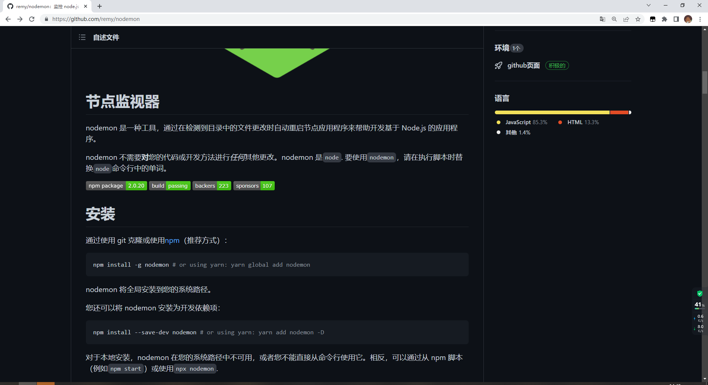
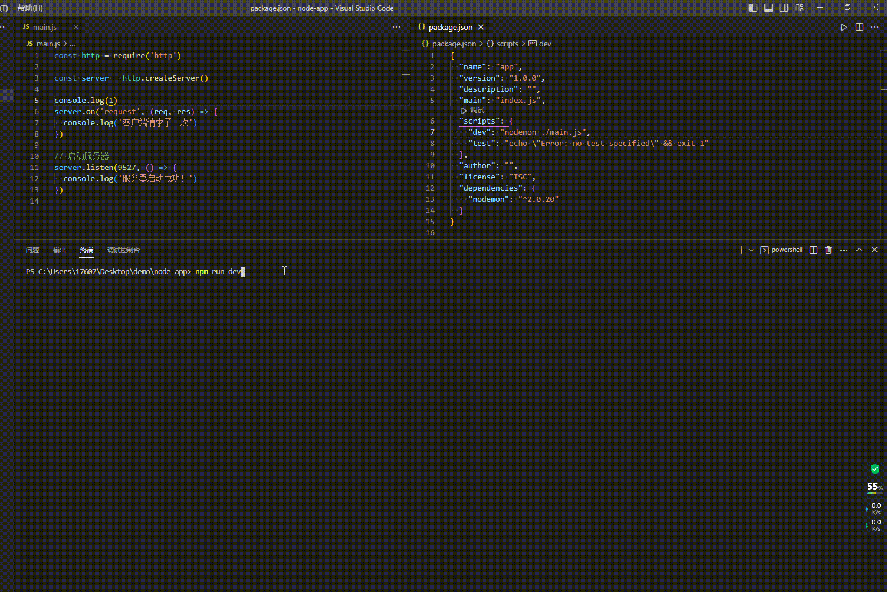

# nodejs 中 nodemon 热更新原理

## start

- 我很早以前学习 nodejs 的时候，搭建了一个本地服务，每次本地修改代码完毕之后，需要手动重启服务。（非常繁琐）
- 然后就接触到了热更新这么一个概念，只需要安装一个依赖`nodemon`，然后利用这个依赖来启动服务，就能实现本地代码修改了，后台服务实时刷新。
- 今天来研究一下这里的热更新逻辑。

## 插件源码

nodemon github [源码地址](https://github.com/remy/nodemon)



`官方解释：`
nodemon 是一种工具，通过在检测到目录中的文件更改时自动重启节点应用程序来帮助开发基于 Node.js 的应用程序。

nodemon 不需要对您的代码或开发方法进行任何其他更改。nodemon 是 node. 要使用 nodemon，请在执行脚本时替换 node 命令行中的单词。

## 使用案例

我使用 nodejs 自带的 http 模块搭建一个基础的本地服务，端口为 9527。代码如下

```js
// main.js
const http = require('http')

const server = http.createServer()

server.on('request', (req, res) => {
  console.log('客户端请求了一次')
})

// 启动服务器
server.listen(9527, () => {
  console.log('服务器启动成功！')
})
```

通常，我们是使用 `node main.js` 来执行对应的 js 文件的。

> 这种方式并不支持代码实时更新。

可以`npm i -g nodemon`然后下载完毕依赖后，使用 `nodemon ./main.js` 执行对应的 js 文件。后续在修改 `main.js` 的时候，无需重启服务，这个依赖会帮我们自动热更新。



## 主干原理

1. 利用 `chokidar` 监听文件的改变。
2. 重新运行`node ./main.js`

## 博客

[探索 nodemon 的实现（源码）](https://www.jianshu.com/p/0f4c531daa9a)
