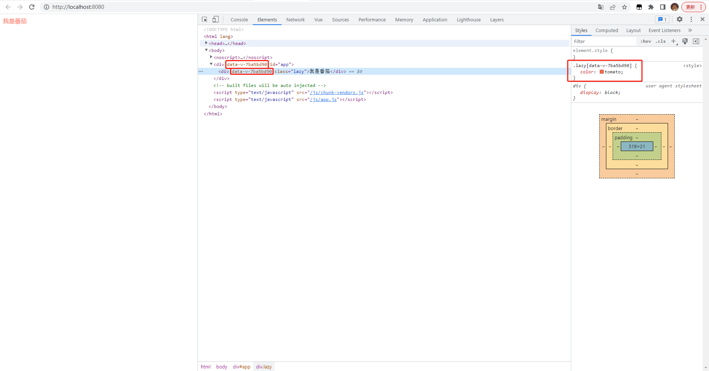
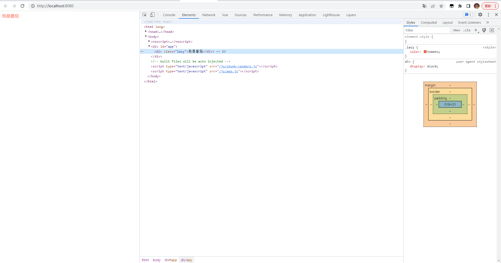

# 1.vue 文件中的 scoped 属性

## start

- 在 `vue` 文件中，我们经常会见到，在 `<style></style>` 标签上存在一个 `scoped` 属性。

- 通过这个 `scoped` 属性，我们可以达到组件之间样式隔离的目的。但是它本质原理的是什么的？

- **研究一下**。

## 正文

### 1. 英文翻译

`scoped`: 作用域内的

> 可以理解限制作用域的意思。

### 2. 使用 ` scoped` 前后差异

对比一下，使用 `scoped` 属性前后，页面的差异。


`添加scoped`

```vue
<template>
  <div id="app">
    <div class="lazy">我是番茄</div>
  </div>
</template>

<style scoped>
.lazy {
  color: tomato;
}
</style>

```





`不添加scoped`

```vue
<template>
  <div id="app">
    <div class="lazy">我是番茄</div>
  </div>
</template>

<style>
.lazy {
  color: tomato;
}
</style>
```





查看上述的内容，我们可以很明显的发现，使用了 `scoped` 属性，会在元素的标签上添加 `data-v-7ba5bd90` 属性。与此同时，还会在对应样式选择器上添加`data-v-7ba5bd90`，以此来达到样式隔离的目的。

> `data-v-7ba5bd90`：是 html5 新增的自定义属性。
>
> `data-`：是自定义属性的前缀。
>
> `7ba5bd90`：是随机的 8 位 hash 值。


### 3.  自定义属性如何实现？

**通过 `vue-loader` 实现**

[相关文章，点击这里：](https://juejin.cn/post/7098569051860893709#heading-1)


### 4. 修改组件库的样式

日常中的开发，修改组件库的样式是很常见的需求。

例如修改`element-ui` 的默认样式。


```
stylus的样式穿透 使用>>> 

sass和less的样式穿透 使用/deep/
```


