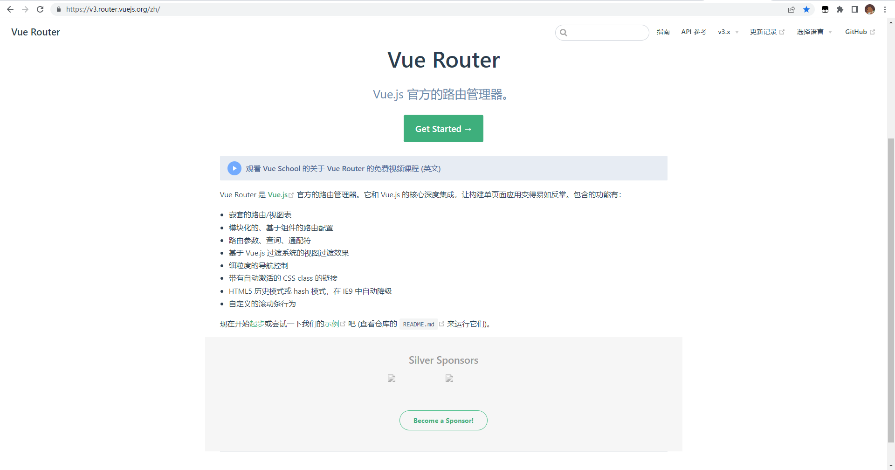

# 深入浅出 Vue-Router基础概念(1)_番茄出品


## Start

+ 从今天起，我决定开始**重新复习**（重新深入学习） `Vue-Router`；并编写相关的博客。

+ 博客的内容，会从它的基础使用，到源码分析。尽可能由浅入深的介绍和掌握 `Vue-Router`；

+ 我最近时常有这样的感觉：

  > 我之所以对一个新接触的框架/库，感到莫名的恐惧。
  >
  > 绝大多数情况都是因为我不足够了解它。
  >
  > 如果我把恐惧的时间，用于深入了解这些框架/库，回过头我发现，其实这些库没有我想象中那么难。
  >
  > （代码不也是用`JavaScript`写的？）
  >
  > 互勉

+ 本文作者：upward_tomato；

+ 编写时间：2023/03/06-23/49


**注意：本文主要以 vue-router@3.0 进行解释说明**


## 1.什么是路由？

在网络通信中,“路由”是一个网络层的术语。*它是指从某一网络设备出发去往某个目的地的路径;*


对于我经常接触的场景来说，一般分为：

+ 后端路由
+ 前端路由

后端路由，例如早期我使用 nodejs+模板引擎编写一个后端服务。不同的路由地址，会匹配不同的页面/资源并返回。

例如：

```
http://lazy_tomato/home          => 获取并展示home页面

http://lazy_tomato/sayHello      => 获取并展示sayHello页面
```


## 2.什么是前端路由

### 2.1 前端页面发展的历程

1. 最初是后端把页面都处理好,直接返回给浏览器;
2. 然后出现了ajax,页面上一部分交互是使用ajax去实时刷新的;
3. 然后开始流行前端三大框架,然后开始流行单页面应用;
4. 单页面应用（single page web application）,简称SPA。

单页面应用,只有一个主页面,但是功能的切换,需要hash history 配合实现。

> 有关前端的路由的 `hash` 和  `history`，可以查看博客：[我想理解 hash history 两种前端路由](https://blog.csdn.net/wswq2505655377/article/details/124482841)

### 2.2 前端路由的工作方式

用户点击了页面上的路由链接;

1. 导致了url地址栏中的值发生了变化,但是页面不会刷新（利用了hash history实现）;

2. 前端路由监听了地址的变化;

3. 前端路由把当前地址对应的组件渲染都浏览器中;

> 本质上,其实就是浏览器的url变化,不刷新浏览器,切换页面展示。hash / history就可以实现我们这一要求。


## 3.为什么要有(用) Vue-Router?

在开始介绍 `Vue-Router` 使用方法之前，我在思考为什么要用它？它能带来了那些好处？毕竟学习任何一个东西都是有学习成本的。

[》》》官网地址点击这里《《《](https://v3.router.vuejs.org/zh/)



结合官网的首页，我列举一下我觉得比较关键的结论：

1. 方便我们定义路由和对应的视图。（注意：**支持嵌套**）

   > 如果让我们手动维护这些路由视图表，当路由表的内容增大，我们维护起来会异常困难。

2. 支持模块化，支持基于组件的路由配置。

3. 支持路由传参等逻辑。

4. 支持 history 模式和 hash 模式，两种模式切换轻松。

   


## 4.怎么使用 Vue-Router?


## 5.$router $route route三者的区别


## End


## 


