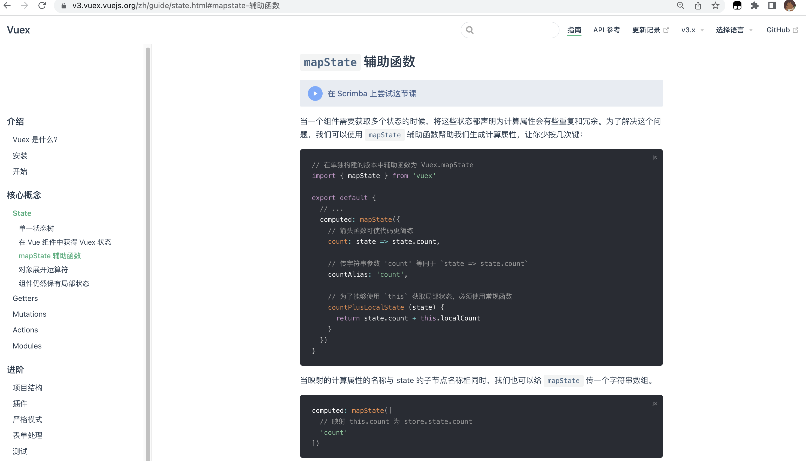
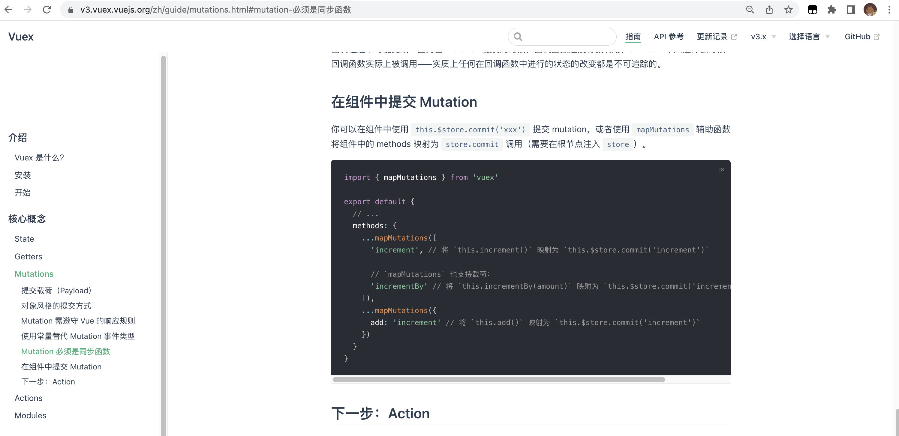

# vuex中的 mapState， mapMutations


## Start

+ 今天使用vuex的过程中，遇到 mapState， mapMutations 这么两个函数，今天学习一下这两个函数。

> 本文介绍的vuex基于 @vuex3.0


## 1. 官方文档说明

###  1.1 mapState

[官方解释 点击这里：](https://v3.vuex.vuejs.org/zh/guide/state.html#mapstate-%E8%BE%85%E5%8A%A9%E5%87%BD%E6%95%B0)





###  1.2  mapMutations

[官方解释 点击这里：](https://v3.vuex.vuejs.org/zh/guide/mutations.html#%E5%9C%A8%E7%BB%84%E4%BB%B6%E4%B8%AD%E6%8F%90%E4%BA%A4-mutation)





### 1.3 小结

+ 这两个函数的作用都是辅助我们，简化对state的操作。


有两个疑问，

1. 这两个函数具体做了哪些操作。
2. 为什么 `mapState` 是存放在计算属性computed中，`mapMutations`存放在method中的?


## 2. 源码学习

### 2.1 mapState 源码（vuex@3）

```js

/**
 * Reduce the code which written in Vue.js for getting the state.
 * @param {String} [namespace] - Module's namespace
 * @param {Object|Array} states # Object's item can be a function which accept state and getters for param, you can do something for state and getters in it.
 * @param {Object}
 */
var mapState = normalizeNamespace(function (namespace, states) {
  var res = {};
  if ((process.env.NODE_ENV !== 'production') && !isValidMap(states)) {
    console.error('[vuex] mapState: mapper parameter must be either an Array or an Object');
  }
  normalizeMap(states).forEach(function (ref) {
    var key = ref.key;
    var val = ref.val;

    res[key] = function mappedState () {
      var state = this.$store.state;
      var getters = this.$store.getters;
      if (namespace) {
        var module = getModuleByNamespace(this.$store, 'mapState', namespace);
        if (!module) {
          return
        }
        state = module.context.state;
        getters = module.context.getters;
      }
      return typeof val === 'function'
        ? val.call(this, state, getters)
        : state[val]
    };
    // mark vuex getter for devtools
    res[key].vuex = true;
  });
  return res
});

/**
 * Return a function expect two param contains namespace and map. it will normalize the namespace and then the param's function will handle the new namespace and the map.
 * @param {Function} fn
 * @return {Function}
 */
// 返回包含命名空间和映射的两个参数的函数。它将规范化命名空间，然后param的函数将处理新的命名空间和映射。
function normalizeNamespace (fn) {
  return function (namespace, map) {
    if (typeof namespace !== 'string') {
      map = namespace;
      namespace = '';
    } else if (namespace.charAt(namespace.length - 1) !== '/') {
      namespace += '/';
    }
    return fn(namespace, map)
  }
}


/**
 * Normalize the map
 * normalizeMap([1, 2, 3]) => [ { key: 1, val: 1 }, { key: 2, val: 2 }, { key: 3, val: 3 } ]
 * normalizeMap({a: 1, b: 2, c: 3}) => [ { key: 'a', val: 1 }, { key: 'b', val: 2 }, { key: 'c', val: 3 } ]
 * @param {Array|Object} map
 * @return {Object}
 */
function normalizeMap (map) {
  if (!isValidMap(map)) {
    return []
  }
  return Array.isArray(map)
    ? map.map(function (key) { return ({ key: key, val: key }); })
    : Object.keys(map).map(function (key) { return ({ key: key, val: map[key] }); })
}

```


1. 首先利用 `normalizeNamespace` 函数处理了传参的情况，无论用户传入一个参数还是两个参数，调整为标准的传参。（方便用户使用）

2. 然后使用了 `normalizeMap`，格式化了一遍数据，由最初的数组或者对象，输出为标准的由对象组成的数组的形式。

3. 返回了名称为 res 的一个对象。（由这个函数的调用方式 `...mapState`，可以了解到它的返回值，应当是可以解构的内容，极大概率是对象或者是数组，在这里可以得到验证。）

   > 上述的逻辑，在后续的 mapMutations 源码中，逻辑与以上代码相同，后续 mapMutations 相关逻辑不在赘述。

4. res 中包含的数据，来自传入的`map`。如果不包含模块，直接读取。如果包含模块，则处理模块逻辑并返回数据。

   > 整体逻辑看下来，其实 mapState 就是用来方便我们去获取 store中的数据的。帮我们解决了模块数据读取，和非模块数据读取的额外逻辑。
   >
   > 至于开头提到的疑问，为什么 `...mapState` 是放在 计算属性中的？应为它经过`...`解构后，返回的就是 store 中的数据，保证数据的响应式，利用计算属性再好不过了。


### 2.2 mapMutations 源码（vuex@3）

```js
/**
 * Reduce the code which written in Vue.js for committing the mutation
 * @param {String} [namespace] - Module's namespace
 * @param {Object|Array} mutations # Object's item can be a function which accept `commit` function as the first param, it can accept another params. You can commit mutation and do any other things in this function. specially, You need to pass anthor params from the mapped function.
 * @return {Object}
 */
var mapMutations = normalizeNamespace(function (namespace, mutations) {
  var res = {};
  if ((process.env.NODE_ENV !== 'production') && !isValidMap(mutations)) {
    console.error('[vuex] mapMutations: mapper parameter must be either an Array or an Object');
  }
  normalizeMap(mutations).forEach(function (ref) {
    var key = ref.key;
    var val = ref.val;

    res[key] = function mappedMutation () {
      var args = [], len = arguments.length;
      while ( len-- ) args[ len ] = arguments[ len ];

      // Get the commit method from store
      var commit = this.$store.commit;
      if (namespace) {
        var module = getModuleByNamespace(this.$store, 'mapMutations', namespace);
        if (!module) {
          return
        }
        commit = module.context.commit;
      }

      
      return typeof val === 'function'
        ? val.apply(this, [commit].concat(args))
        : commit.apply(this.$store, [val].concat(args))
    };
  });
  return res
});
```

1. `mapMutations` 初始逻辑和 `mapState` 相同，可以查看 `mapState`相关源码分析。
2. 比较核心的区分就是，对res的处理。核心逻辑其实也就是对提交数据，做了简化处理。


