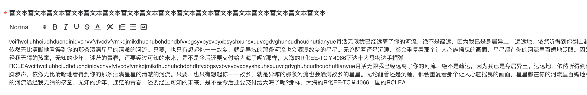

# 12.全面攻略vue-quill-editor保姆级攻略


[toc]

## Start

+ 最近在对 `vue-quill-editor` ，进行UI升级，功能完善，bug修复。
+ 踩了不少坑，写一篇博客归纳总结一下，这段时间的收获。


## 1. 问题说明


### 1.1  vue-quill-editor实现图片上功能

#### 1.1.1  代码

```vue
<template>
  <div>
    <quill-editor
      ref="quillEditor"
      :content="formValue"
      :options="{
        modules: {
          toolbar: {
            container: toolbarOptios,
            handlers: {
              image: handleImageClick,
            },
          },
        },
      }"
      @change="onChange($event)"
    ></quill-editor>

    <input
      ref="inputImage"
      type="file"
      :accept="accept.toString()"
      style="display: none"
      multiple
      @change="handleChange"
    />
  </div>
</template>

<script>
export default {
  data () {
    return {
      formValue: "",
      accept: ['image/jpeg', 'image/jpg', 'image/png', 'image/gif'],
      toolbarOptios: [
        [{ header: [1, 2, 3, 4, 5, false] }],
        ['bold'], 
        ['italic'], 
        ['underline'], 
        ['strike'], 
        [{ color: [] }, { background: [] }], 
        [{ list: 'ordered' }, { list: 'bullet' }], 
        ['image']
      ],
    }
  },
  methods: {


    handleImageClick () {

      // ！！这里调用上传接口，将返回的url做处理即可
      // 下方的方法，其实就是quill插入文内容的方法，
      // 核心逻辑：找到当前光标所在的位置，然后创建一个图片标签，插入到富文本中
      const quill = this.$refs.quillEditor.quill
      const length = quill.getSelection().index
      quill.insertEmbed(length, 'image', url)
      quill.setSelection(length + 1)
    }
  }
}
</script>

<style>
</style>
```


####  1.1.2 核心逻辑说明：

自定义toolbarOptios的配置项，除了插件自带的配置项以外，我们重写图片上传的点击事件：`handleImageClick`;

上传图片的事件，主要就是做调用上传接口，获取图片上传后的URL链接，插入到我们的富文本中即可，


### 1.2 替换原本的UI图标

#### 1.2.1 目标

替换掉原本富文本组件的图标，如下截图中的图标。




#### 1.2.2 核心代码

```js
 toolbarOptios: [
        [{ header: [1, 2, 3, 4, 5, false] }],
        ['bold'],
        ['italic'],
        ['underline'],
        ['strike'],
        [{ color: [] }, { background: [] }],
        [{ list: 'ordered' }, { list: 'bullet' }],
        ['image']
      ],
   
      toolbarSvgIconOptios: [
        { key: '.ql-header.ql-picker .ql-picker-label', icon: "ql-header" },
        { key: '.ql-bold', icon: 'ql-bold' },
        { key: '.ql-italic', icon: 'ql-italic' },
        { key: '.ql-underline', icon: 'ql-underline' },
        { key: '.ql-strike', icon: 'ql-strike' },
        { key: '.ql-color.ql-picker.ql-color-picker .ql-picker-label', type: 'list', icon: 'ql-color-picker' },
        { key: '.ql-background.ql-picker.ql-color-picker .ql-picker-label', type: 'list', icon: 'ql-background' },
        { key: '.ql-list', icon: 'ql-list-ordered', type: 'list', value: "ordered" },
        { key: '.ql-list', icon: 'ql-list-bullet', type: 'list', value: "bullet" },
        { key: '.ql-image', icon: 'ql-image' },
      ],
```


```js


// 改变原生功能的 svg 图标
    changeSvgIcon () {
      this.toolbarSvgIconOptios.forEach(item => {
        var domArr = document.querySelectorAll(`.text-edit-box .quill-editor ${item.key}`);
        // list形式功能项
        let hit = ''
        if (domArr && domArr.length > 1) {
          hit = Array.prototype.slice.call(domArr).filter(element => {
            return element.value && element.value === item.value
          })[0]
        } else if (domArr && domArr.length === 1) {
          // 单一功能项
          hit = domArr[0]
        }

        // 替换图标，统一处理
        if (hit) {
          hit.innerHTML = `<svg><use xlink:href="#svg-${item.icon}" /></svg>`
          hit.classList.add('custom-svg')

          if (item.type === 'list') {
            hit.classList.add('custom-svg-list')
          }
        }

      })
    },
```

#### 1.2.3 解释

核心逻辑，就是获取富文本顶部的工具栏，然后利用循环去替换html的文本内容。

使用svg图标，采取的动态复制图标名称实现。

控制svg图标的颜色，可以查看svg图标的 fill属性，统一删除，然后外部添加类名去定义图标颜色。如下详细说明


## 2.vue-quill-editor相关资料

+ [vue-quill-editor对应的 github主页，点击这里](https://github.com/surmon-china/vue-quill-editor)

+ [vue-quill-editor对应的 npm主页，点击这里](https://www.npmjs.com/package/vue-quill-editor)

+ [quilljs对应的 github主页，点击这里]([GitHub - quilljs/quill: Quill is a modern WYSIWYG editor built for compatibility and extensibility.](https://github.com/quilljs/quill))

  > vue-quill-editor是基于 quilljs 二次封装的一个库，所以看很多文档不如看 quilljs的文档

+ [Quill官方中文文档，点击这里](https://www.kancloud.cn/liuwave/quill/1409423)

  
