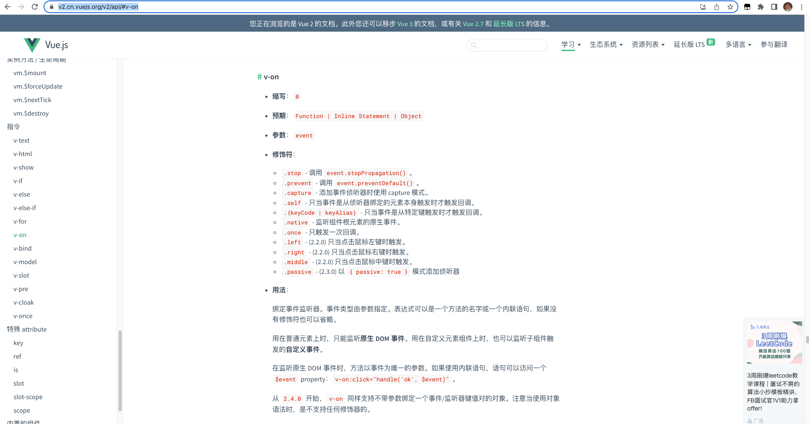
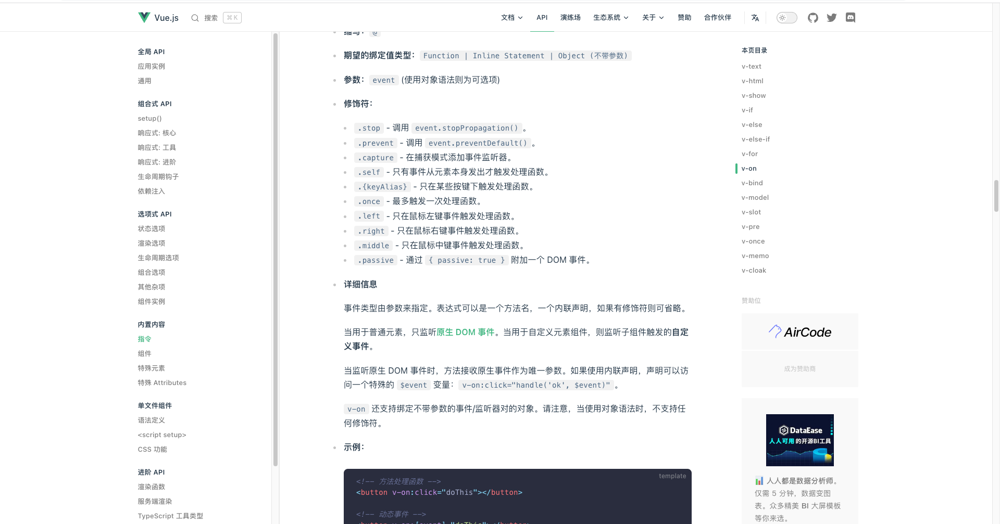

# 13.vue 中的事件修饰符介绍+示例说明

## Start

- 最近使用到 vue 的事件修饰符，发现由于时间太过久远，今天快速的过一下 vue 中的事件修饰符.

## 1. 官方文档

[vue2 v-on 点击这里](https://v2.cn.vuejs.org/v2/api/#v-on)

[vue3 v-on 点击这里](https://cn.vuejs.org/api/built-in-directives.html#v-on)

`vue2中有关 v-on 的介绍`



`vue3中有关 v-on 的介绍`



> 初步看下来，vue2 和 Vue3 中修饰符差距并不大。

## 2. 说明+实例

### 2.1 .stop

`.stop` 修饰符的作用是阻止冒泡

```vue
<template>
  <div @click="handleClick(2)">
    <button @click.stop="handleClick(1)">点击</button>
  </div>
</template>

<script>
export default {
  data() {
    return {};
  },
  methods: {
    handleClick(key) {
      console.log('你好', key);
    },
  },
};
</script>
```

js 中事件默认是由内向外层冒泡传递的。正常情况下点击按钮会依次打印 `1`,`2`。当我们并不想触发外层的事件时，我们可以用 `.stop` 阻止冒泡。

> 对应源码使用的是 `$event.stopPropagation()` 实现此功能

### 2.2 .prevent

`.prevent` 修饰符的作用是阻止默认事件

```vue
<template>
  <div>
    <a href="#" @click.prevent="handleClick(1)">点我</a>
  </div>
</template>

<script>
export default {
  data() {
    return {};
  },
  methods: {
    handleClick(key) {
      console.log('你好', key);
    },
  },
};
</script>
```

html 某些元素自带一些默认的事件，例如常见的:from 表单的提交；a 标签的跳转；如果想禁用这些时间，就可以使用 `.prevent` 修饰符。

> 对应源码使用的是 `event.preventDefault()` 实现此功能

### 2.3 .capture

事件默认是由里往外**冒泡**，`.capture` 修饰符的作用是,由外部向内进行**捕获**

```vue
<template>
  <div @click.capture="handleClick(2)">
    <button @click="handleClick(1)">点击</button>
  </div>
</template>

<script>
export default {
  data() {
    return {};
  },
  methods: {
    handleClick(key) {
      console.log('你好', key);
    },
  },
};
</script>
```

此处会先打印 `2`,再打印 `1`。

> - 对应 js 原生中修改事件是，冒泡还是捕获，`dom.addEventListener(eventName,fn,capture)`。
> - 第三个参数默认是 false，及冒泡。如果为 true，及捕获。
> - `capture` 英译 ：捕获。

### 2.4 {keyCode | keyAlias}

当需要对键盘按钮做处理的时候，比如 `keydown`, `keyup`。如果想针对特定的某些按钮进行监听，可以添加修饰符，例如：

```
.enter
.tab
.delete (捕获“删除”和“退格”键)
.esc
.space
.up
.down
.left
.right
```

常见的按键码 [官方文档对按键码的介绍](https://v2.cn.vuejs.org/v2/guide/events.html#%E6%8C%89%E9%94%AE%E7%A0%81)

### 2.5 .native

`.native` 修饰符是加在自定义组件的事件上，保证事件能执行.

```
// 执行不了
<My-component @click="shout(3)"></My-component>

// 可以执行
<My-component @click.native="shout(3)"></My-component>
```

### 2.6 .once

`.once`修饰符的作用是，事件只执行一次

```
<button  @click.once="handleClick($event)">
  按钮
</button>
```

### 2.7 .left .right .middle

`.left .middle .right` 这三个修饰符分别是鼠标的左中右按键触发的事件

### 2.8 .passive

当我们在监听元素滚动事件的时候，会一直触发 onscroll 事件，在 pc 端是没啥问题的，但是在移动端，会让我们的网页变卡，因此我们使用这个修饰符的时候，相当于给对移动端的滚动做一些优化。

```
<div @scroll.passive="onScroll">...</div>
```

[相关文档](https://blog.csdn.net/wangjun5159/article/details/104251705)

## End

- 事件修饰符底层还是基于 js 实现的。当然 vue 也还是基于 js 的封装。
- **事件修饰符不难**，暂时记住这么几种即可。
- 就我目前接触到的情况来说，元素的原生事件在某些关键时刻有奇效，但是也会发生很奇特的 bug。
