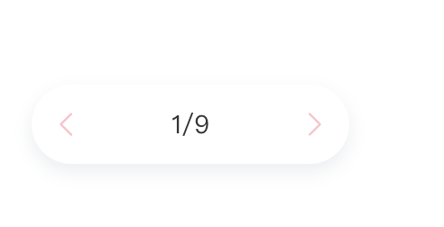

# 自定义svg图标颜色


## Start

+ 正常情况下，我们使用 svg 图标是自带颜色的，图标直接拿来使用就好了。
+ 但是有时候我们经常会遇到，禁用或高亮的需求，可以通过切换两个颜色不同的图标。（这个方法需要准备多个内容相同，颜色不同的 svg 图标）
+ **能不能通过样式控制 svg 图标呢？**这样我可以随意设置它的颜色。
+ 今天讲讲怎么自定义 svg 图标颜色。


##  处理svg图标

首先以文本的形式打开我们的svg图标。可以用记事本或者vscode都可以。

> 使用浏览器打开会直接看到svg的效果。


`记事本打开`


1. 全局搜索 `fill`， 删除对应的属性名和属性值

```
fill="#CCCCCC" 
```

> 需要注意的是，fill字段都需要删除，一个文件可能有多个，例如：
>
> 

2. 给页面的svg图标添加如下样式即可。

```
  fill: currentColor; //此属性为更改svg颜色属性设置
  color:pink;
```


`效果图`




## End

+ 完结