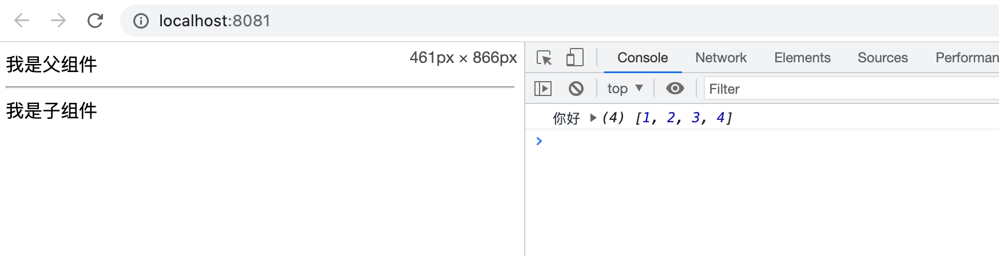
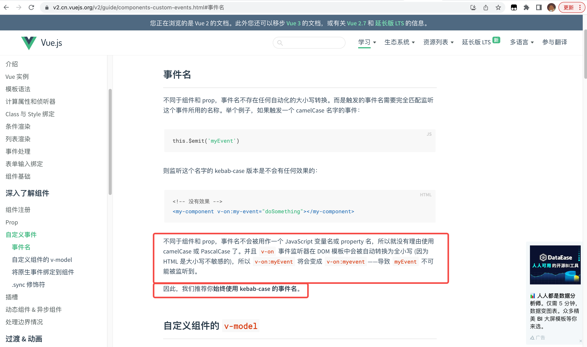
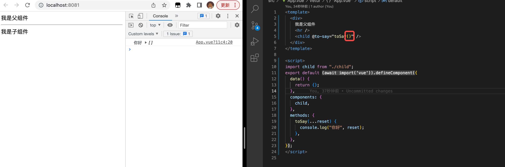

# Vue 子组件触发父组件事件,传递多个参数以及异常情况处理


## Start

+ 今天这篇文章记录一下子组件调用父组件事件，**传参的逻辑**。
+ 以及一些特殊的点和异常情况。


## 1. 示例

### 1.1 父组件

```vue
<template>
  <div>
    我是父组件
    <hr />
    <child @to-say="toSay" />
  </div>
</template>

<script>
import child from "./child";
export default {
  data() {
    return {};
  },
  components: {
    child,
  },
  methods: {
    toSay(...reset) {
      console.log("你好", reset);
    },
  },
};
</script>
```


### 1.2 子组件

```vue
<template>
  <div @click="say">我是子组件</div>
</template>

<script>
export default {
  methods: {
    say() {
      this.$emit("to-say", 1, 2, 3, 4);
    },
  },
};
</script>

<style>
</style>
```


### 1.3 效果截图





## 2.注意事项

上述的示例其实就是一个最基础的，子组件触发父组件事件的代码。


### 2.1 注意事项一：

子组件 `$emit` 的事件名和父组件接收的事件名必须相同。

```vue
this.$emit("to-say", 1, 2, 3, 4);

<child @to-say="toSay" />
```

> 事件名称不会类似组件名，prop；做驼峰转换。
>
> 官方文档对这里了的做了说明，并且推荐用 **kebab-case 的事件名**。
>
> 


### 2.2 注意事项

父组件定义接收的事件时，添加括号会导致$emit的传参无法接收到。


`效果截图`




1. 没有添加括号，是可以成功获取到对应参数的。

```vue
 <child @to-say="toSay" />
// 可以获取到$emit的参数
```


2. 添加了括号无法正确获取参数，

```vue
 <child @to-say="toSay()" />
// 无法获取到$emit的参数
```


## end

+ 记录事件传参的方法
+ 记录事件命名和传参的隐藏问题
+ 这里提一下事件相关的源码分析文章 [点击这里](https://ustbhuangyi.github.io/vue-analysis/v2/extend/event.html#%E7%BC%96%E8%AF%91)


