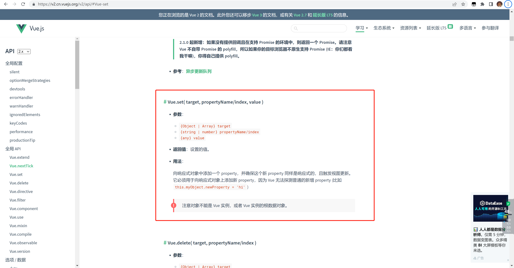
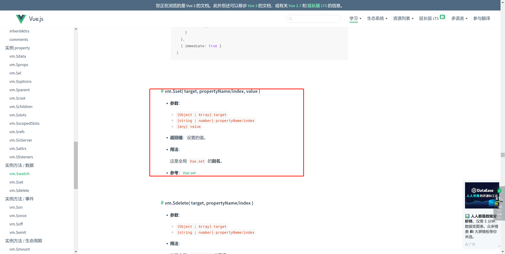
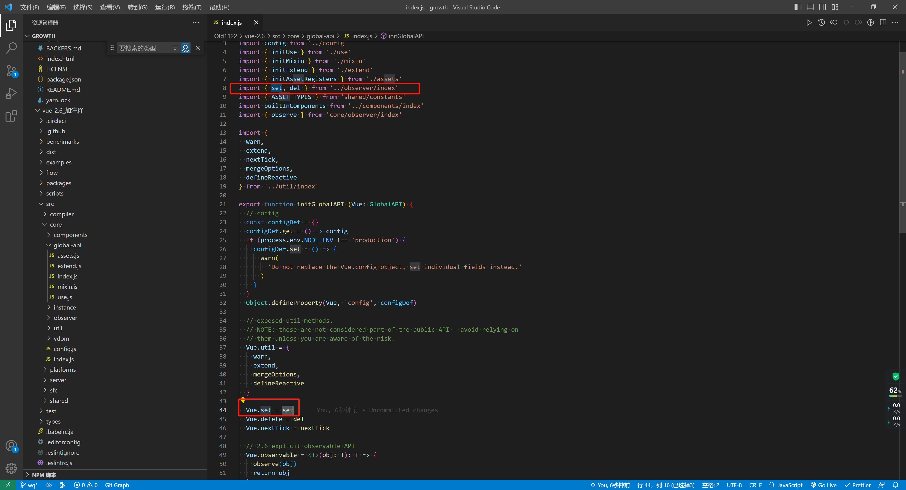
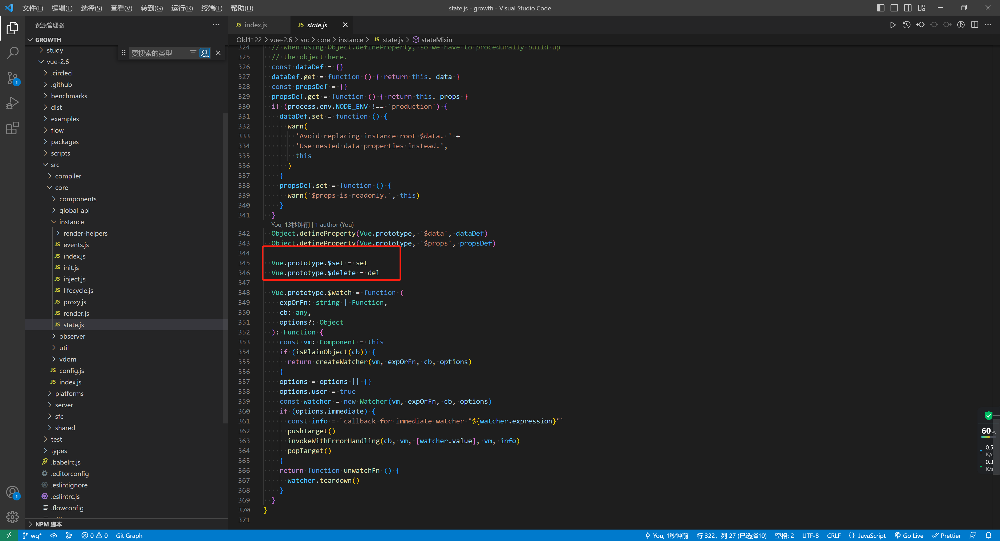
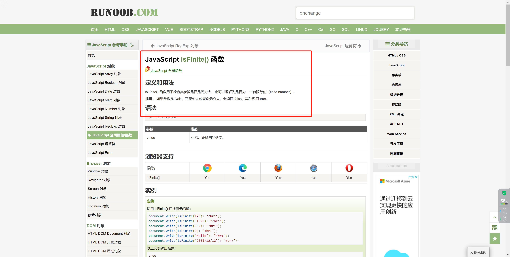

# 完全掌握 Vue 中的 $set 方法


## start

+ 今天在使用 $set 的时候，发现如果 被赋值的数据 层级较深会出现报错的情况。

+ 一知半解，是我最讨厌的状态，今天就带着问题，再阅读一下对应的源码，了解问题的本质。


## 问题说明

> 简单说明一下我遇到的问题，明确探究问题的目标。


### 需求

```text
我有一个空对象，我希望可以给它的属性的属性的属性赋值。
```


### 错误代码：

```vue
<template>
  <div>
    lazy_tomato

    <h2>{{ obj }}</h2>

    <button @click="handleChange">点击我给obj赋值</button>
  </div>
</template>

<script>
export default {
  data() {
    return {
      obj: {},
    }
  },
  methods: {
    handleChange() {
      this.obj.a = {
        b: {
          c: '爱吃番茄',
        },
      }

      console.log(JSON.stringify(this.obj))
      // 直接新增属性，不会触发 vue2本质的Object.defineProperty。所以数据更新了视图不更新
    },
  },
}
</script>

```


### 正确代码

```vue
<template>
  <div>
    lazy_tomato

    <h2>{{ obj }}</h2>

    <button @click="handleChange">点击我给obj赋值</button>
  </div>
</template>

<script>
export default {
  data() {
    return {
      obj: {},
    }
  },
  methods: {
    handleChange() {
      // 错误代码二  typeError: Cannot read properties of undefined (reading '__ob__')
      // this.$set(this.obj.a, 'b.c', '爱吃番茄')

      // 正确代码
      this.$set(this.obj, 'a', { b: { c: '爱吃番茄' } })

      console.log(JSON.stringify(this.obj))
        

    },
  },
}
</script>

```


**所以 $set 对这三个参数分别是如何处理的？如何避免我们错误使用？**


## [官方文档](https://v2.cn.vuejs.org/v2/api/#Vue-set)








### 区分 Vue.set 和 vm.$set

**`Vue` 构造函数自身上的 `set` 和 `vm` 实例上的 `$set` 是相同的函数。**


> 解决了以下问题：
>
> 1.新增对象的属性
>
> 2.删除对象的属性
>
> 3.通过数组索引修改数据








## 对应源码

`完整源码`

```js
export function set (target: Array<any> | Object, key: any, val: any): any {
  if (process.env.NODE_ENV !== 'production' &&
    (isUndef(target) || isPrimitive(target))
  ) {
    warn(`Cannot set reactive property on undefined, null, or primitive value: ${(target: any)}`)
  }
  if (Array.isArray(target) && isValidArrayIndex(key)) {
    target.length = Math.max(target.length, key)
    target.splice(key, 1, val)
    return val
  }
  if (key in target && !(key in Object.prototype)) {
    target[key] = val
    return val
  }
  const ob = (target: any).__ob__
  if (target._isVue || (ob && ob.vmCount)) {
    process.env.NODE_ENV !== 'production' && warn(
      'Avoid adding reactive properties to a Vue instance or its root $data ' +
      'at runtime - declare it upfront in the data option.'
    )
    return val
  }
  if (!ob) {
    target[key] = val
    return val
  }
  defineReactive(ob.value, key, val)
  ob.dep.notify()
  return val
}
```


`分析源码`

```js
// 1. 接受参数类型分别为  数组/对象; 任意 ; 任意
export function set(target: Array<any> | Object, key: any, val: any): any {
  // 2. 判断第一个参数 不为 undefined null string number symbol boolean
  if (
    process.env.NODE_ENV !== 'production' &&
    (isUndef(target) || isPrimitive(target))
  ) {
    warn(
      `Cannot set reactive property on undefined, null, or primitive value: ${(target: any)}`
    )
  }

  // 3. 如果是数组，而且第二个参数是有效索引
  if (Array.isArray(target) && isValidArrayIndex(key)) {
    // 更新数组长度 有可能传入的索引大于现有索引
    target.length = Math.max(target.length, key)

    // 调用 splice
    target.splice(key, 1, val)

    // // 返回值是设置的值
    return val
  }

  // 4. 是该对象的属性 （且不是原型链上的属性）
  if (key in target && !(key in Object.prototype)) {
    // 直接赋值 （这里赋值可以触发 Object.defineProperty）
    target[key] = val

    // 返回值是设置的值
    return val
  }

  // 5. 获取 observe实例
  const ob = (target: any).__ob__
  if (target._isVue || (ob && ob.vmCount)) {
    process.env.NODE_ENV !== 'production' &&
      warn(
        'Avoid adding reactive properties to a Vue instance or its root $data ' +
          'at runtime - declare it upfront in the data option.'
      )
    return val
  }

  // 6. 无observe实例，直接赋值，// 返回值是设置的值
  if (!ob) {
    target[key] = val
    return val
  }

  // 7. 收集依赖
  defineReactive(ob.value, key, val)

  // 8. 手动通知，触发视图更新
  ob.dep.notify()
  // // 返回值是设置的值
  return val
}

/* 工具函数 */
function isPrimitive(value) {
  return (
    typeof value === 'string' ||
    typeof value === 'number' ||
    // $flow-disable-line
    typeof value === 'symbol' ||
    typeof value === 'boolean'
  )
}

// explicitness and function inlining.
function isUndef(v) {
  return v === undefined || v === null
}

// 是否是有效的数组索引
function isValidArrayIndex(val) {
  const n = parseFloat(String(val))
  return n >= 0 && Math.floor(n) === n && isFinite(val)
}

```





### 小结：

主要的处理顺序：

1. 处理数组（使用 劫持过的数组 splice 方法）；
2. 处理对象上自带的属性；
3. 收集依赖，手动触发。


```js
// this.$set(this.obj.a, 'b.c', '爱吃番茄')
错误的原因,this.obj.a 本身是 undefined 所以直接被第一步就拦截了。

// this.obj.a={}
// this.$set(this.obj.a, 'b.c', '爱吃番茄')
也达不到效果，它会直接吧 b.c当做属性名初始化
```


思考：

> + 虽然官方文档设定，第二个参数是数字和字符串，理论上可以传入其他类型的。
> + 第二个参数最好是单层级的属性值


## 扩展 ：del 方法

```js
/**
 * Delete a property and trigger change if necessary.
 * 如果需要，删除属性并触发更改。
 */
export function del(target: Array<any> | Object, key: any) {
  if (
    process.env.NODE_ENV !== "production" &&
    // 如果是 undefined 或 null; 或者是原始值 ---同Vue.$set
    (isUndef(target) || isPrimitive(target))
  ) {
    warn(
      `Cannot delete reactive property on undefined, null, or primitive value: ${target}`
    );
  }

  // 数组，利用splice，直接改
  if (Array.isArray(target) && isValidArrayIndex(key)) {
    target.splice(key, 1);
    return;
  }

  // ---同Vue.$set 排除Vue实例 和 根对象
  const ob = (target: any).__ob__;
  if (target._isVue || (ob && ob.vmCount)) {
    process.env.NODE_ENV !== "production" &&
      warn(
        "Avoid deleting properties on a Vue instance or its root $data " +
          "- just set it to null."
      );
    return;
  }

  // 如果 属性不是自身的属性，直接 return
  if (!hasOwn(target, key)) {
    return;
  }

  // 删除对应的key
  delete target[key];

  // 不是响应式的不做处理（这个地方可以理解为，浅层监听的 watch，有些深层的属性不需要watch，就会走这个情况）
  if (!ob) {
    return;
  }

  // 手动触发 ！！ 有作者在想，直接在代码中 `.__ob__`  手动通知不就ok了？ 虽然可以但是不建议这样做、
  ob.dep.notify();
}
```


## end

上述的源码查看的是` vue@2.6`。 vue3中由于响应式实现原理发生了变化，所以不需要 $set 了，所以不做探究。