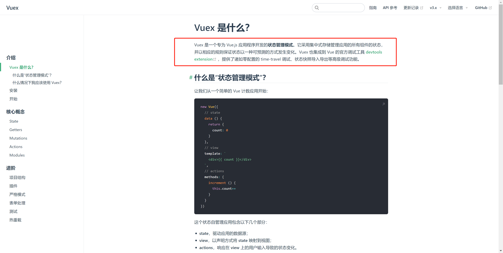
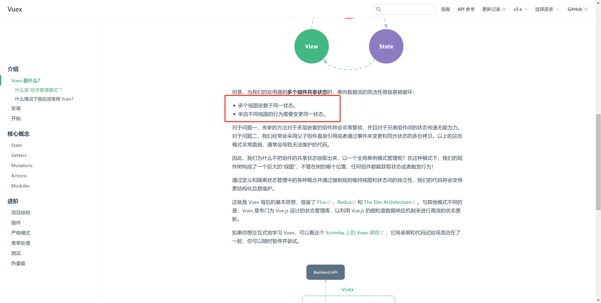
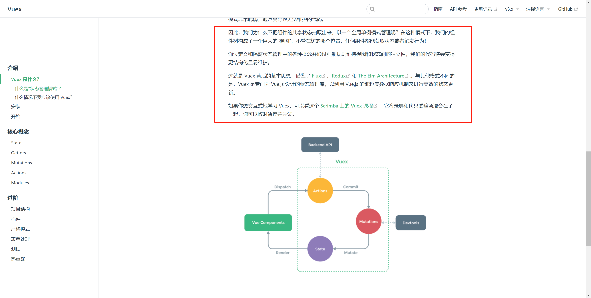
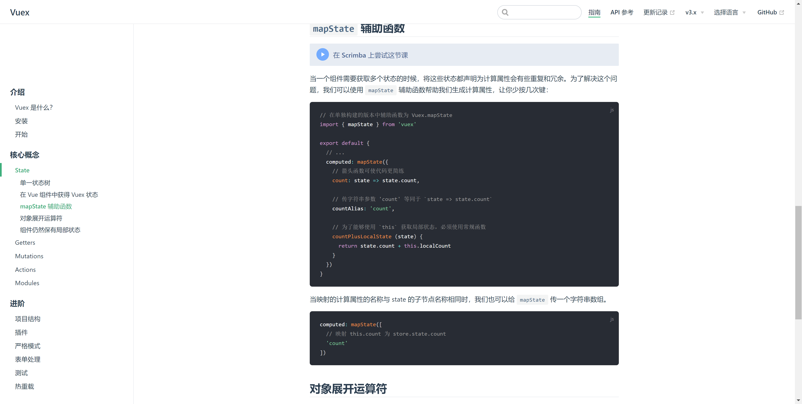

# 时隔多年再学习Vuex，什么？原来如此简单!


## start

1. 写 `Vue` 写了好多年了，少不了和 `Vuex`  打交道。虽然使用它的次数非常频繁，但是潜意识里总觉得这东西很难，导致遇到与之相关的问题就容易慌张。
2. 时至今日，升级版新款 “大菠萝”  `pinia` 都已经推出了，我居然还是对 `Vuex` 掌握不透彻。这不太好吧？
3. 那么今天就让这个问题，消失在这篇博客吧！
4. 作者：lazy_tomato
5.  编写时间：*2023/02/16-11/16*


## 官网

[`Vuex`官方文档](https://v3.vuex.vuejs.org/zh/)

> 上述链接中 `Vuex` 版本为 `3.x`，后续讲解的内容均为此版本。


我后续会依托官方文档，讲讲我对 `Vuex`  的理解。

**本文大部分内容均为我个人的理解，难免有些表述不当之处，参考即可**。


## 一. `Vuex` 是什么？

### 1.Vuex是什么？




学习一个东西，首先我们要知道这东西是什么，先来看看官方文档对它的说明：

`Vuex` 是一个专为 `Vue.js` 应用程序开发的**状态管理模式**。


+ 状态：状态可以理解为data中的数据；

+ 管理：对数据进行管理；

+ 模式：可以理解为是一种解决方案；

所以官方文档的话，可以理解为：

**`Vuex` 是一个专为 `Vue.js` 应用程序开发管理 `data` 中数据的一个解决方案？**


### 2.为什么要使用 `Vuex` ?





官方文档已经给了我们答案：

+ 多个视图依赖于同一状态。传参的方法对于多层嵌套的组件将会非常繁琐，并且对于兄弟组件间的状态传递无能为力。
+ 来自不同视图的行为需要变更同一状态。我们经常会采用父子组件直接引用或者通过事件来变更和同步状态的多份拷贝。


用我自己的理解来表达：

+ 多个组件依赖同一个数据，这就涉及到组件之间的数据传参了，如果组件的层级略微复杂，数据的传递会很痛苦。
+ 多个组件同时变更一个数据，虽然数据是同一个，但是会有很多无用的拷贝。


### 3. 问题`2`中的哪些痛点的数据有哪些呢，能列举一下吗？

例如：

+ 一个网页版的后台管理系统，用户的信息，肯定是很多地方都会使用到的，往往，多个组件都会需要读取这个数据。

+ 一个电商的网站，有一个购物车的功能，购物车存储的信息，可能很多组件都会去变更，


### 4. `Vuex` 中设计的思想？




 `Vuex` 背后的基本思想，借鉴了 [Flux ](https://facebook.github.io/flux/docs/overview)、[Redux](http://redux.js.org/)和 [The Elm Architecture](https://guide.elm-lang.org/architecture/)。

> 这句话介绍了 `Vuex` 借鉴的思想来源于哪里


`Vuex` 是专门为 `Vue.js` 设计的状态管理库，以利用 `Vue.js` 的细粒度数据响应机制来进行高效的状态更新。

> 这里介绍了  `Vuex` 区别于其他库，有哪些特点：更贴合 `Vue.js` 的细粒度数据响应机制。（`Vue`响应式的颗粒度精确到对象上每一个属性的变化）


把组件的共享状态抽取出来，以一个全局单例模式管理。在这种模式下，我们的组件树构成了一个巨大的“视图”，不管在树的哪个位置，任何组件都能获取状态或者触发行为！

> + 原话是一个反问句，我适当调整了一下，调整成了陈述句。陈述句阅读起来，给人很直爽的感觉。
>
> + 核心思想：**把共享的数据抽离出来，以全局单例模式管理。**


### 5.什么是单例模式？

> 要是换做以前，可能这段内容我就跳过了。但是最近刚好学习了设计模式，又刚好学习了单例模式，这里我就讲讲我的理解。


#### 5.1 一般的情况下，我们有一个类，我们可以通过 new 关键词，基于这个类创建多个实例。

例如：

```js
class Tomato {
  constructor(name) {
    this.name = name
  }
}

var t1 = new Tomato('红色的番茄')
var t2 = new Tomato('橙色的番茄')

console.log(t1)
// { name: '红色的番茄' }

console.log(t2)
// { name: '橙色的番茄' }

```


#### 5.2 单例模式的概念

*保证一个类仅有一个实例，并提供一个访问它的全局访问点，这样的模式就叫做单例模式。*

> 我的理解：一个类只能有一个实例


#### 5.3 为什么要用单例模式？

举个例子：

假如，我一个项目组有好几个人。

我在项目搭建的时候，我引入了 `Vuex`，做状态管理。

然后我通过 `const A = new Vuex()` ，创建了一个对象A。我所有的共享数据，都存储在这个对象A中。

> 当然 `new Vuex` 只是举例，后续会讲到它的真实用法。

如果其他的小伙伴不知情，也通过 ``const B = new Vuex()` 创建了实例B 。那我想读取和存储共享的数据，到底存储在A还是B呢？

所以这就必须要引入一个 **单例模式** 的概念。


#### 5.4 如何实现单例模式？


**我在编写这篇文章的时候，下载的 `Vuex`版本是 4.0，找了很久找不到对应代码了。**


**请注意，本文讲解的逻辑主要针对 3.x ** [下方源码对应 Github 地址 ，点击这里](https://github.com/vuejs/vuex/blob/3.x/src/store.js)

```js
// vuex/src/store.js
function install (_Vue) {
  //  判断传入的Vue实例对象是否已经被install过Vuex插件（是否有了唯一的state）
  if (Vue && _Vue === Vue) {
    if ((process.env.NODE_ENV !== 'production')) {
      console.error(
        '[vuex] already installed. Vue.use(Vuex) should be called only once.'
      );
    }
    return
  }
  Vue = _Vue;
  applyMixin(Vue);
}

```


自己实现一个 单例模式：

```js
class SingleDog {
    show() {
        console.log('我是一个单例对象')
    }
    static getInstance() {
        // 判断是否已经new过1个实例
        if (!SingleDog.instance) {
            // 若这个唯一的实例不存在，那么先创建它
            SingleDog.instance = new SingleDog()
        }
        // 如果这个唯一的实例已经存在，则直接返回
        return SingleDog.instance
    }
}

const s1 = SingleDog.getInstance()
const s2 = SingleDog.getInstance()

// true
s1 === s2
```

好了，说远了，回归到正题。


------


## 二. `Vuex` 如何使用？


### 1. 安装

```
npm install vuex --save
```


### 2. 引入

```js
import Vue from 'vue'
import Vuex from 'vuex'

Vue.use(Vuex)

const store = new Vuex.Store({
  state: {
    count: 0
  },
  mutations: {
    increment (state) {
      state.count++
    }
  }
})

new Vue({
  el: '#app',
  store: store, // 这样我们可以
})
```

`Store` 英文释义： `仓库`。

主要的用法：

1. `Vue.use(Vuex)` 在 `Vuex` 中绑定 `vue` 实例。
2. 基于 `Vuex.Store` ，`new` 出一个实例 `store`。
3. 在 `new Vue` 的配置对象中，传入 `store`。方便全局直接 `this.$store` 使用。


### 3. state

在 `new Vuex.Store()` 中传入的配置项，主要有五个属性。

1. state `状态`
2. mutations `改变`
3. actions `行动`
4. getters `获得`
5. modules `模块`


首先，`Vuex` 主要是用来管理数据，所以必须要有一个位置可以存储数据。这个位置就是 state。使用时结合计算属性 `computed` 选项使用。 

```js
// 注册：
const store = new Vuex.Store({
  state: {
    count: 0
  },
})


// 在组件中使用
const Counter = {
  template: `<div>{{ count }}</div>`,
  computed: {
    count () {
      return store.state.count
    }
  }
}
```


当一个组件需要获取多个状态的时候，将这些状态都声明为计算属性会有些重复和冗余。为了解决这个问题，我们可以使用 `mapState` 辅助函数帮助我们生成计算属性，让你少按几次键：


```js
// 在单独构建的版本中辅助函数为 Vuex.mapState
import { mapState } from 'vuex'

export default {
  // ...
  computed: mapState({
    // 箭头函数可使代码更简练
    count: state => state.count,

    // 传字符串参数 'count' 等同于 `state => state.count`
    countAlias: 'count',

    // 为了能够使用 `this` 获取局部状态，必须使用常规函数
    countPlusLocalState (state) {
      return state.count + this.localCount
    }
  })
}
```



### 4. mutations

更改 Vuex 的 store 中的状态的唯一方法是提交 mutation。


同步修改 state 的数据，在 `mutations ` 中定义方法，外部调用这个方法，触发修改。

```js
const store = new Vuex.Store({
  state: {
    count: 1
  },
  mutations: {
    increment (state) {
      // 变更状态
      state.count++
    }
  }
})


// 触发更改
store.commit('increment')
```


### 5. action

Action 类似于 mutation，不同在于：

- Action 提交的是 mutation，而不是直接变更状态。
- Action 可以包含任意异步操作。

```js
const store = new Vuex.Store({
  state: {
    count: 0
  },
  mutations: {
    increment (state) {
      state.count++
    }
  },
  actions: {
    increment (context) {
      context.commit('increment')
    }
  }
})
```


### 6. getters 


Vuex 允许我们在 store 中定义“getter”（可以认为是 store 的计算属性）。就像计算属性一样，getter 的返回值会根据它的依赖被缓存起来，且只有当它的依赖值发生了改变才会被重新计算。

```js
const store = new Vuex.Store({
  state: {
    todos: [
      { id: 1, text: '...', done: true },
      { id: 2, text: '...', done: false }
    ]
  },
  getters: {
    doneTodos: state => {
      return state.todos.filter(todo => todo.done)
    }
  }
})

store.getters.doneTodos // -> [{ id: 1, text: '...', done: true }]
```


### 7. modules

由于使用单一状态树，应用的所有状态会集中到一个比较大的对象。当应用变得非常复杂时，store 对象就有可能变得相当臃肿。

为了解决以上问题，Vuex 允许我们将 store 分割成**模块（module）**。每个模块拥有自己的 state、mutation、action、getter、甚至是嵌套子模块——从上至下进行同样方式的分割：

```js
const moduleA = {
  state: () => ({ ... }),
  mutations: { ... },
  actions: { ... },
  getters: { ... }
}

const moduleB = {
  state: () => ({ ... }),
  mutations: { ... },
  actions: { ... }
}

const store = new Vuex.Store({
  modules: {
    a: moduleA,
    b: moduleB
  }
})

store.state.a // -> moduleA 的状态
store.state.b // -> moduleB 的状态

// 使用:
store.state.a.xxx
```


## 三.思考

截止到这里，对Vuex的基础使用，算是基本掌握了。

记录一下我自己的思考。


1. 使用Vuex的目的：解决多个组件依赖，多个组件需要修改的数据，共享的问题。
2. 同步修改，使用 commit的方式，触发 mutation；
3. 异步修改，使用 dispatch的方式，触发 action；
4. getters 相当于过滤器，用于处理数据格式。
5. modules 用于将一个大的 state，拆分多个模块。访问的时候，中间穿插模块名。


也没什么好恐怖的，其实很简单，简单来说，就是一个全局单例的一个对象，存储我们频繁使用的需要共享的数据。


