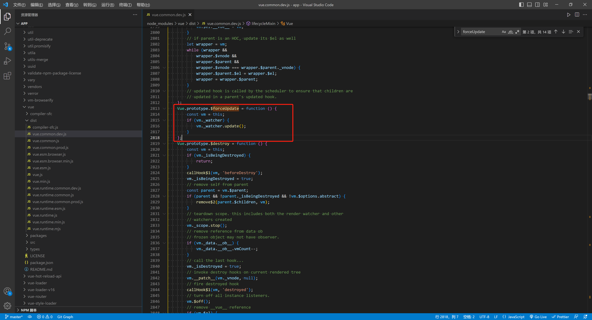
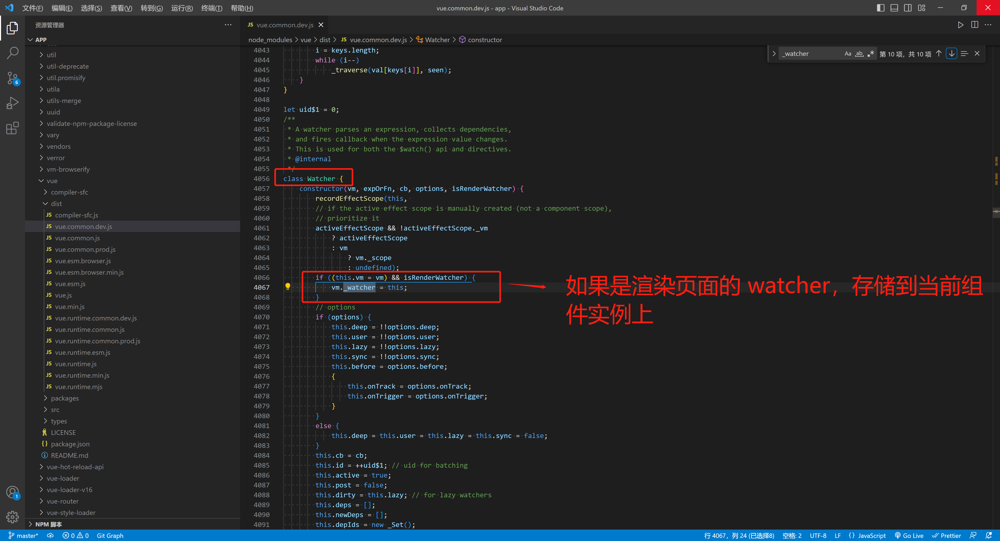
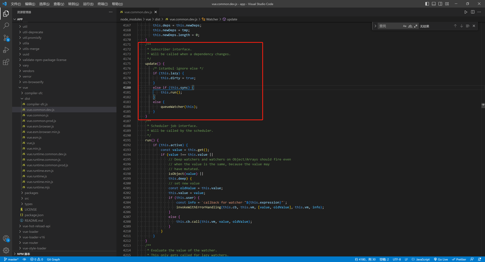

# this.$forceUpdate对应源码是什么，到底如何生效的？


## start

+ 最近在编写代码的时候，更新了一个比较复杂的数据，但是对应的视图没有更新。
+ 使用到了 `this.$forceUpdate()` ，但是网上的博客总说它有性能损耗问题。查看一下它的源码，学习一下。

 


## 正文





`对应源码`

```js
    Vue.prototype.$forceUpdate = function () {
        // 这里的 this 指向的是 组件的实例
        const vm = this;
        // 组件实例上有 watcher ，主动触发 update() 方法
        if (vm._watcher) {
            vm._watcher.update();
        }
    };
```





`对应源码`

```js
 class Watcher {
    constructor(vm, expOrFn, cb, options, isRenderWatcher) {
        recordEffectScope(this, 
        // if the active effect scope is manually created (not a component scope),
        // prioritize it
        activeEffectScope && !activeEffectScope._vm
            ? activeEffectScope
            : vm
                ? vm._scope
                : undefined);
        if ((this.vm = vm) && isRenderWatcher) {
            vm._watcher = this;
        }
```




`对应源码`

```js
class Watcher {
  // 主动触发组件的更新
  update() {
    if (this.lazy) {
      this.dirty = true
    } else if (this.sync) {
      this.run()
    } else {
      queueWatcher(this)
    }
  }
}

```


## 总结

查看了上述的代码， `this.$forceUpdate()`  主要逻辑就是触发当前组件实例的渲染 `watcher`上的 `update` 更新方法。

也就是主动触发整个组件的更新。
