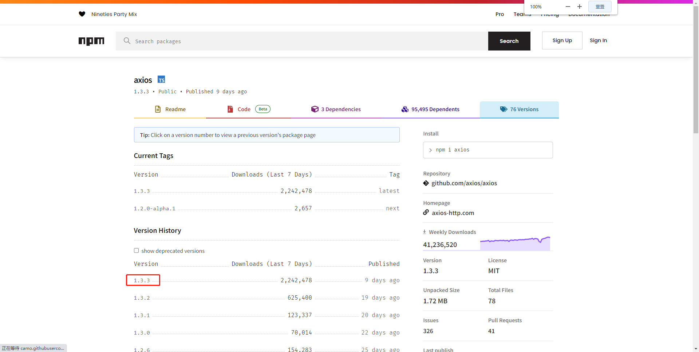
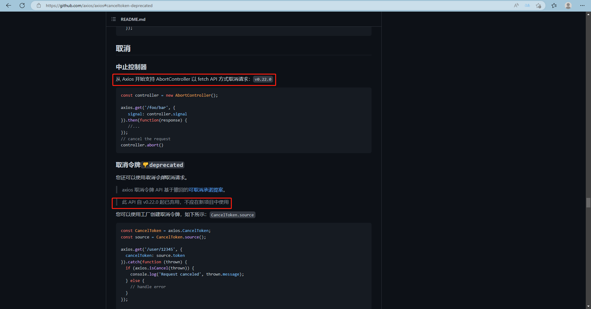
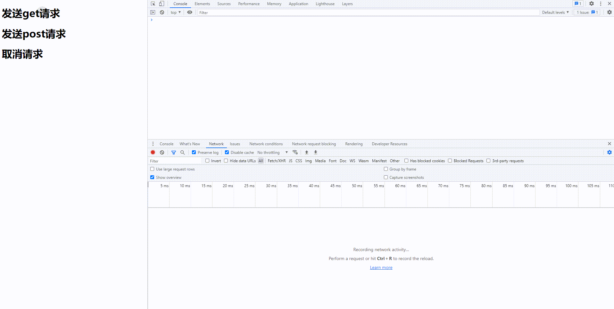
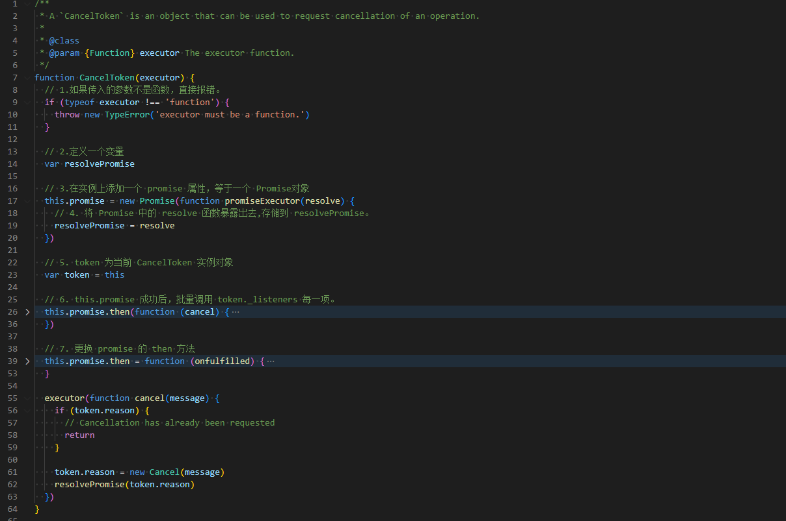
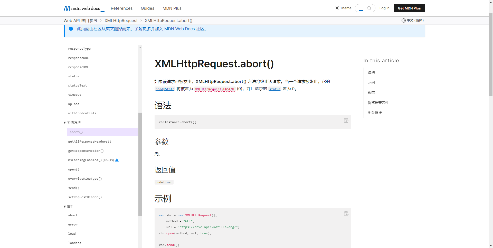
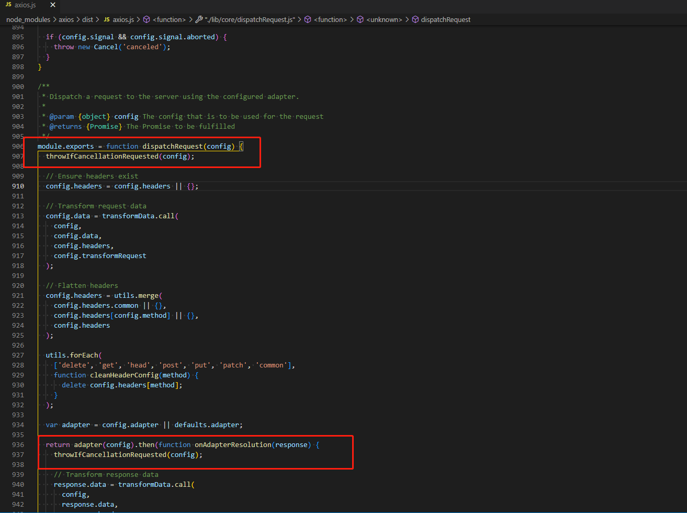

# axios 中如何取消请求


## start

+ 最近频繁遇到一个问题，`axios` 是如何取消请求的？
+ 这篇文章将从新手小白的视角出发，从 `axios` 取消逻辑的基础使用，到原理分析，带你彻底了解并掌握 `axios` 中取消请求的“秘密”。
+ 编写时间：2023/02/24-23/14
+ 编写作者：lazy_tomato


## 1. 官方信息

### 1.1 源码地址

[github-axios 点击跳转](https://github.com/axios/axios)


### 1.2 axios 目前 npm 默认版本为 1.3.3




+ 我去年阅读 `axios` 源码的时候，默认版本还是 `0.28.x` ，今年变成了 `1.x.x` 了，这个需要注意下。

+ 我对 `axios` 版本号比较在意的原因是，看到过这句话：

  ```
  axios 的实现原理非常简单。
  但是 axios 的精髓在于它已经迭代了40个版本，但是大版本号使用为0. 
  npm 的 version 规则是首个版本号变化表示 api 不向下兼容。
  而 axios 增加了这么多功能。却始终保持没有 api 明显变化。
  这里 axios 内部使用了多种设计模式和架构模式。 (适配器，桥接，代理，抽象工厂，微内核设计。)
  ```

+ `axios` 整体源码不过千行，可模仿和学习的地方还是有很多的，互勉。


### 1.3 axios 中取消请求的api



由上述的截图可得，目前最新的 `axios` 的取消请求api，推荐使用 `AbortController `。旧版本的 `CancelToken `  在 `v0.22.0` 后弃用。

> **本文主要讲解 `CancelToken `**  , 有关 `AbortController ` 的说明后续博客再做补充。


#### 1.3.1 CancelToken 

**官方示例**

```js
const CancelToken = axios.CancelToken;
const source = CancelToken.source();

axios.get('/user/12345', {
  cancelToken: source.token
}).catch(function (thrown) {
  if (axios.isCancel(thrown)) {
    console.log('Request canceled', thrown.message);
  } else {
    // handle error
  }
});

axios.post('/user/12345', {
  name: 'new name'
}, {
  cancelToken: source.token
})

// cancel the request (the message parameter is optional)
source.cancel('Operation canceled by the user.');
```


#### 1.3.2   AbortController 

```js
const controller = new AbortController();

axios.get('/foo/bar', {
   signal: controller.signal
}).then(function(response) {
   //...
});
// cancel the request
controller.abort()
```


## 2. CancelToken 使用案例

官方文档中的演示案例不太直观，我们搭建一个服务，本地调试一下。


### 2.1安装依赖

```shell
npm init -y
 
npm i axios@0.22.0 express body-parser
# 注意，需要手动指定 axios 的版本，默认安装的axios是1.3.x版本的。
```


### 2.2 后端服务代码 `main.js`

```js
const express = require('express')
const bodyParser = require('body-parser')
const app = express()

const router = express.Router()

// 跨域请求处理
app.all('*', (req, res, next) => {
  res.header('Access-Control-Allow-Origin', '*')
  res.header('Access-Control-Allow-Headers', 'X-Requested-With')
  res.header(
    'Access-Control-Allow-Headers',
    'Content-Type, Content-Length, Authorization, Accept, X-Requested-With, X_Requested_With'
  )
  res.header('Access-Control-Allow-Methods', 'PUT, POST, GET, DELETE, OPTIONS')
  //允许接收的请求头上加上一个Authorization，这样我们才能够将数据发送过去
  res.header('X-Powered-By', '3.2.1')

  // OPTIONS类型的请求 复杂请求的预请求
  if (req.method == 'OPTIONS') {
    res.send(200)
  } else {
    /*让options请求快速返回*/
    next()
  }
})

// 挂载处理post请求的插件
app.use(bodyParser.urlencoded({ extended: false }))
app.use(bodyParser.json())

router.get('/', (req, res) => {
  res.send('Hello World')
})

// 五秒后返回
router.get('/tomato', (req, res) => {
  setTimeout(() => {
    res.send({
      text: '我是lazy_tomato',
    })
  }, 5000)
})


router.post('/lazy', (req, res) => {
  console.log(req.body)
  setTimeout(() => {
    res.send({
      name: req.body.name + 'tomato',
    })
  }, 5000)
})

// 挂载路由
app.use(router)

// 监听5000端口 启动服务
app.listen('5000', () => {
  console.log('Server is running 5000')
})

```


### 2.3 启动本地服务

```shell
node ./main.js
```


### 2.4 前端代码 index.html

```html
<!DOCTYPE html>
<html lang="en">

<head>
  <meta charset="UTF-8">
  <title>lazy_tomato出品</title>
</head>

<body>

  <h1 id="sendGet">发送get请求</h1>
  <h1 id="sendPost">发送post请求</h1>
  <h1 id="cancel">取消请求</h1>

  <script src="./node_modules/axios/dist/axios.min.js"></script>

  <script>
    var sendGet = document.getElementById('sendGet')
    var sendPost = document.getElementById('sendPost')
    var cancel = document.getElementById('cancel')

    const CancelToken = axios.CancelToken;
    const source = CancelToken.source();

    sendPost.addEventListener('click', () => {
      console.log('开始发送请求post请求')
      axios.post('http://localhost:5000/lazy', {
        name: '我是 lazy-'
      }, {
        cancelToken: source.token
      }).then(res => {
        console.log(res)
      }).catch(err => {
        if (axios.isCancel(err)) {
          console.log('请求取消', err);
        } else {
          console.log('其他错误', err)
        }
      });

    }, true)


    sendGet.addEventListener('click', () => {
      console.log('开始发送get请求')
      axios.get('http://localhost:5000/tomato', {
        cancelToken: source.token
      }).then(res => {
        console.log(res)
      }).catch(err => {
        if (axios.isCancel(err)) {
          console.log('请求取消', err);
        } else {
          console.log('其他错误', err)
        }
      });
    }, true)


    cancel.addEventListener('click', () => {
      console.log('开始终止请求')
      source.cancel('手动调用 source.cancel方法，手动取消请求');
    }, true)


  </script>
</body>

</html>
```


### 2.5 效果展示

#### 2.5.1 取消get请求




#### 2.5.2 取消post请求


#### 2.5.3 取消后再次发起请求


### 2.6 CancelToken 使用总结

```js
const CancelToken = axios.CancelToken;
const source = CancelToken.source();

axios.get('/user/12345', {
  cancelToken: source.token
}).catch(function (thrown) {
  if (axios.isCancel(thrown)) {
    console.log('Request canceled', thrown.message);
  } else {
    // handle error
  }
});

axios.post('/user/12345', {
  name: 'new name'
}, {
  cancelToken: source.token
})

// cancel the request (the message parameter is optional)
source.cancel('Operation canceled by the user.');
```

对照官方的使用示例，总结一下：

+ 不管是 `get` 请求还是 `post` 请求，都是在调用接口的时候，传入一个 `cancelToken` 属性。
+ 当我们想要取消该接口调用的时候，调用 ` source`的 `cancel` 方法即可。
+ 重复调用，接口会直接取消。


## 3. 对应源码

**如果对源码不感兴趣，可直接跳跃到 4 ，查看结论即可。**


### 3.1 CancelToken.source()

对照我们的使用案例，核心逻辑就是 `CancelToken.source()`。源代码如下：

` CancelToken.source()` 返回值其实就是一个对象，它包含 `token`，`cancel` 两个属性。

```js
/**
 * Returns an object that contains a new `CancelToken` and a function that, when called,
 * cancels the `CancelToken`.
 * 返回一个对象，其中包含一个新的 'CancelToken' 和一个函数，当调用时，
 * 取消' CancelToken '
 */
CancelToken.source = function source() {
  var cancel
  // 在 new CancelToken的时候，传入一个函数 executor；将这个函数接收到的参数存储到 cancel 中
  var token = new CancelToken(function executor(c) {
    cancel = c
  })
  
  // source 其实就是一个对象
  return {
    token: token,
    cancel: cancel,
  }
}
```

+ `token ` 很好理解，是构造函数 `CancelToken` 的实例（具体包含那些信息，可以查看 `CancelToken` 构造函数）；

+ `cancel` 是在 `new CancelToken` 过程中，传入的 `executor` 函数接收到的形参；

> 阅读到这里，主要逻辑就在函数 `CancelToken` 。


### 3.2 CancelToken 整体概览


整体代码截图：




### 3.3  source 中的 cancel 属性存储的是什么？

查看 `CancelToken `  中的 `executor` 函数接收了什么参数？


`CancelToken 源码`

```js
executor(function cancel(message) {
  if (token.reason) {
    // Cancellation has already been requested
    return
  }
  token.reason = new Cancel(message)
  resolvePromise(token.reason)
})
```


`所以 cancel 可以理解为`

```js
function cancel(message) {
  if (token.reason) {
    return
  }
  token.reason = new Cancel(message)
  resolvePromise(token.reason)
}
```


`调用逻辑`

```js
source.cancel('Operation canceled by the user.');

// 等同于

function cancel('Operation canceled by the user.') {
  if (token.reason) {
    return
  }
  token.reason = new Cancel('Operation canceled by the user.')
  resolvePromise(token.reason)
}
```


### 3.4 Cancel

上方 `new Cancel('Operation canceled by the user.')` 对应源码

```js
// 一个普通的函数，包含一个 message 属性
function Cancel(message) {
  this.message = message;
}

// 所以它返回的就是一个包含错误信息的对象
{ message: 'Operation canceled by the user.' }
```


### 3.5 CancelToken 原型上的方法

```js
/**
 * Throws a `Cancel` if cancellation has been requested.
 * 如果已请求取消，则抛出' Cancel '。  （我的理解：如果实例上存在 reason，报错）
 */
CancelToken.prototype.throwIfRequested = function throwIfRequested() {
  if (this.reason) {
    throw this.reason
  }
}

/**
 * Subscribe to the cancel signal
 * 订阅取消标识
 */
CancelToken.prototype.subscribe = function subscribe(listener) {
  // 存在错误，直接执行listener
  if (this.reason) {
    listener(this.reason)
    return
  }

  // 将 listener 以数组的形式存储在当前实例的 _listeners 上
  if (this._listeners) {
    this._listeners.push(listener)
  } else {
    this._listeners = [listener]
  }
}

/**
 * Unsubscribe from the cancel signal
 * 取消订阅取消标识
 */

CancelToken.prototype.unsubscribe = function unsubscribe(listener) {
  if (!this._listeners) {
    return
  }
  var index = this._listeners.indexOf(listener)
  if (index !== -1) {
    this._listeners.splice(index, 1)
  }
}
```

这一小节，查看了 `CancelToken` 原型上的方法：

+ `throwIfRequested`：如果存在取消属性，抛出错误。
+ `subscribe`：存储传入的参数 `listener`；
+ `unsubscribe`：删除传入的参数 `listener`；


### 3.6 CancelToken 完整代码分享

`CancelToken` 全局逻辑梳理

```js
function CancelToken(executor) {
  // 1.如果传入的参数不是函数，直接报错。
  if (typeof executor !== 'function') {
    throw new TypeError('executor must be a function.')
  }

  // 2.定义一个变量
  var resolvePromise

  // 3.在实例上添加一个 promise 属性，等于一个 Promise对象
  this.promise = new Promise(function promiseExecutor(resolve) {
    // 4. 将 Promise 中的 resolve 函数暴露出去,存储到 resolvePromise。
    resolvePromise = resolve
  })

  // 5. token 为当前 CancelToken 实例对象
  var token = this

  // 6. this.promise 成功后，批量调用 token._listeners 每一项。
  this.promise.then(function (cancel) {
    if (!token._listeners) return

    var i
    var l = token._listeners.length

    for (i = 0; i < l; i++) {
      token._listeners[i](cancel)
    }
    token._listeners = null
  })

  // 7. 更换 promise 的 then 方法
  this.promise.then = function (onfulfilled) {
    var _resolve

    var promise = new Promise(function (resolve) {
      token.subscribe(resolve)
      _resolve = resolve
    }).then(onfulfilled)

    promise.cancel = function reject() {
      token.unsubscribe(_resolve)
    }

    return promise
  }

  // 8. 处理 executor 的形参
  executor(function cancel(message) {
    if (token.reason) {
      return
    }

    token.reason = new Cancel(message)
    resolvePromise(token.reason)
  })
}

```


难点说明：

+ 第 3，4 步：`this.promise` 上存储一个 `Promise` 对象，该 `Promise` 对象的状态将由外部的 `resolvePromise` 控制。
+ 第 5 步：当前实例对象的 `token` 属性，等于当前实例对象。
+ 第 6，7 步：这两部略微比较复杂。详细说明一下。


第 6 步定义的是 `this.promise` **成功之后**触发的方法。

```js
function (cancel) {
  if (!token._listeners) return

  var i
  var l = token._listeners.length

  for (i = 0; i < l; i++) {
    token._listeners[i](cancel)
  }
  token._listeners = null
}
```

第 7 步定义的是 `this.promise` **成功时**触发的方法。

```js
function (onfulfilled) {
  var _resolve

  var promise = new Promise(function (resolve) {
    token.subscribe(resolve)
    _resolve = resolve
  }).then(onfulfilled)

  promise.cancel = function reject() {
    token.unsubscribe(_resolve)
  }

  return promise
}
```

> 第 6 步和第 7 步，如果顺序颠倒，执行结果完全不同。
>
> 源码的执行逻辑：第 6 步，先注册一个微任务，到队列。然后第 7 步更改当前 `Promsie` 对象的 `then` 方法。
>
> `resolvePromise` 的时候，**仅会**执行第 6 步，但是会判断 `then` 方法返回的是否是 `Promsie` 对象，是 `Promsie` 对象则执行第 6 步，不是则跳过。


### 3.7 请求 xhr.js

目前的 `axios` 支持 `XMLHttpRequest` 和 `http` 两种方式发送请求。

本文重点看一下 `XMLHttpRequest`.

```js
var request = new XMLHttpRequest()

if (config.cancelToken || config.signal) {
  onCanceled = function (cancel) {
    if (req.aborted) return

    req.abort()
    reject(!cancel || (cancel && cancel.type) ? new Cancel('canceled') : cancel)
  }

  config.cancelToken && config.cancelToken.subscribe(onCanceled)
  if (config.signal) {
    config.signal.aborted
      ? onCanceled()
      : config.signal.addEventListener('abort', onCanceled)
  }
}

```

每发送一次请求，都会创建一个 `XMLHttpRequest` 的实例。如果存在 `cancelToken` ，主动触发 `config.cancelToken.subscribe(onCanceled)`  方法。存储取消的方法 `onCanceled` 到 `CancelToken` 的实例上。

`CancelToken` 的实例，存储 `onCanceled`，这里利用的闭包的特性。


### 3.8 onCanceled

```js
function onCanceled(cancel) {
  // 不存在 request 直接 return
  if (!request) {
    return
  }

  // 调用 取消的方法。
  request.abort()
  reject(cancel)
  // Clean up request
  request = null
}
```

取消请求，落实到具体实现，其实就是：`request.abort()`，也就是 `XMLHttpRequest.abort()`

[MDN官方文档-XMLHttpRequest.abort()](https://developer.mozilla.org/zh-CN/docs/Web/API/XMLHttpRequest/abort)




### 3.9 取消一次请求，后续请求全部自动取消？

```js
function throwIfCancellationRequested(config) {
  if (config.cancelToken) {
    config.cancelToken.throwIfRequested();
  }

  if (config.signal && config.signal.aborted) {
    throw new Cancel('canceled');
  }
}

CancelToken.prototype.throwIfRequested = function throwIfRequested() {
  if (this.reason) {
    throw this.reason;
  }
};
```

每次发起请求之前，在处理配置的时候就会触发校验函数： `throwIfCancellationRequested`

如果传入的参数存在 `cancelToken`，而且 `cancelToken` 实例上有 `reason` 则直接报错。




## 4. 总结

分两个讲解：

### 4.1 使用

使用的方式，就是在发送请求的时候，传入一个 `cancelToken: CancelToken.source().token` 令牌即可。

需要取消请求的时候，手动触发 `CancelToken.source().cancel`


### 4.2 原理

1. `CancelToken.source()` 会返回一个对象 `source`；

2. `source` 对象上有两个属性分别为： `token，cancel`；

```js
{
  "source.token":"存储 CancelToken 的实例对象 A",
  "source.cancel":"存储可以改变 A.promise 状态的函数"
}
```

3. A上还存储着，取消当前请求的方法 b；

4. `A.promise` 状态改变，就会调用方法 b；

5. 当我们想主动取消请求的时候，调用 `source.cancel` =》改变 `A.promise` 状态 =》调用方法 b；


**核心逻辑：**利用工厂函数，创建对象。利用闭包的特性，在对象中存储取消请求的方法，共外部调用。


## 5. 思考

这几天，一直在研究 `axios` 的取消逻辑代码；截止今天，终于学习并编写完毕了相关文档。

我在总结有那些收获呢？

### 5.1 大的方向上：

1. 了解了 `axios` 取消请求的用法；
2. 了解了 `axios` 取消请求，两个版本的不同实现方式；


### 5.2 具体的提升：

1. 源码中，将一个 `Promise` 对象的状态，交由外部变量控制，这种思路可以模仿；
2. 相对于我们平时的面向过程编程，包括我查看 Vue 源码中某些功能的实现，都是基于一个 构造函数 实现的，常使用"工厂模式"，来批量初始化一些有相同共性的对象，是极其方便的。或许在我后续的编程中，会逐步学习尝试使用这种方式。
3. 在一个 `CancelToken` 源码中，批量通知取消请求的逻辑，值得我多加揣摩。一个实例属性，存储多个订阅的对象，当取消请求时，批量通知。（有点类似 发布订阅的思想）


## end

axios相关博客

+ [使用axios传递参数，为什么`new Date()` 会变成 `2022-08-10T11:33:56.849Z`](https://blog.csdn.net/wswq2505655377/article/details/126292279)
+ [最新版axios@1.3.x取消请求-AbortController-初体验-番茄出品](https://blog.csdn.net/wswq2505655377/article/details/129250915)


 


