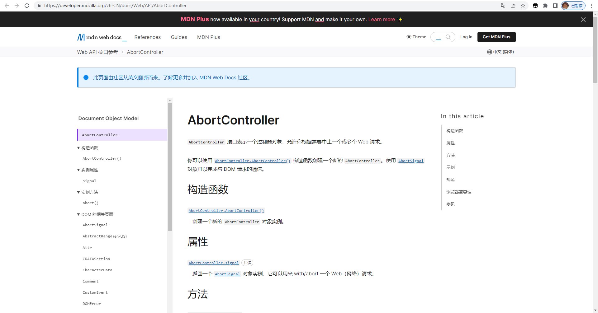
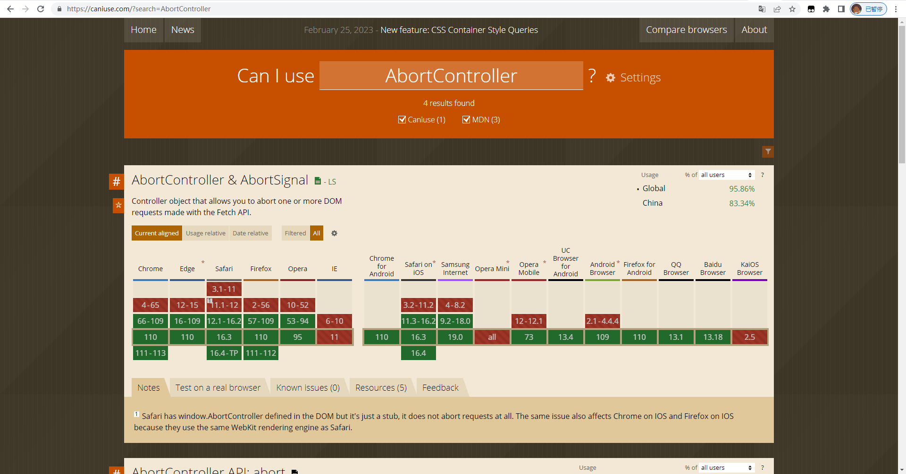
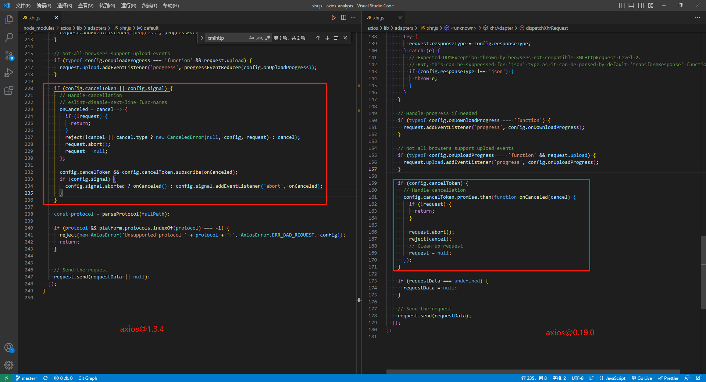
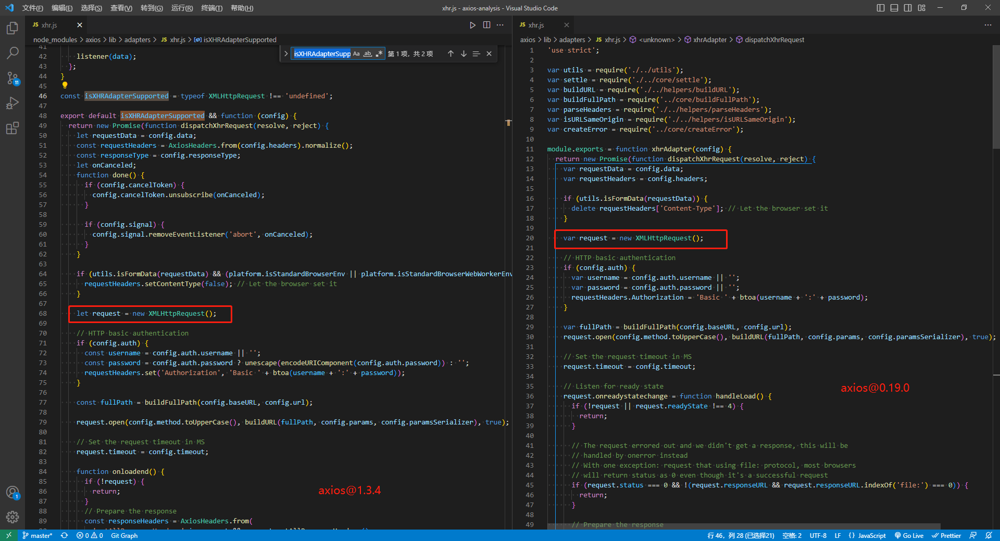

# 最新版axios@1.3.x取消请求-AbortController-初体验-番茄出品


## start

+ 前文提到，`axios` 中的取消请求，包含两种方式：
  + `AbortController`；
  + `CancelToken`；

+ 上篇文章讲解了  `CancelToken`，今天这篇文章来了解一下 `AbortController`;
+ 作者：lazy_tomato
+ 编写时间：2023/02/27 23/10


## 1. AbortController 是什么？

### 1.1 介绍

**`AbortController`** 接口表示一个控制器对象，允许你根据需要中止一个或多个 Web 请求。


### 1.2 MDN官方文档

MDN官方文档  [点击这里：](https://developer.mozilla.org/zh-CN/docs/Web/API/AbortController)




### 1.3 官方文档使用案例

```js
let controller;
const url = 'video.mp4';

const downloadBtn = document.querySelector('.download');
const abortBtn = document.querySelector('.abort');

downloadBtn.addEventListener('click', fetchVideo);

abortBtn.addEventListener('click', () => {
  if (controller) {
    controller.abort();
    console.log('中止下载');
  }
});

function fetchVideo() {
  controller = new AbortController();
  const signal = controller.signal;
  fetch(url, { signal })
    .then((response) => {
      console.log('下载完成', response);
    })
    .catch((err) => {
      console.error(`下载错误：${err.message}`);
    });
}
```


### 1.3 兼容性




1. 可以在 `caniuse.com` 中 查看到对 `AbortController` 的解释；

```text
Controller object that allows you to abort one or more DOM requests made with the Fetch API.

控制器对象，该对象允许您中止使用 Fetch API 发出的一个或多个DOM请求。
```

2. **原生 AbortController  不支持  IE 全系列**；


## 2. axios 中的 AbortController 如何作用

新版旧版差异：



由上图可以查看到：

1. `axios` 对旧版本的 `CancelToken` 用法，还是保留了兼容处理；

2. 最新版本的 `axios`，提供了对 `signal` 属性的判断；

3. 在浏览器端，使用的都是 XMLHttpRequest 发起请求的；

   


## 3. 总结

总的来说，截至目前，`1. AbortController`；`2. CancelToken`；两者都可以实现取消请求。

+ 底层逻辑相同：都是通过传入配置参数，再手动触发对应参数的取消方法。

+ 差异：传入的配置对象不同。


