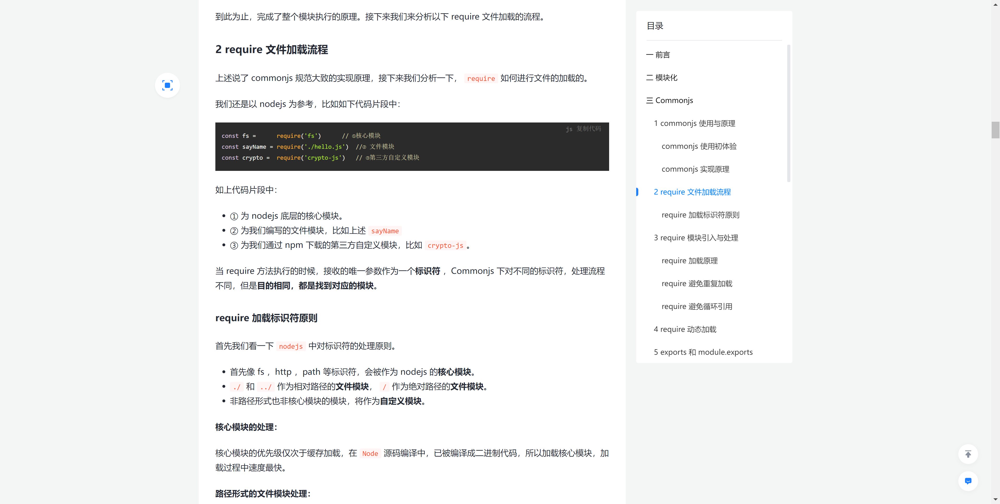
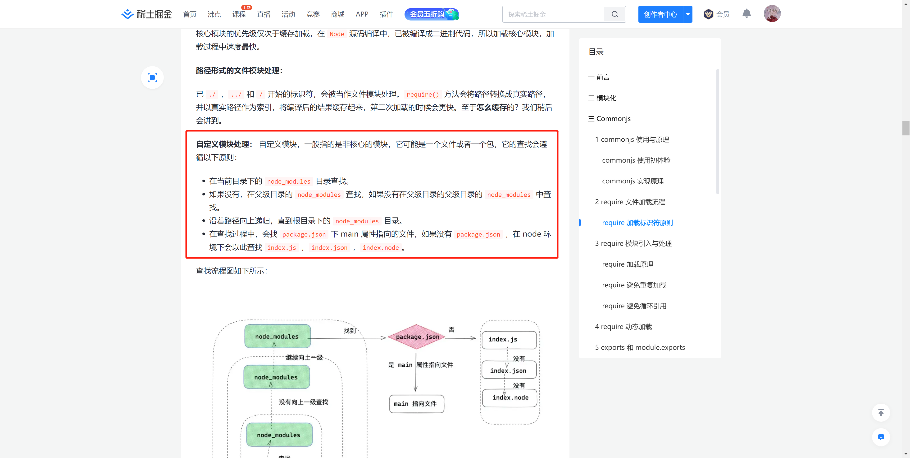
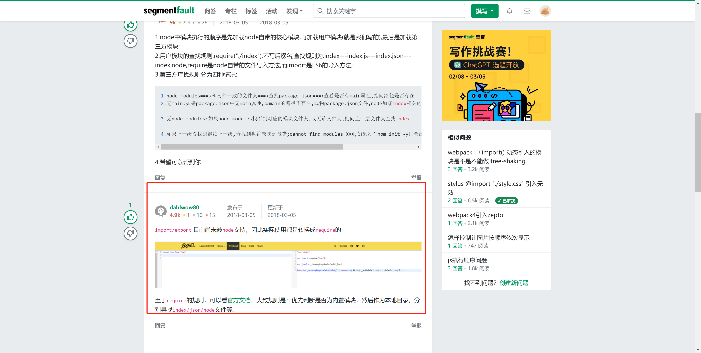

# 前端基础组件库如何实时调试，软链接


## start

+ 最近在做基础组件库的重构工作，遇到的第一个问题就是，组件库的代码修改完毕了，如何调试呢？
+ 组件库的代码在供外部使用的时候，**通常是**通过打包输出 `lib` 或者 `dist` 文件，上传 `npm` 库，供其他项目调用。
+ 但是在我调试源码的时候，打包生成了 `lib` ，再去其他项目调用就不是很方便了。


## 解决思路

目前想到的解决思路：

1. 我搭建一个项目A，一个组件库项目B

2. 项目A中的 `node_modules` 中软链接项目B。

3. 启动项目A，修改项目B，在项目A中实时查看效果。


## 软链接的实现方式


```shell
# mac/linux
ln -s 源文件 目标文件

# windows
mklink 当前目录 目标目录
```


## 相关小知识

### 1. ln -s

#### 1.1 基础解释

`ln` 它的功能是为某一个文件在另外一个位置建立一个同步的链接。

当我们需要在不同的目录，用到相同的文件时，我们不需要在每一个需要的目录下都放一个必须相同的文件，我们只要在某个固定的目录，放上该文件，然后在 其它的目录下用ln命令链接（link）它就可以，不必重复的占用磁盘空间。


#### 1.2 基础使用

`ln -s 源文件 目标文件`


#### 1.3 参数说明

+ `-s` 软链接：只会在你选定的位置上生成一个文件的镜像，不会占用磁盘空间；
+ 不带`-s` 硬链接：它会在你选定的位置上生成一个和源文件大小相同的文件；

> 无论是软链接还是硬链接，文件都保持同步变化


### 2.  node_modules 寻找顺序？

> 由于涉及到了 `node_modules ` ，所以就有一个项目中  `node_modules ` 如何寻找的逻辑了，这里在复习一下。


#### 2.1 require -commonjs加载模块的顺序

[阮一峰-require加载node_modules的顺序](https://javascript.ruanyifeng.com/nodejs/module.html#toc7)

[require 文件加载流程](https://juejin.cn/post/6994224541312483336#heading-6)








#### 2.2 import加载顺序？`es modules`

> 印象中，好像只了解到了 require的加载顺序，很少提到 `esmodules` 中 import 的加载顺序，所以思考了一下。

搜索了全网目前得到的答案：`import/export 目前尚未被 node 支持，因此实际使用都是转换成 require 的`

> 我觉得他说的还是很有道理的，理论上我编写一个 vue 工程，基于 webpack 打包编译，webpack 本身也是手动实现一个require罢了。
>
> 所以这里的加载机制或许可以默认 import 等同于 node的require；
>
> 当然后续真的找到问题的答案了，我再回来纠正。

[出处点击这里](https://segmentfault.com/q/1010000013536010)





## End

+ 这就是今天的收获，还不错，后续继续加油！

