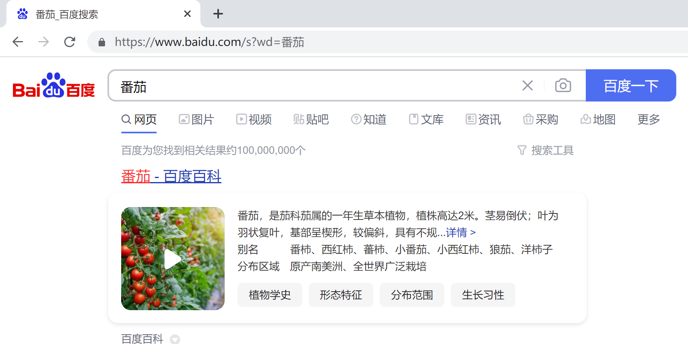
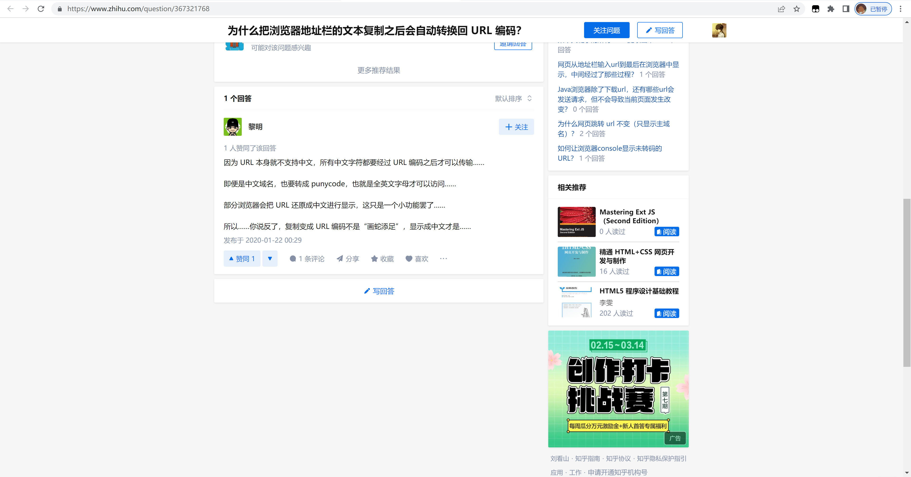
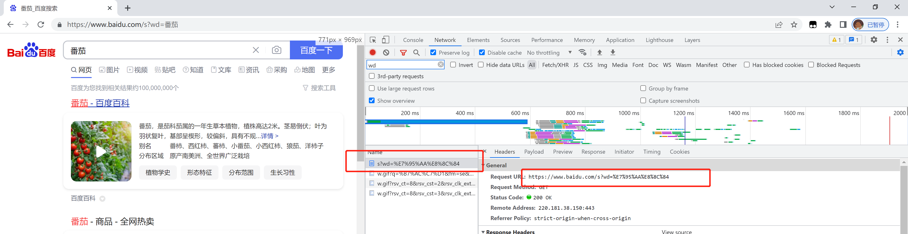

## 为什么我复制的中文url粘贴出来会是乱码的？ 浏览器url编码和解码


## Start

+ 番茄最近涉及到一些和单点登录相关的业务需求，在实现功能的过程中，难免少不了和 `url` 打交道。
+ 但是在打交道的过程中，遇到一个痛点：明明我复制的 `url` 是一个很简短的url，但是粘贴到浏览器的时候，却变成很长一串。
+ why？


## 1. 问题场景

举个例子：番茄我突然有一天心血来潮，想要找一个番茄的图片。于是我打开百度，输入番茄，回车搜索。如下图





可以看到上述截图，我们访问的 url 实际就是 `https://www.baidu.com/s?wd=番茄`；突然我觉得这个番茄图片特别好看，我想分享给我的小伙伴。于是我复制网站的 `url`，准备粘贴到我的聊天框中，发送给我的小伙伴。

但是有一个很神奇的现象，我粘贴后的链接，却是这样的：

`https://www.baidu.com/s?wd=%E7%95%AA%E8%8C%84`


## 2. 为什么粘贴出来的内容是被转码后的内容呢？

[别人的讨论的结果](https://www.zhihu.com/question/367321768)





可以看到上述的内容，最关键的一个点就是：

**因为 URL 本身就不支持中文，所有中文字符都要经过 URL 编码之后才可以传输**


如何验证他说的话呢？

> 打开浏览器控制台，查看 `network` 选项，刷新页面。在调用接口的时候，发现访问的 `url` 是被转码后的内容了。如下图：





所以，转义的原因是：

`URl` 本身就不支持某些字符，在进行传输的时候，它会经过 URL 编码。


## 3. 转码相关的疑问

### 3.1 那些会被转义

对歧义性的数据进行 URL 百分号编码。


### 3.2 url转义字符原理： 

将这些特殊的字符转换成ASCII码，格式为：%加字符的ASCII码，即一个百分号%，后面跟对应字符的ASCII（16进制）码值。例如 空格的编码值是"%20"。 


### 3.3 **URL特殊字符需转义** 

1、空格换成加号(+) 
2、正斜杠(/)分隔目录和子目录 
3、问号(?)分隔URL和查询 
4、百分号(%)制定特殊字符 
5、#号指定书签 
6、&号分隔参数 


### 3.4 中文字符转义原理

待补充


## 4. JS中如何实现解码和编码

### 4.1 解码

```js
decodeURI()
decodeURIComponent()
```

### 4.2 编码

```js
encodeURI()
encodeURIComponent()
```

### 4.3 中文解释

decodeURI() 函数可对 encodeURI() 函数编码过的 URI 进行解码。

decodeURIComponent() 函数可对 encodeURIComponent() 函数编码的 URI 进行解码。


### 4.4 使用示例

```js
/* 1.基础编码 */
console.log(encodeURI('番茄'))
// %E7%95%AA%E8%8C%84
console.log(encodeURIComponent('番茄'))
// %E7%95%AA%E8%8C%84

/* 2.encodeURIComponent支持特殊字符的编码 */
console.log(encodeURI('番茄#'))
// %E7%95%AA%E8%8C%84#
console.log(encodeURIComponent('番茄#'))
// %E7%95%AA%E8%8C%84%23


/* 3.基础解码 */
console.log(decodeURI('%E7%95%AA%E8%8C%84'))
// 番茄
console.log(decodeURIComponent('%E7%95%AA%E8%8C%84'))
// 番茄

/* 4.encodeURIComponent支持特殊字符的解码 */
console.log(decodeURI('%E7%95%AA%E8%8C%84%23'))
// 番茄%23
console.log(decodeURIComponent('%E7%95%AA%E8%8C%84%23'))
// 番茄#
```


**区别： decodeURIComponent() 可以编码和解码URI特殊字符（如#，/，￥等），而 decodeURI()则不能。**


## End

+ 回想起日常工作中经常使用的截取 `url` 参数的函数。通常会依据`?`，`&` 进行参数处理。当时的我就担心，会不会出现多个特殊字符的情况。
+ 在对比思考一下这边博客了解到的内容。才发现，担心的情况是会有的，但是会做特殊转义，避免相关问题了。
+ 加油


