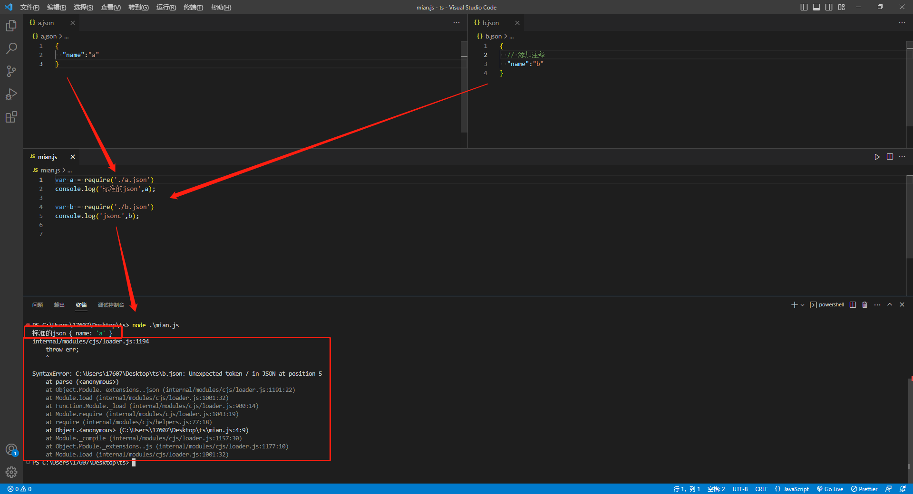

# 2.为什么在vscode中的某些 JSON 文件可以写注释 tsconfig.json setting.json

## Start
+ 番茄最近在学习 TypeScript，在编写 TypeScript 配置文件的时候，使用命令 `tsc --init` 自动生成的 `tsconfig.json` 。
+ 查看了这个 json 文件，有一个疑问出现在我脑海久久不能除去。**为什么它可以在 JSON 文件中写注释？**

## 1. 正文

### 1.1 验证 json 到底能不能编写注释

为了验证 json 到底能不能编写注释？我新建一个 `index.json` 文件，在文件中编写注释。

如下图，编辑器会在注释的底部，出现红色波浪线做警告提示。

鼠标悬浮上去，编辑器提示我们 `JSON 中不允许有注释`

### 1.2 问题

但是打开我们刚刚生成的  `tsconfig.json`，并没有标红提示，这是为什么？

### 1.3 解答

问题的关键就是对比刚刚放上来的两个截图中的。

vscode在底部的蓝色区域，对文本的一些格式做了提示。例如第几行，第几列，编码格式，换行方式。

重点是后续的 `JSON with Comments` ，定义文件是那种类型？

结合上图，对比一下两个文件的，我们可以知道，在解析这些配置文件的时候。

+ **vscode 对可以编写注释的  JSON 文件，使用的是 `JSON with Comments`**；
+ **vscode 对不可编写注释的 JSON 文件，使用的是 `JSON`**；

### 1.4 JSON with Comments

随即我就很好奇 `JSON with Comments` 是什么？

下面说说我了解到的内容

1. `JSON with Comments` 英译过来就是 ： 带有注释的JSON。

2. 可以简写为 `jsonc`。

3. 我试验了一下，这种带有注释的 json 文件，并不能和正常的 json 文件一样直接引入使用， 如下图：

   

4. jsonc 文件的解析，可借助 `jsonc-parser` 进行解析。

   >  [jsonc-parser-github官网点击这里：]([microsoft/node-jsonc-parser: Scanner and parser for JSON with comments. (github.com)](https://github.com/Microsoft/node-jsonc-parser))

## 2. 相关博客

+ [说说什么是JSON_番茄出品](https://blog.csdn.net/wswq2505655377/article/details)

