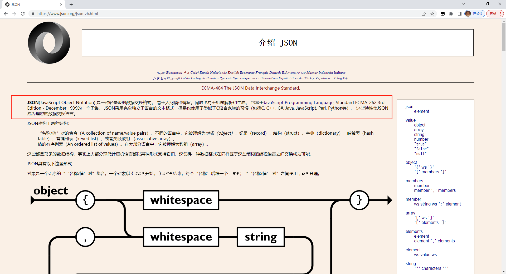

# 什么是JSON?

## Start

+ 今天来说说，什么是JSON。
+ 作者：番茄
+ 编写时间 2023/03/30

## 1. 什么是 JSON

了解JSON是什么，我们直接访问官方 

[JSON 官网点击这里：](https://www.json.org/json-zh.html)

### 1.2 官方网站介绍的内容：

+ **JSON**(JavaScript Object Notation) 是一种轻量级的数据交换格式。 
+ 易于人阅读和编写。
+ 同时也易于机器解析和生成。
+ 它基于[JavaScript Programming Language](http://www.crockford.com/javascript), Standard ECMA-262 3rd Edition - December 1999的一个子集。
+ JSON采用完全独立于语言的文本格式，但是也使用了类似于C语言家族的习惯（包括C, C++, C#, Java, JavaScript, Perl, Python等）。
+ 这些特性使JSON成为理想的数据交换语言。

### 1.3 说说我对JSON的理解

看完官方文档对JSON的介绍，我说说我个人的理解：

1. JSON 是一种优质的数据传输格式，这种格式类似 JavaScript 中的对象。（但是和普通的JS对象有些**特定限制**）;

2. JSON 是基于 JavaScript 的一个子集，但是它独立于语言，很多其他语言也支持，例如 Java，C等；

### 1.4 JSON对象特定的限制：

1. 属性和属性值必须双引号包裹；
2. 最后一项不能有逗号
3. 不能编写注释

