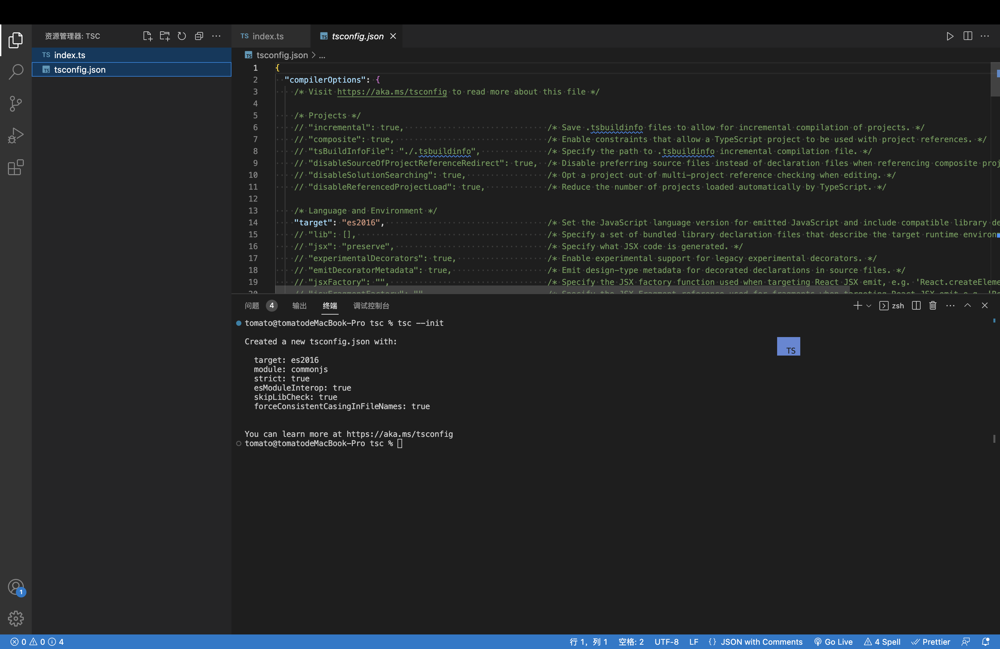

# 二. TypeScript环境搭建以及基础配置

## Start

+ 本篇文章主要介绍学习 `TypeScript`必须的一些基础配置

## 1. 安装nodejs

前端环境必备 nodejs，可自行下载。

### 1.1 下载方式

+ 官网下载；[访问官网点击这里~](https://nodejs.org/en)

+ 通过 nvm下载；

  > window版本：[点击这里~](https://blog.csdn.net/wswq2505655377/article/details/114909800)


### 1.2 推荐nodejs版本

截止目前 `nodejs` 最新稳定版本为 `18.x.x`。推荐下载 `12.x.x` 以上的偶数版本的 `nodejs`。


## 2. 安装typescript

```shell
npm i typescript -g

# 安装完毕后，在控制台输入tsc，出现英文提示说明安装成功
```


## 3. 编译初体验

```tsx
// index.ts
const demo: number = 1

const lazy = (a: number, b: number): number => {
  return a + b
}
console.log(
  lazy(1, 2)
)
```

```shell
# 利用我们安装的npm包，编译我们的ts文件
tsc .\index.ts
```

```js
// 编译输出 index.js
var demo = 1;
var lazy = function (a, b) {
    return a + b;
};
console.log(lazy(1, 2));
```


`小结：`

1. 我们利用了 `tsc`，编译了ts文件，输出了js文件。
2. 我们**目前**无法直接执行`ts`文件，需要通过工具将`ts`转换成`js`，再执行生成的 `js`。
3. 可以看到上述的基础示例中，我们对变量的类型；函数的形参，返回值的类型；成功的做了限制。
4. ts可以将高版本的js转换成低版本的js。例如：示例的箭头函数默认就转换成了普通函数的写法。


## 4. typescript编译选项： tsconfig.json

###  4.1 创建tsconfig.json

创建方法有两种：

+ 手动新建文件；
+ `tsc --init`，自动初始化文件。




### 4.2 默认生成的配置项

```json
{
  "compilerOptions": {
    /* Visit https://aka.ms/tsconfig to read more about this file */

    /* Projects */
    // "incremental": true,                              /* Save .tsbuildinfo files to allow for incremental compilation of projects. */
    // "composite": true,                                /* Enable constraints that allow a TypeScript project to be used with project references. */
    // "tsBuildInfoFile": "./.tsbuildinfo",              /* Specify the path to .tsbuildinfo incremental compilation file. */
    // "disableSourceOfProjectReferenceRedirect": true,  /* Disable preferring source files instead of declaration files when referencing composite projects. */
    // "disableSolutionSearching": true,                 /* Opt a project out of multi-project reference checking when editing. */
    // "disableReferencedProjectLoad": true,             /* Reduce the number of projects loaded automatically by TypeScript. */

    /* Language and Environment */
    "target": "es2016",                                  /* Set the JavaScript language version for emitted JavaScript and include compatible library declarations. */
    // "lib": [],                                        /* Specify a set of bundled library declaration files that describe the target runtime environment. */
    // "jsx": "preserve",                                /* Specify what JSX code is generated. */
    // "experimentalDecorators": true,                   /* Enable experimental support for legacy experimental decorators. */
    // "emitDecoratorMetadata": true,                    /* Emit design-type metadata for decorated declarations in source files. */
    // "jsxFactory": "",                                 /* Specify the JSX factory function used when targeting React JSX emit, e.g. 'React.createElement' or 'h'. */
    // "jsxFragmentFactory": "",                         /* Specify the JSX Fragment reference used for fragments when targeting React JSX emit e.g. 'React.Fragment' or 'Fragment'. */
    // "jsxImportSource": "",                            /* Specify module specifier used to import the JSX factory functions when using 'jsx: react-jsx*'. */
    // "reactNamespace": "",                             /* Specify the object invoked for 'createElement'. This only applies when targeting 'react' JSX emit. */
    // "noLib": true,                                    /* Disable including any library files, including the default lib.d.ts. */
    // "useDefineForClassFields": true,                  /* Emit ECMAScript-standard-compliant class fields. */
    // "moduleDetection": "auto",                        /* Control what method is used to detect module-format JS files. */

    /* Modules */
    "module": "commonjs",                                /* Specify what module code is generated. */
    // "rootDir": "./",                                  /* Specify the root folder within your source files. */
    // "moduleResolution": "node10",                     /* Specify how TypeScript looks up a file from a given module specifier. */
    // "baseUrl": "./",                                  /* Specify the base directory to resolve non-relative module names. */
    // "paths": {},                                      /* Specify a set of entries that re-map imports to additional lookup locations. */
    // "rootDirs": [],                                   /* Allow multiple folders to be treated as one when resolving modules. */
    // "typeRoots": [],                                  /* Specify multiple folders that act like './node_modules/@types'. */
    // "types": [],                                      /* Specify type package names to be included without being referenced in a source file. */
    // "allowUmdGlobalAccess": true,                     /* Allow accessing UMD globals from modules. */
    // "moduleSuffixes": [],                             /* List of file name suffixes to search when resolving a module. */
    // "allowImportingTsExtensions": true,               /* Allow imports to include TypeScript file extensions. Requires '--moduleResolution bundler' and either '--noEmit' or '--emitDeclarationOnly' to be set. */
    // "resolvePackageJsonExports": true,                /* Use the package.json 'exports' field when resolving package imports. */
    // "resolvePackageJsonImports": true,                /* Use the package.json 'imports' field when resolving imports. */
    // "customConditions": [],                           /* Conditions to set in addition to the resolver-specific defaults when resolving imports. */
    // "resolveJsonModule": true,                        /* Enable importing .json files. */
    // "allowArbitraryExtensions": true,                 /* Enable importing files with any extension, provided a declaration file is present. */
    // "noResolve": true,                                /* Disallow 'import's, 'require's or '<reference>'s from expanding the number of files TypeScript should add to a project. */

    /* JavaScript Support */
    // "allowJs": true,                                  /* Allow JavaScript files to be a part of your program. Use the 'checkJS' option to get errors from these files. */
    // "checkJs": true,                                  /* Enable error reporting in type-checked JavaScript files. */
    // "maxNodeModuleJsDepth": 1,                        /* Specify the maximum folder depth used for checking JavaScript files from 'node_modules'. Only applicable with 'allowJs'. */

    /* Emit */
    // "declaration": true,                              /* Generate .d.ts files from TypeScript and JavaScript files in your project. */
    // "declarationMap": true,                           /* Create sourcemaps for d.ts files. */
    // "emitDeclarationOnly": true,                      /* Only output d.ts files and not JavaScript files. */
    // "sourceMap": true,                                /* Create source map files for emitted JavaScript files. */
    // "inlineSourceMap": true,                          /* Include sourcemap files inside the emitted JavaScript. */
    // "outFile": "./",                                  /* Specify a file that bundles all outputs into one JavaScript file. If 'declaration' is true, also designates a file that bundles all .d.ts output. */
    // "outDir": "./",                                   /* Specify an output folder for all emitted files. */
    // "removeComments": true,                           /* Disable emitting comments. */
    // "noEmit": true,                                   /* Disable emitting files from a compilation. */
    // "importHelpers": true,                            /* Allow importing helper functions from tslib once per project, instead of including them per-file. */
    // "importsNotUsedAsValues": "remove",               /* Specify emit/checking behavior for imports that are only used for types. */
    // "downlevelIteration": true,                       /* Emit more compliant, but verbose and less performant JavaScript for iteration. */
    // "sourceRoot": "",                                 /* Specify the root path for debuggers to find the reference source code. */
    // "mapRoot": "",                                    /* Specify the location where debugger should locate map files instead of generated locations. */
    // "inlineSources": true,                            /* Include source code in the sourcemaps inside the emitted JavaScript. */
    // "emitBOM": true,                                  /* Emit a UTF-8 Byte Order Mark (BOM) in the beginning of output files. */
    // "newLine": "crlf",                                /* Set the newline character for emitting files. */
    // "stripInternal": true,                            /* Disable emitting declarations that have '@internal' in their JSDoc comments. */
    // "noEmitHelpers": true,                            /* Disable generating custom helper functions like '__extends' in compiled output. */
    // "noEmitOnError": true,                            /* Disable emitting files if any type checking errors are reported. */
    // "preserveConstEnums": true,                       /* Disable erasing 'const enum' declarations in generated code. */
    // "declarationDir": "./",                           /* Specify the output directory for generated declaration files. */
    // "preserveValueImports": true,                     /* Preserve unused imported values in the JavaScript output that would otherwise be removed. */

    /* Interop Constraints */
    // "isolatedModules": true,                          /* Ensure that each file can be safely transpiled without relying on other imports. */
    // "verbatimModuleSyntax": true,                     /* Do not transform or elide any imports or exports not marked as type-only, ensuring they are written in the output file's format based on the 'module' setting. */
    // "allowSyntheticDefaultImports": true,             /* Allow 'import x from y' when a module doesn't have a default export. */
    "esModuleInterop": true,                             /* Emit additional JavaScript to ease support for importing CommonJS modules. This enables 'allowSyntheticDefaultImports' for type compatibility. */
    // "preserveSymlinks": true,                         /* Disable resolving symlinks to their realpath. This correlates to the same flag in node. */
    "forceConsistentCasingInFileNames": true,            /* Ensure that casing is correct in imports. */

    /* Type Checking */
    "strict": true,                                      /* Enable all strict type-checking options. */
    // "noImplicitAny": true,                            /* Enable error reporting for expressions and declarations with an implied 'any' type. */
    // "strictNullChecks": true,                         /* When type checking, take into account 'null' and 'undefined'. */
    // "strictFunctionTypes": true,                      /* When assigning functions, check to ensure parameters and the return values are subtype-compatible. */
    // "strictBindCallApply": true,                      /* Check that the arguments for 'bind', 'call', and 'apply' methods match the original function. */
    // "strictPropertyInitialization": true,             /* Check for class properties that are declared but not set in the constructor. */
    // "noImplicitThis": true,                           /* Enable error reporting when 'this' is given the type 'any'. */
    // "useUnknownInCatchVariables": true,               /* Default catch clause variables as 'unknown' instead of 'any'. */
    // "alwaysStrict": true,                             /* Ensure 'use strict' is always emitted. */
    // "noUnusedLocals": true,                           /* Enable error reporting when local variables aren't read. */
    // "noUnusedParameters": true,                       /* Raise an error when a function parameter isn't read. */
    // "exactOptionalPropertyTypes": true,               /* Interpret optional property types as written, rather than adding 'undefined'. */
    // "noImplicitReturns": true,                        /* Enable error reporting for codepaths that do not explicitly return in a function. */
    // "noFallthroughCasesInSwitch": true,               /* Enable error reporting for fallthrough cases in switch statements. */
    // "noUncheckedIndexedAccess": true,                 /* Add 'undefined' to a type when accessed using an index. */
    // "noImplicitOverride": true,                       /* Ensure overriding members in derived classes are marked with an override modifier. */
    // "noPropertyAccessFromIndexSignature": true,       /* Enforces using indexed accessors for keys declared using an indexed type. */
    // "allowUnusedLabels": true,                        /* Disable error reporting for unused labels. */
    // "allowUnreachableCode": true,                     /* Disable error reporting for unreachable code. */

    /* Completeness */
    // "skipDefaultLibCheck": true,                      /* Skip type checking .d.ts files that are included with TypeScript. */
    "skipLibCheck": true                                 /* Skip type checking all .d.ts files. */
  }
}

```


常见的 例如 ：

+ compilerOptions：编译选项；
+ target：编译生成js的目标版本；
+ module：输出js的模块化类型；
+ strict：开启严格检查；


## 思考

1. 我们发现typescript，不仅可以校验类型，还支持类似babel的编译功能（将高版本的js编译成低版本的js），那么他们都可以编译，他们两有哪些相同点和差异呢？
1. 学习过json的都应该知道，json文件是不允许写注释的，为什么这里的`tsconfig.json`，却可以写注释？


