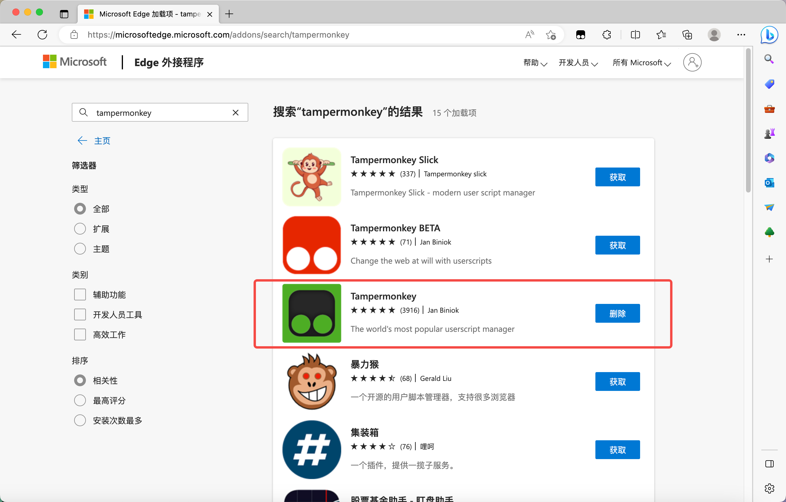
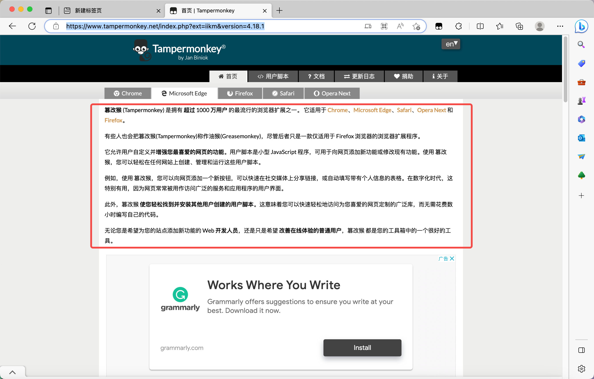

# 2.安装油猴

## Start

本文将

+ 介绍油猴的安装？
+ 介绍油猴是什么？

## 1 .安装

安装油猴插件，在浏览器插件商店直接下载。

> 谷歌浏览器需要科学上网。如果无法下载可以尝试使用 Edge 浏览器。

[点击这里访问 Edge 浏览器扩展程序商店]([Microsoft Edge 加载项](https://microsoftedge.microsoft.com/addons/Microsoft-Edge-Extensions-Home))

搜索 **tampermonkey**，点击获取。

> 红色的为测试版本，绿色的为稳定版本，这里我们选择稳定版。

下载完毕后，我们可以点击浏览器访问地址后的 插件图标，查看我们刚刚下载的油猴插件。

## 什么是油猴

[首页 | Tampermonkey](https://www.tampermonkey.net/index.php?ext=iikm&version=4.18.1)

结合官方文档的说明，他是一个适用于多种浏览器的浏览器插件。他可以帮助我们执行 JS 脚本，用来自定义网页。

>比如：
>
>我想实现一个网站自动填写表单的功能，我可以自己编写一段对应的JS代码，然后通通过油猴脚本，在访问网站的时候，自动执行我们编写的代码。

