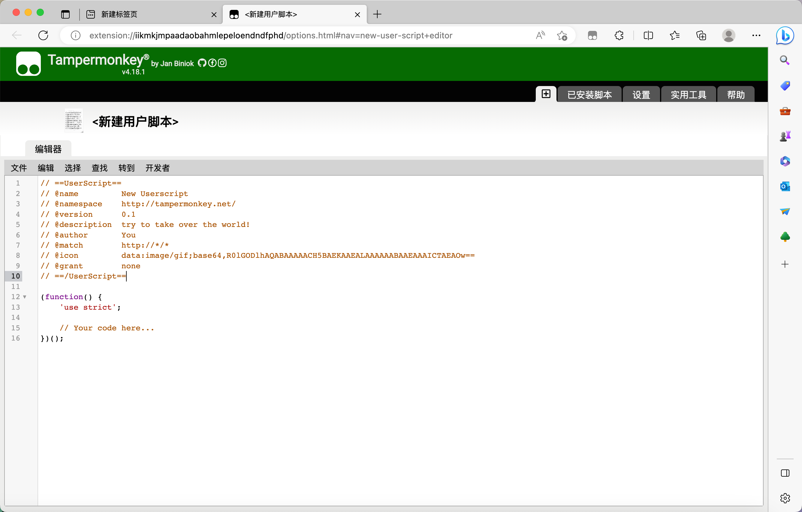
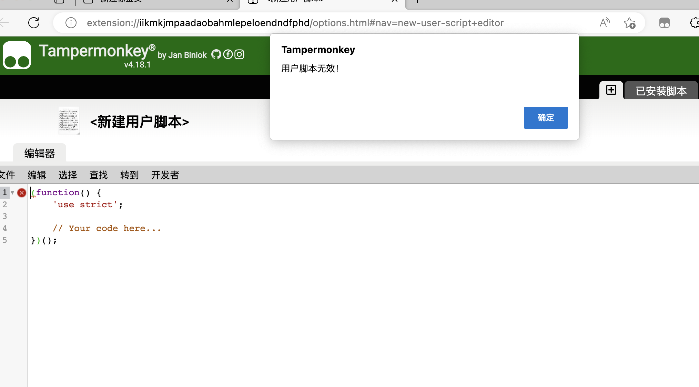
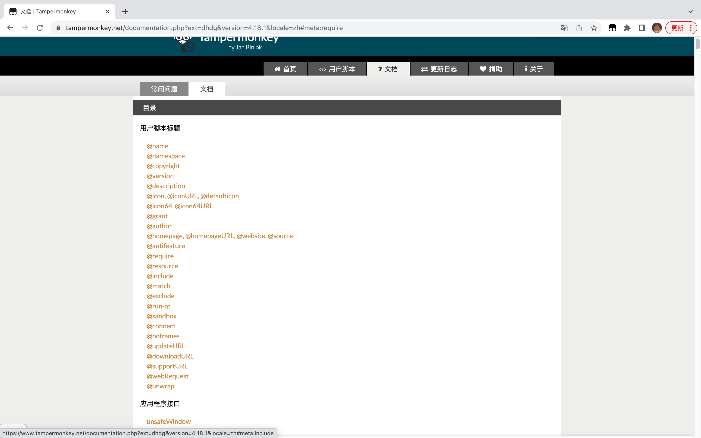
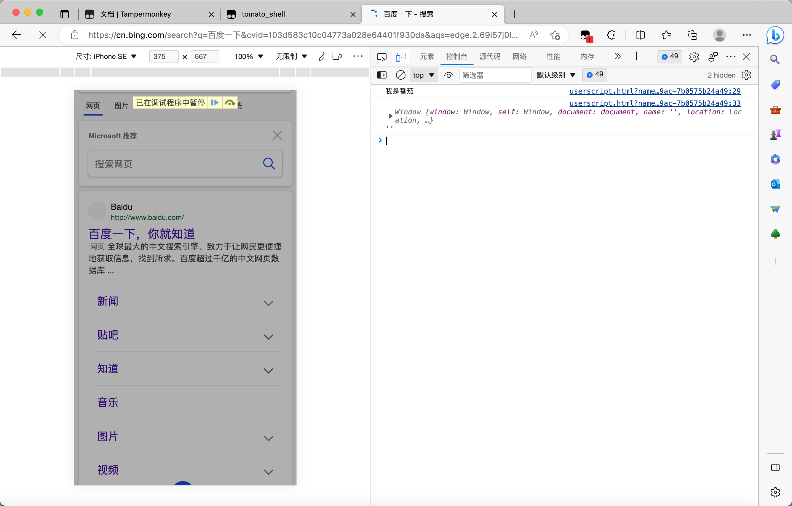

# 3.编写油猴脚本之-helloword


## Start

通过上一篇文章的学习，我们安装完毕了油猴插件。今天我们来编写一个helloword的脚步，体验一下油猴。


## 1. 开始

点击油猴插件=>添加新脚本





默认生成的脚本

```js
// ==UserScript==
// @name         New Userscript
// @namespace    http://tampermonkey.net/
// @version      0.1
// @description  try to take over the world!
// @author       You
// @match        http://*/*
// @icon         data:image/gif;base64,R0lGODlhAQABAAAAACH5BAEKAAEALAAAAAABAAEAAAICTAEAOw==
// @grant        none
// ==/UserScript==

(function() {
    'use strict';

    // Your code here...
})();
```


解释：

1. 不会编写脚本？没关系，可以点击获取脚本，然后根据你的需求，去下载并使用对应脚本。

2. 当然我这个系列的目标是，自己编写脚本，根据我们自己具体的需求，去自定义脚本。

3. 上述生成的基础脚本代码，可以发现其实也是一个JS文件。

4. 开头有很多行注释的内容，这些注释的内容有用吗？有什么用？

   > 下一节内容会对这里作说明

5. 后续的具体代码，可以看到，其实就是编写JS代码。


## 2. 注释项说明

在基础的脚本示例中，开头有很多注释行，既然是注释，那么他们有用吗？


我删除掉注释行，保存试一下？




结合上述的截图，我们可以发现，当我删除掉这些注释行，点击保存按钮时，系统会提示我们“脚本无效”。


那么这些注释代表什么意思呢？


### 2.1 注释项详细说明

[官方注释项说明文档](https://www.tampermonkey.net/documentation.php?ext=dhdg&version=4.18.1&locale=zh)





常见的项：

| 标题        | 作用                                                     | 使用实例       |
| ----------- | -------------------------------------------------------- | -------------- |
| name        | 脚本的名称。                                             | New Userscript |
| version     | 脚本的版本                                               |                |
| description | 脚本的说明                                               |                |
| author      | 脚本的作者                                               |                |
| match       | 匹配脚本运行网页的url                                    |                |
| grant       | 引入函数，或者变量                                       |                |
| @include    | 脚本应运行的页面。允许多个标记实例。                     |                |
| @require    | 指向在脚本本身开始运行之前加载和执行的 JavaScript 文件。 |                |


## 3. 编写一个 helloworld 脚本。

```
// ==UserScript==
// @name         tomato_shell
// @version      0.1
// @description  脚本的说明 hellotomato
// @author       tomato
// @match        http://*/*
// @match        https://*/*
// @icon         data:image/gif;base64,R0lGODlhAQABAAAAACH5BAEKAAEALAAAAAABAAEAAAICTAEAOw==
// @grant        none
// ==/UserScript==


/*
1.虽然是注释，但是通过`==UserScript==`包裹。用来和普通的注释做区分
==UserScript== 
==/UserScript==
*/

/*
2.@match 
定义所有的http或者https的网站，都会加载我们的脚本。
*/

(function() {
  'use strict';

  // 3.编写一个输出
  console.log('我是番茄')


  // 4.打印一下全局变量
console.log(globalThis,'')
  // 查看是否可以deb
  debugger
})();
```





解释

1. 设定match 可以执行脚本的网站，就可以执行我们的js代码
2. 答应全局变量是window
3. 可以通过 debugger 调试我们的脚本