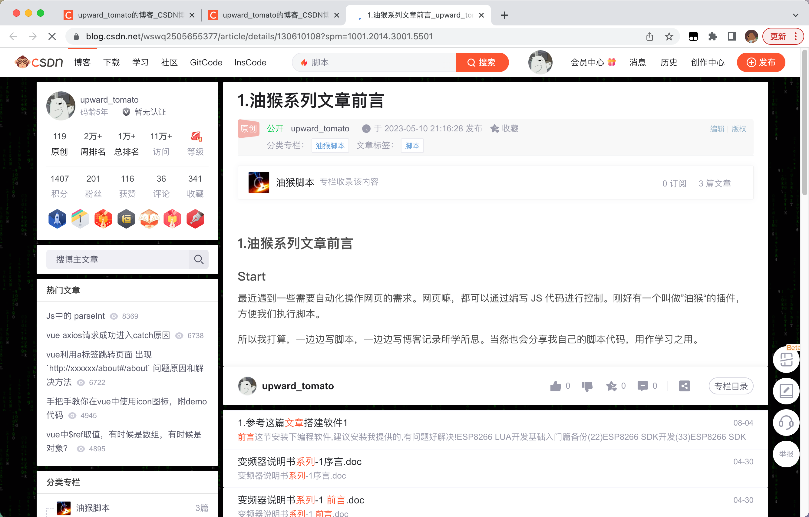
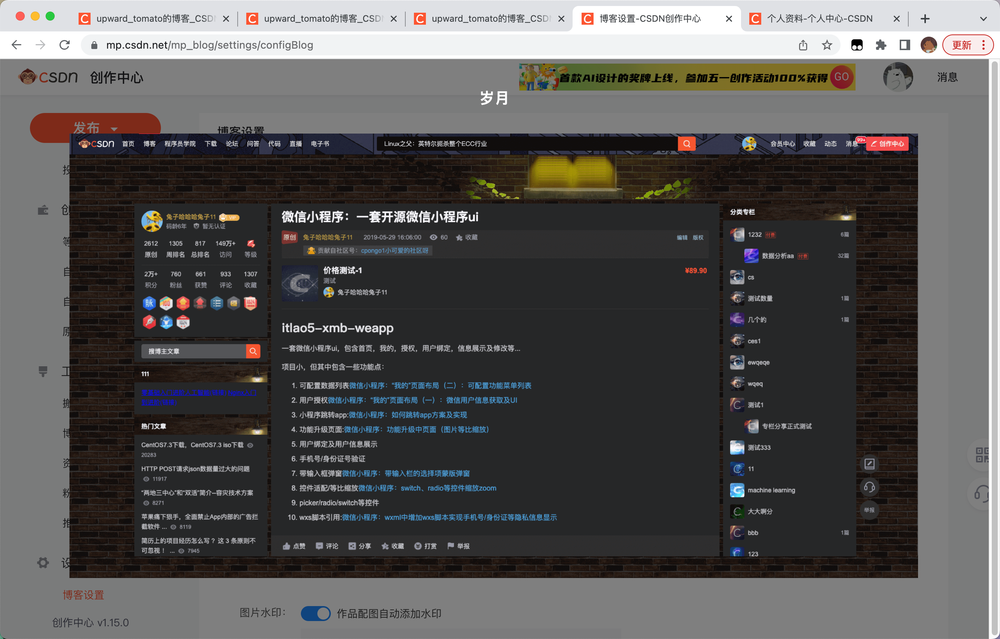

# 4.实现csdn暗黑模式-油猴脚本实战1

## Start

+ 前面的文章，对油猴脚本做了基础的介绍。今天来我们来实战一下，编写一个有实际作用的油猴脚本。

+ **如果我希望我的csdn是暗黑模式，怎么办？** 看我表演？

+ 本文作者： upward_tomato(向上的番茄)

## 1. 需求说明

作为一个非付费用户，我查看我自己的文章，是白底黑字的形式。如下图：

白底黑字，平时看着还可以。在夜间，我希望我查看的文章是黑底白字的怎么办？

需要付费，即可给我们的文章进行换肤。

怎么能通过所学的知识，免费的解决这个问题呢？

## 2. 思路分析

既然是网页，我们肯定是可以通过JS去实现这个功能的，但是手动处理每一个地方的样式，会有些繁琐。既然官方提供了深色主题，不如我们看下官方皮肤是如何实现的？

## 3. 具体代码

